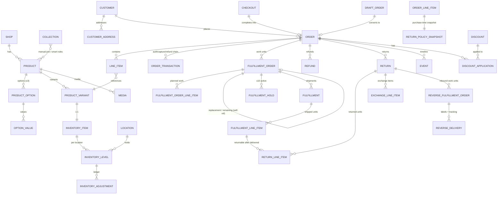
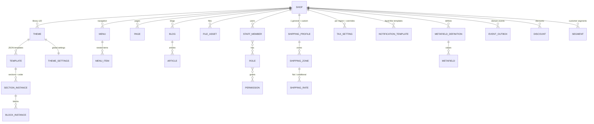

# 06 — 整合資料模型與狀態機總表

> 本篇把 01–05、09 的研究收斂成一張可實作的資料模型：核心 ER 圖、各狀態機、多租戶與金額處理原則。命名對齊 Shopify Admin GraphQL API，方便回查官方文件。

## 1. 多租戶原則（先於一切）

- **所有業務表帶 `shop_id`**，複合索引一律 `(shop_id, ...)` 開頭；應用層 middleware 強制注入租戶條件（或 Postgres RLS）。
- Shop 表本身承載：名稱、myshopify 子網域、自訂網域、store currency、時區、方案、feature flags。
- 金額欄位用**整數最小幣值單位**（cents）+ currency code；為未來多幣別預留 `presentment_*` 欄位（demo 可先只填 shop 幣別）。
- ID：bigint 自增即可；對外 API 可包裝成 `gid://` 風格全域 ID。

## 2. 商務核心 ER 圖



要點：

- **LineItem 快照原則**：下單當下把 title、variant title、SKU、單價、稅率複製進 line item——商品之後改名改價不影響歷史訂單。
- **OrderTransaction 鏈**：authorization → capture(parent) → refund(parent)；金流所有動作都是一筆 transaction，不直接改 order 欄位；order 的 financial status 由 transactions 推導。
- **FulfillmentOrder**：訂單成立時按出貨地點拆出 1..n 個 FulfillmentOrder（demo 單地點 = 1 個），出貨動作掛在它上面——這是 Shopify 現行模型，先進 schema 未來不用重構。**自參照外鍵 `parent_fulfillment_order_id` 為必要欄位**：`fulfillmentOrderCancel` 會產生「替代單」、部分 hold／move 會產生「剩餘單」，沒有這條關聯，剩餘品項會憑空消失（規格見 16-F3.2）。
  <!-- 依 46a:236、46a:354、46a:358–366 補寫，原文：`fulfillmentOrderCancel`＝「Cancels order and creates replacement for remaining work」；hold/move 回傳 `remainingFulfillmentOrder` -->
- **🔴 RETURN_LINE_ITEM 的外鍵指向 FULFILLMENT_LINE_ITEM，不是 ORDER_LINE_ITEM**：只有「已出貨且已送達」的單位才能退。
  <!-- 依 46a:519、46a:627、46a:648、46a:1034 修正，原文：`ReturnLineItemInput.fulfillmentLineItemId: ID!` 逐字「The ID of the fulfillment line item to be returned」；`returnableFulfillments` 前提逐字「A returnable fulfillment is an order that has been delivered」。
       🔴 此處原本寫錯：本 ER 圖原本只有 `ORDER ||--o{ RETURN`，退貨掛在訂單層——這是 schema 級錯誤，上線後改不得，且會允許退未出貨品項。任何人翻舊版都不要改回去。 -->
- **RETURN_POLICY_SNAPSHOT**：退貨與取消規則**綁購買時點**，`order_line_items.return_policy_snapshot_id` 為 NOT NULL；規則被改不影響既有訂單（規格見 16-F7.4）。
  <!-- 依 46c:422–426、44:437 補寫（三方一致），原文：「對退貨規則所做的變更僅適用於未來的訂單」 -->
- **ReverseFulfillmentOrder / ReverseDelivery**：逆向履行層，原本整層不存在。disposition **不是一次性終態**（`PROCESSING_REQUIRED` 是中間態），同一 line item 允許多筆 disposition 紀錄、取最新（46a:671–680）。
- **Inventory ledger**：InventoryLevel 存各狀態量（available/committed/on_hand），每次變動寫一筆 INVENTORY_ADJUSTMENT（reason + delta + reference）——對帳、稽核、除錯全靠它。
- **CHECKOUT 表**：進結帳即落一筆（含 email、line items snapshot、金額組成、recovery token）；完成→關聯 order；未完成→就是棄單列表的資料來源。

## 3. 內容與平台 ER（第二張）



- **Theme = 資料不是程式碼**：template 是 JSON（section 實例 + 順序 + 每個實例的 settings），section 型別對應前端元件註冊表；theme editor 就是這份 JSON 的視覺化編輯器（見 03、07）。
- **EVENT_OUTBOX**：與業務寫入同交易插入（topic = `orders/create` 風格），單一 dispatcher 消費——先支撐站內通知信，之後開放對外 webhook 直接沿用（見 09）。

## 4. 狀態機總表

> **本表只列「有哪些狀態」**。完整的**合法轉移＋非法轉移＋每個轉移的前置條件與副作用**寫在對應 spec：
> FulfillmentOrder → `docs/specs/16` F3.1；Return / Exchange → `16` F7.1；Order 取消 → `16` F4.1/F4.2。

| 資源 | 欄位 | 狀態流 |
|---|---|---|
| Product | status | DRAFT → ACTIVE ⇄ ARCHIVED |
| Order | ~~status~~ **（無單一 status）** | 🔴 **Order 沒有單一 status 欄位**，由四條**正交軸**組成：`displayFinancialStatus` × `displayFulfillmentStatus` × 生命週期旗標（`closed`/`cancelled` 等 11 個布林） × `returnStatus`。`closed` 判定式＝**所有 line item 已履行或已取消 AND 所有金流交易完成**；**`VOIDED` 不使訂單 closed** |
| Order | financial_status | **8 值**：PENDING → AUTHORIZED →（PARTIALLY_PAID）→ PAID → PARTIALLY_REFUNDED → REFUNDED；另 VOIDED、EXPIRED。**VOIDED / EXPIRED / REFUNDED 為終態不可逆**；`AUTHORIZED → PARTIALLY_PAID → PAID` 為多次部分請款路徑（需 `capture_payments_for_orders` 權限） |
| Order | fulfillment_status | **現行 7 值**：UNFULFILLED / ON_HOLD / SCHEDULED / IN_PROGRESS / PARTIALLY_FULFILLED / FULFILLED / **REQUEST_DECLINED**；另 3 個 deprecated（OPEN / PENDING_FULFILLMENT / RESTOCKED，GraphQL enum 保留標 deprecated、**不落地**）。**derived 不可寫入**；`ON_HOLD`/`SCHEDULED` 的定義是「***所有*** unfulfilled items 皆處於該狀態」 |
| Order | return_status | **6 值**（聚合、derived）：NO_RETURN / RETURN_REQUESTED / IN_PROGRESS / INSPECTION_COMPLETE / RETURNED / RETURN_FAILED |
| **FulfillmentOrder** | **status** | **7 值**：OPEN / IN_PROGRESS / SCHEDULED / ON_HOLD / CLOSED / INCOMPLETE / CANCELLED。**CLOSED、CANCELLED 為終態**；🔴 `fulfillmentOrderClose → INCOMPLETE`（**不是 CLOSED**） |
| **FulfillmentOrder** | **requestStatus**（第二條正交軸） | **8 值**：UNSUBMITTED / SUBMITTED / ACCEPTED / REJECTED / CANCELLATION_REQUESTED / CANCELLATION_ACCEPTED / CANCELLATION_REJECTED / CLOSED。**不變量：未指派 fulfillment service 的 FO 恆為 `UNSUBMITTED`** |
| **FulfillmentOrder** | **supportedActions**（計算欄位） | **12 值**：CREATE_FULFILLMENT / REQUEST_FULFILLMENT / CANCEL_FULFILLMENT_ORDER / REQUEST_CANCELLATION / HOLD / RELEASE_HOLD / MOVE / SPLIT / MERGE / MARK_AS_OPEN / REPORT_PROGRESS / EXTERNAL。**伺服器端計算，admin 按鈕啟用完全由它驅動** |
| **FulfillmentHold** | reason | **8 值**：AWAITING_PAYMENT / **AWAITING_RETURN_ITEMS**（換貨專用）/ HIGH_RISK_OF_FRAUD / INCORRECT_ADDRESS / INVENTORY_OUT_OF_STOCK / UNKNOWN_DELIVERY_DATE / ONLINE_STORE_POST_PURCHASE_CROSS_SELL / OTHER。每張 FO **≤10 個 active hold** |
| **Fulfillment** | status | **現行 4 值** SUCCESS / CANCELLED / ERROR / FAILURE ＋ 2 deprecated（OPEN / PENDING） |
| DraftOrder | status | open → invoice_sent → completed |
| Checkout | — | active → completed（轉 order）／ abandoned（留 email 後 **10 分鐘**未完成）→ 90 天清除 |
| Return | status | **5 值**：REQUESTED / OPEN / DECLINED / CLOSED / **CANCELED（單 L）**。**DECLINED、CANCELED 為終態** |
| **ReverseFulfillmentOrder** | status | **3 值**：OPEN / CLOSED / CANCELED |
| **ReverseFulfillmentOrderLineItem** | dispositionType | **4 值**：RESTOCKED / NOT_RESTOCKED / MISSING / **PROCESSING_REQUIRED（中間態，可多次 disposition）** |
| **Refund** | **（刻意無 status）** | 🔴 **Refund 是不可變帳務紀錄，不建 `refunds.status` 欄位**；退款是否成功看底下 OrderTransaction |
| Transfer | status | draft → ordered/in_transit → partially_received → received / canceled |
| Discount | status | scheduled → active → expired（由起訖時間推導） |
| Transaction | kind/status | authorization/sale/capture/void/refund × pending/success/failure |
| Theme | role | draft ⇄ published（每店僅一個 published） |
| Payout（若做） | status | scheduled → in_transit → paid / failed |

<!-- 依 46a:136–152、46a:1045 修正，原文：Order 由四條正交軸組成、無單一 status。
     🔴 此處原本寫錯：本表原有一列 `| Order | status | open → archived / canceled |`，把 Order 寫成單一 status 欄位，與官方直接衝突。任何人翻舊版都不要改回去。 -->
<!-- 依 46a:438–482、46c:1021–1033（C-07）修正，原文：`ReturnStatus` 5 值（REQUESTED/OPEN/DECLINED/CLOSED/CANCELED）。
     🔴 此處原本寫錯：本表原寫 `requested → in_progress → inspection_complete → returned`（help 的 4 態展示狀態），
     缺 DECLINED/CANCELED 兩個終態；help 的「檢查完成」在 dev 是 OPEN 底下的子進度，不是獨立狀態。任何人翻舊版都不要改回去。 -->
<!-- 依 46a:213–290、46a:383–392 補寫：FulfillmentOrder（status/requestStatus/supportedActions）、FulfillmentHold、Fulfillment、
     ReverseFulfillmentOrder、Refund（刻意無 status）六列原本完全不存在 -->

推導規則（重要）：
- financial_status 從 transaction 聚合推導（sum captured vs order total vs refunded）。
- fulfillment_status 從 fulfillment orders / line item 已出數量推導。
- 各條狀態機**互相獨立**（可以 paid+unfulfilled、pending+fulfilled 並存；FulfillmentOrder 的 `status` 與 `requestStatus` 亦互相獨立）。
- **狀態機違規的統一錯誤碼＝`INVALID_STATE`**（源自 `ReturnErrorCode` 26 值，全專案沿用）。

## 5. 庫存數量恆等式

```
on_hand   = available + committed + unavailable(damaged/qc/safety/draft_reserved/app_reserved/other)
incoming  獨立計（在途，不入 on_hand）
下單:        available -= n ; committed += n            (reason: order_created)
出貨:        committed -= n ; on_hand  -= n             (reason: fulfillment)
訂單草稿保留: available -= n ; unavailable[draft_reserved] += n   🔴 不是 committed
草稿轉正式單: unavailable[draft_reserved] -= n ; committed += n
建立退貨:     不動任何數量（僅標記「待收退貨品項」）
退貨處理入庫: available += n                             (reason: return_restock)
退款+回補:    available += n                             (reason: restock)
盤點/調整:    available ±= n                             (reason: correction…)
編輯 on_hand: available 等量變動（on_hand 為 derived）
```

<!-- 依 46c:546–549、46c:895 補寫，原文：「訂單草稿保留庫存 → 進 Unavailable 狀態（不是 Committed）」；
     46c:296、46c:330：「建立退貨當下庫存不變，品項標記『待收退貨品項』」；46c:594–595：編輯連動規則。
     恆等式本身（06:111）原本就對，但 13-F5 只實作 available/committed 兩欄 → 恆等式恆不成立。落地規格見 13-F5.1 -->

**恆等式是 nightly 對帳 job 的斷言，不是註解**：`13-F5.1` 是它的唯一落地規格；`inventory_levels` 必須有 `available / committed / unavailable / incoming` 四個實體欄位 ＋ `inventory_unavailable_buckets` 子分類表，且 `Σ buckets.quantity == unavailable`。

超賣控制：`UPDATE inventory_level SET available = available - n WHERE available >= n`（inventoryPolicy=CONTINUE 時免 WHERE 保護、允許負數）。

## 6. 金額計算管線（訂單金額的唯一真相）

```
subtotal(line items Σ)
→ product/order discounts（按 class + combinesWith 規則，分攤到 line）
→ shipping（zone/rate 引擎）+ shipping discounts
→ taxes（稅率表；含稅價則反推）
→ total
→ transactions（authorized / captured / refunded 累計）
→ balance（應收餘額）
```

實作成純函式模組（輸入 cart/order + 設定，輸出金額明細與分攤），checkout、draft order、訂單編輯、退款計算全部重用同一個引擎——這是 Shopify「到處金額都對得上」的關鍵。

## 7. 建議的表清單（demo 範圍，Postgres）

shops, staff_members, roles, role_permissions；products, product_options, option_values, product_variants, media, collections, collection_products, collection_rules；inventory_items, locations, inventory_levels, inventory_adjustments；customers, customer_addresses；checkouts, orders, line_items, order_transactions, fulfillment_orders, fulfillments, refunds, refund_line_items, events(timeline)；discounts, discount_applications；themes, templates, theme_settings, menus, menu_items, pages, files；shipping_profiles, shipping_zones, shipping_rates；tax_settings；notification_templates；metafield_definitions, metafields；segments；event_outbox；sessions/api_tokens。約 40 張表——這就是「早期 Shopify 骨幹」的實際大小。

**P0 修正後**必須補的表（15 張，缺任一即對應 P0 無處落地）：

| 表 | 為什麼必要 | P0 |
|---|---|---|
| `fulfillment_order_line_items` | FO 的計畫工作量；拆單不變量的計算基礎 | P0-04/05 |
| `fulfillment_line_items` | **出貨單位**——`return_line_items` 的外鍵目標 | P0-08 |
| `fulfillment_holds` | 8 種 reason ＋ 每 FO ≤10 active | P0-05 |
| `returns` | 5 態狀態機 ＋ `return_shipping_fee_cents`（per return，presentment 幣別） | P0-02/06 |
| `return_line_items` | FK → `fulfillment_line_items`；`restocking_fee_bp`（per line） | P0-02/08 |
| `exchange_line_items` | 換貨品項；驅動 `ON_HOLD` + `AWAITING_RETURN_ITEMS` 的 FO | P0-09 |
| `reverse_fulfillment_orders` | 逆向履行層（3 態） | P0-06 |
| `reverse_fulfillment_order_line_items` | disposition 可多筆、取最新 | P0-06 |
| `reverse_deliveries` | 退貨標籤與追蹤 | P0-06 |
| `return_rules` | 多條規則 ＋ 按市場切換 | P0-10 |
| `return_policy_snapshots` | **immutable append-only**；`order_line_items.return_policy_snapshot_id` NOT NULL | P0-10 |
| `return_rule_final_sale_targets` | 最終銷售以 collection／product 為粒度 | P0-10 |
| `inventory_unavailable_buckets` | `unavailable` 六子分類；草稿保留與待收退貨的落腳處 | P0-15 |
| `pickup_point_providers` / `order_pickup_points` | 超商取貨 admin 側（門市快照） | P0-13 |
| `store_credit_accounts` / `store_credit_transactions` | `refundMethods` 的 store credit（原型已標「06 §7 待補」） | P0-01（退款方式） |

`idempotency_keys` 的欄位定義改為「存 `result_ref` 指標」而非 `response_body` 快照——見 `docs/specs/11` §2.1（P0-11）。
