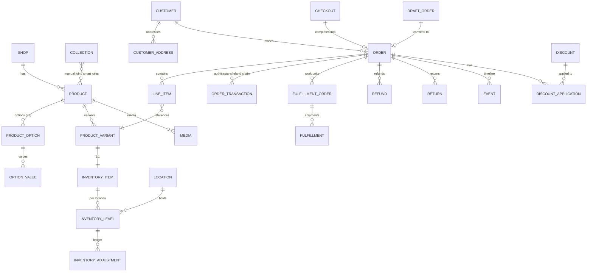
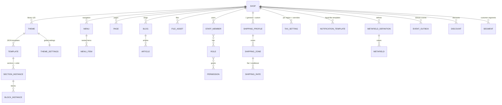

# 06 — 整合資料模型與狀態機總表

> 本篇把 01–05、09 的研究收斂成一張可實作的資料模型：核心 ER 圖、各狀態機、多租戶與金額處理原則。命名對齊 Shopify Admin GraphQL API，方便回查官方文件。

## 1. 多租戶原則（先於一切）

- **所有業務表帶 `shop_id`**，複合索引一律 `(shop_id, ...)` 開頭；應用層 middleware 強制注入租戶條件（或 Postgres RLS）。
- Shop 表本身承載：名稱、myshopify 子網域、自訂網域、store currency、時區、方案、feature flags。
- 金額欄位用**整數最小幣值單位**（cents）+ currency code；為未來多幣別預留 `presentment_*` 欄位（demo 可先只填 shop 幣別）。
- ID：bigint 自增即可；對外 API 可包裝成 `gid://` 風格全域 ID。

## 2. 商務核心 ER 圖



要點：

- **LineItem 快照原則**：下單當下把 title、variant title、SKU、單價、稅率複製進 line item——商品之後改名改價不影響歷史訂單。
- **OrderTransaction 鏈**：authorization → capture(parent) → refund(parent)；金流所有動作都是一筆 transaction，不直接改 order 欄位；order 的 financial status 由 transactions 推導。
- **FulfillmentOrder**：訂單成立時按出貨地點拆出 1..n 個 FulfillmentOrder（demo 單地點 = 1 個），出貨動作掛在它上面——這是 Shopify 現行模型，先進 schema 未來不用重構。
- **Inventory ledger**：InventoryLevel 存各狀態量（available/committed/on_hand），每次變動寫一筆 INVENTORY_ADJUSTMENT（reason + delta + reference）——對帳、稽核、除錯全靠它。
- **CHECKOUT 表**：進結帳即落一筆（含 email、line items snapshot、金額組成、recovery token）；完成→關聯 order；未完成→就是棄單列表的資料來源。

## 3. 內容與平台 ER（第二張）



- **Theme = 資料不是程式碼**：template 是 JSON（section 實例 + 順序 + 每個實例的 settings），section 型別對應前端元件註冊表；theme editor 就是這份 JSON 的視覺化編輯器（見 03、07）。
- **EVENT_OUTBOX**：與業務寫入同交易插入（topic = `orders/create` 風格），單一 dispatcher 消費——先支撐站內通知信，之後開放對外 webhook 直接沿用（見 09）。

## 4. 狀態機總表

| 資源 | 欄位 | 狀態流 |
|---|---|---|
| Product | status | DRAFT → ACTIVE ⇄ ARCHIVED |
| Order | status | open → archived / canceled |
| Order | financial_status | pending → authorized → paid → partially_refunded → refunded；另 partially_paid、voided、expired |
| Order | fulfillment_status | unfulfilled → (on_hold / scheduled / in_progress) → partially_fulfilled → fulfilled |
| DraftOrder | status | open → invoice_sent → completed |
| Checkout | — | active → completed（轉 order）／ abandoned（留聯絡方式未完成）→ 3 個月清除 |
| Return | status | requested → in_progress → inspection_complete → returned |
| Transfer | status | draft → ordered/in_transit → partially_received → received / canceled |
| Discount | status | scheduled → active → expired（由起訖時間推導） |
| Transaction | kind/status | authorization/sale/capture/void/refund × pending/success/failure |
| Theme | role | draft ⇄ published（每店僅一個 published） |
| Payout（若做） | status | scheduled → in_transit → paid / failed |

推導規則（重要）：
- financial_status 從 transaction 聚合推導（sum captured vs order total vs refunded）。
- fulfillment_status 從 fulfillment orders / line item 已出數量推導。
- 兩條狀態機**互相獨立**（可以 paid+unfulfilled、pending+fulfilled 並存）。

## 5. 庫存數量恆等式

```
on_hand   = available + committed + unavailable(damaged/safety/qc/reserved)
incoming  獨立計（在途，不入 on_hand）
下單:      available -= n ; committed += n      (reason: order_created)
出貨:      committed -= n ; on_hand  -= n      (reason: fulfillment)
退款+回補: available += n                       (reason: restock)
盤點/調整: available ±= n                       (reason: correction…)
```

超賣控制：`UPDATE inventory_level SET available = available - n WHERE available >= n`（inventoryPolicy=CONTINUE 時免 WHERE 保護、允許負數）。

## 6. 金額計算管線（訂單金額的唯一真相）

```
subtotal(line items Σ)
→ product/order discounts（按 class + combinesWith 規則，分攤到 line）
→ shipping（zone/rate 引擎）+ shipping discounts
→ taxes（稅率表；含稅價則反推）
→ total
→ transactions（authorized / captured / refunded 累計）
→ balance（應收餘額）
```

實作成純函式模組（輸入 cart/order + 設定，輸出金額明細與分攤），checkout、draft order、訂單編輯、退款計算全部重用同一個引擎——這是 Shopify「到處金額都對得上」的關鍵。

## 7. 建議的表清單（demo 範圍，Postgres）

shops, staff_members, roles, role_permissions；products, product_options, option_values, product_variants, media, collections, collection_products, collection_rules；inventory_items, locations, inventory_levels, inventory_adjustments；customers, customer_addresses；checkouts, orders, line_items, order_transactions, fulfillment_orders, fulfillments, refunds, refund_line_items, events(timeline)；discounts, discount_applications；themes, templates, theme_settings, menus, menu_items, pages, files；shipping_profiles, shipping_zones, shipping_rates；tax_settings；notification_templates；metafield_definitions, metafields；segments；event_outbox；sessions/api_tokens。約 40 張表——這就是「早期 Shopify 骨幹」的實際大小。
