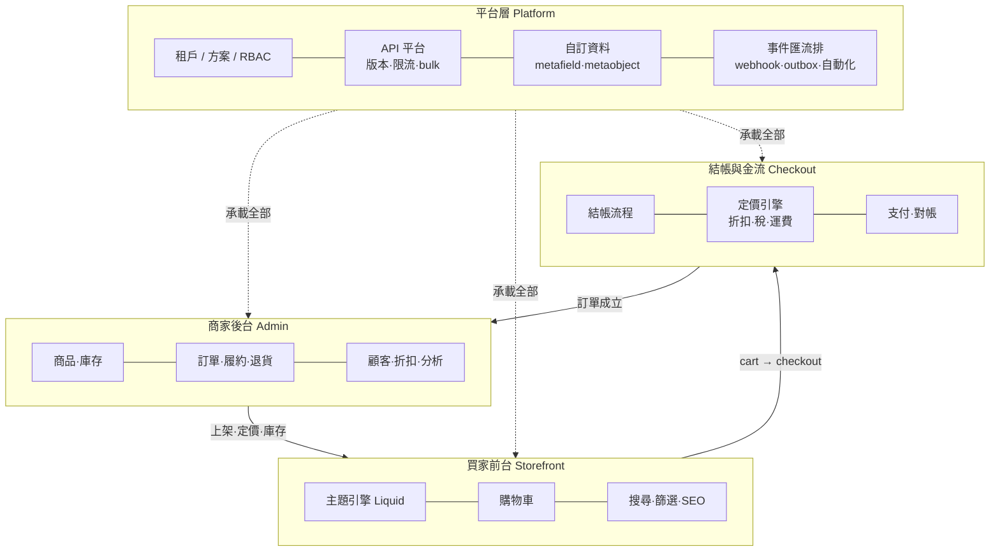
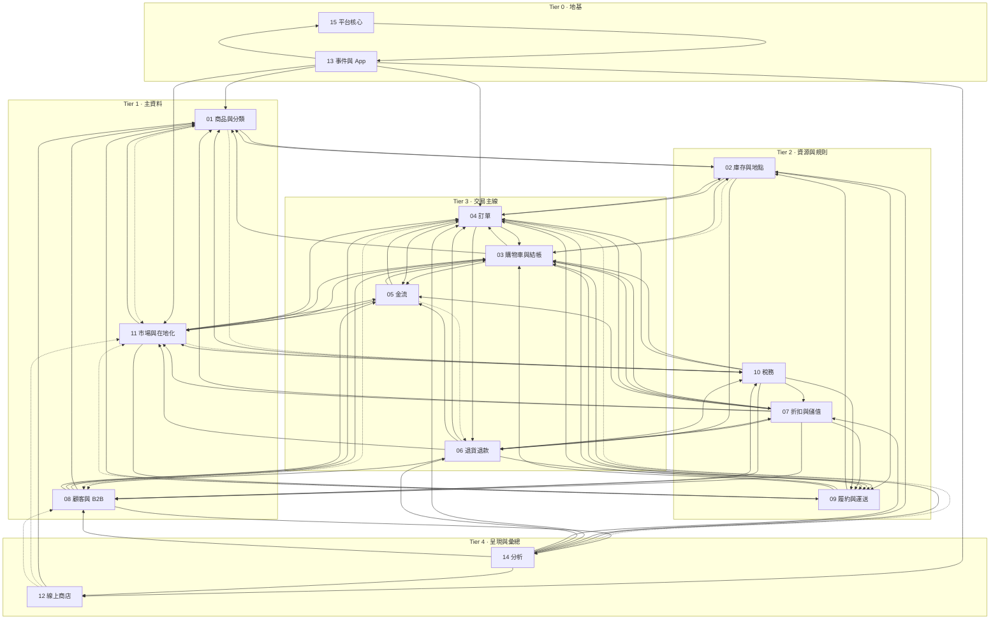

# 90 — Shopify 業務邏輯總綱（可落地開發版）

> **這是什麼**：把 Shopify 2026 的**業務邏輯**（不是 UI、不是代碼）拆解到「工程師可以照著建表、寫狀態機、排實作順序」的程度。考掘日 **2026-08-14**，來源以 `shopify.dev`（含 Admin GraphQL 物件／enum／mutation 參考頁）與 `help.shopify.com` 為主，逐條標註 URL 與取證日期。
>
> **與既有文件的關係**：`docs/research/00-10` 是模組研究的百科、`21/22/44/59/60/7x` 是 admin 實測 teardown、`docs/specs/11-19` 是我方生產級規格。**本檔補的是第三種東西**——把散落在三處的「業務規則」收斂成**單一份跨模組的邏輯正典**：狀態機全集、不變量與公式、事件與耦合方向、上限值、以及每一條「本尊怎麼做 vs 我方裁定怎麼做」。
>
> **分章**：本檔是總綱（跨模組），15 個領域的細節在 `docs/research/91`–`105`，章號對應見 §10。
>
> 🔴 **本檔不是裁定文件**。它記錄本尊的行為與我方既有裁定；§7 列出的未決問題**必須由使用者裁定或實測本尊**後才可動工，不得靜默採用建議值。

---

## 0. 怎麼用這份文件

> 🔴 **D- 識別字命名空間規則（2026-08-17 補，PR #52 首輪 🟡）**：本檔有三套形近編號——
> §3 狀態機列用**無連字號**（D7／G2）；§4 不變量用 **D-1..D-19**；§6 裁定用 **D-01..D-102**
> （各章 F 節另有章內 F-D-n）。D-10～D-15 在 §4 與 §6.1 完全同形 ⇒ 跨節引用**必須帶節號**
> （「§3 D7」「§4 D-7」「§6 D-07」），裸寫 D-n 視為 §6 裁定。

| 你要做什麼 | 先讀 |
|---|---|
| 排整體實作順序 | §9 實作排序 → §2 端到端主幹 |
| 建一張表 / 寫一個 model | §3 狀態機總表 → 對應分章的 §A（物件模型）|
| 寫一支 mutation | 分章 §C（業務規則）＋ §4 併發要害 ＋ §6 裁定登記 |
| 決定「這件事該同步還非同步」 | §5 耦合契約清單 |
| 寫測試 | §4 不變量目錄（每條都寫成可斷言形式）＋ §9 各里程碑測試門檻 |
| 查一個上限值 | §8（可直接貼進 `config/limits.yml`）|
| 卡住了、規格沒寫 | §7 未決問題總表——若在表上，代表**本專案已知道它未決**，照表上的解法走；不在表上才問使用者 |

**閱讀約定**：`§04 B.1` 指第 04 章（訂單）的 B.1 節；⚠️ 表示官方文檔未明文、屬推定或待實測；🔴 表示做錯會造成資料損毀或金錢損失的條款。

---

## 1. 系統模型：四個平面、五個維度、三本帳

### 1.1 四個平面



四個平面的**責任邊界**是本專案最容易被寫壞的地方，三條界線寫死：

1. **前台不計算最終金額**。購物車顯示的是**預估**；稅、運費、關稅、部分折扣只有結帳階段才算得準（§03 C.6）。前台算出來的數字不得落庫、不得當作訂單金額。
2. **訂單成立後不再回頭跑定價引擎**。訂單上的每一行都是**下單瞬間的快照**（§04 A.1、`docs/specs/87`）；商品改價、改標題、下架都不得回寫既有訂單。
3. **平台層不含業務語義**。事件匯流排只管投遞，不管「訂單能不能取消」；限流只管成本，不管「這個商家買了什麼方案」——方案 gating 是平台層的**資料**，判斷發生在業務層。

### 1.2 五個橫切維度

任何一張業務表、任何一次查詢，都要先問「這五個維度我帶齊了嗎」：

| 維度 | 是什麼 | 落在哪 | 做錯的後果 |
|---|---|---|---|
| **租戶 shop** | 資料隔離的根 | 🔴 全業務表帶 `shop_id`，複合索引以它開頭（鐵律 2；組織層身分表為白名單豁免） | 跨租戶資料外洩 |
| **地點 location** | 庫存、履約、POS、運費的共同軸 | `inventory_levels`、`fulfillment_orders.assigned_location`、運費 profile 覆寫 | 多倉商家的可售量與出貨全錯 |
| **市場 market** | 幣別、語言、網域、定價、稅務、可售性 | catalog／price list／web presence／jurisdiction pack | 國際訂單收錯錢、稅算錯 |
| **管道 publication** | 同一商品可在多通路上架 | `publications` × `resource_publications`（§01 B.4） | 商品「明明是 active 卻買不到」 |
| **語言 locale** | 內容翻譯與顯示格式 | translations（資源 × 欄位 × locale）＋ 顯示格式（§11 C.1） | 切語言掉內容、金額格式硬編 |

🔴 **可見性 ≠ 可購買性**。商品能不能被看到（狀態 × publication × market catalog × 密碼頁）與能不能被買到（庫存政策 × 變體可用 × 通路）是**兩組獨立條件**，四態商品（含 `UNLISTED`）的存在本身就是證明（§01 B.1）。實作必須把它們寫成兩個獨立謂詞，不得共用一個 `published` 布林。

### 1.3 三本帳

系統裡有三本必須各自平帳、且**不可互相推導**的帳：

**① 庫存帳（量化 8 態，§02 A.2）**

```
on_hand = available + committed + reserved + damaged + safety_stock + quality_control
incoming 永不計入 on_hand（在途，收貨後才轉入）
```
`committed` 與 `incoming` 是**唯讀推導態**——只能由訂單成立／履約／到貨事件改變，任何直接寫入即 bug。

**② 金流帳（交易 ledger，§05 A.3）**

訂單的金流狀態是**由交易列推導**的，不是一個可以直接寫的欄位：
```
netPayment = Σ(SALE + CAPTURE 成功) − Σ(REFUND 成功)
displayFinancialStatus = f(訂單總額, netPayment, 授權狀態)   // derived
```
🔴 任何「直接把 financial_status 改成 PAID」的代碼路徑都是錯的；正確做法是**建一筆交易**，讓狀態自己被推導出來（§04 B.2 的 `orderMarkAsPaid` 即是如此：它建交易，不是改欄位）。

**③ 金額帳（銷售恆等式，§14 C.1）**

```
gross_sales  = Σ(商品單價 × 數量)                              // 稅、運費、折扣、撤銷之前
net_sales    = gross_sales − discounts − sales_reversals       // 🔴 可以是負數
total_sales  = net_sales + taxes + duties + shipping + fees
```
🔴 `sales_reversals`（**撤銷**）不等於「退貨」——它是退款／退貨／取消／訂單編輯造成的負向調整統稱——**記帳口徑拆分量**：商品段（gross−discounts）調整入 sales_reversals 本欄；對運費·稅·關稅·費用的調整**各入該分量的淨值**，不重複塞進本欄（§14 C.1 更正式（2026-08-17 更正，PR #52 第 11 輪）：原「涵蓋對運費、稅、費用、折扣的調整」會與已取淨分量雙扣，同 §14 C.1）。`docs/specs/86` §3.2 管**來源互斥**（refunds／取消／編輯去重疊），金額段口徑＝商品段（86 已同步回寫（2026-08-17 更正，PR #52 第 12 輪））。分析線叫撤銷、訂單線叫退貨，**兩線用詞不同是本尊的事實，照抄**；資料欄名跟語義走、不跟 UI 走。

三條公式必須是**同一份 rollup 的欄位**（鐵律 7 數字同源），已知三個官方例外：① **AOV 的分子刻意排除 post-order adjustments**（`AOV = (gross_sales − discounts) / orders`），因此 `AOV ≠ net_sales / orders`；② **Live View 的 total_sales 少算 duties 與 fees**，與報表版本並存——本尊自身不同源；③ `ANY_CLICK` 歸因各通路加總會超過 metric 本身。三條全在 §14 C.1–C.3。

### 1.4 六條全域原則（每一章都適用）

| # | 原則 | 出處 |
|---|---|---|
| 1 | **金額三尺度不同型別**：儲存 ×100（`Money::Storage`）／顯示兩位小數／對外依 PSP pack 宣告格式（`Money::PspMinor` 或 `Money::PspDecimal`）——不同尺度用不同型別與不同識別字後綴，無隱式轉換 | 鐵律 3、`docs/specs/65` |
| 2 | **快照 vs 現值**：訂單行、稅額、折扣分攤、成本（COGS）一律**下單瞬間存快照，永不回寫**；報表維度走哪一軌逐指標定義 | `docs/specs/87`、§14 C.13 |
| 3 | **狀態是推導的還是持久化的，必須先想清楚**：derived 欄位（金流軸、履行軸、可見性）不得允許直接寫入，否則兩份真相必然發散 | §3 總表逐欄標注 |
| 4 | **冪等在寫入路徑是預設，不是選配**：訂單成立、退款、庫存調整、外部投遞一律帶 `idempotencyKey`；transaction 內禁外部 IO，副作用走 outbox | 鐵律 5、§4.3 |
| 5 | **上限值一律查表**：任何數字（變體上限、行數上限、頻率）引 `config/limits.yml`，不得硬編 | 鐵律 6、§8 |
| 6 | **法域能力 pack 化**：稅務憑證、儲值監管、隱私法、幣別格式、稅號格式不是核心功能，核心只發「稅務事件／合規事件」，由 jurisdiction pack 決定要不要落地 | 鐵律 11、§10 |

---

## 2. 端到端主幹：一張訂單的一生

> 本節把 6 章分域考掘（§02 庫存／§03 購物車與結帳／§04 訂單／§05 支付／§06 退貨退款／§09 履約物流）壓成**一條時間軸**。
> 引用格式「§04 B.1」＝該分章的節號。標 ⚠️ 者為**官方未明文**，不得腦補；標 🔴 者為原子性或金額鐵律，違反即事故。
> 本節不重複各章的值域全集與來源表——需要窮舉時回該章。

---

### 2.1 主幹時序表（實作排期的主表）

**讀法**：`庫存量化態`欄的加減一律指**單一 (shop_id, inventory_item_id, location_id)** 三元組（§02 C.5 對帳必須做到單一地點層級，全店加總會把 move 造成的對錯互抵掩蓋）。`事件`欄名稱＝本尊 webhook topic，我方 outbox 事件名 1:1 映射（鐵律 5）。

| # | 階段 | 操作者 | 系統動作 | 狀態變化（實體：從 → 到） | 庫存量化態變化 | 金流變化 | 發出的事件 | 失敗分支 |
|---|---|---|---|---|---|---|---|---|
| S0 | 加入購物車 | buyer | `add.js`：庫存粗檢；行合併鍵＝variant＋properties＋selling_plan＋價格四者全同才併行（§03 C.1；bundle 組件行另帶 `parent_id` 入鍵——Q-44 未決前暫定、防跨父誤併，第 19 輪隨 M2 切片同步） | Cart ∅ → `active` | **無**（cart 階段永不動庫存，§03 C.7-3） | 無 | `carts/create`／`carts/update`（僅線上商店 cart，§03 E.1） | 售罄 ⇒ 不加入回 422；不足 ⇒ 加到可用上限＋422（§03 C.2）。🔴 `update.js` **不驗**已在 cart 內品項的數量（§03 C.2），server 端不得信任 cart 數量 |
| S1 | 進入 checkout | buyer | 建 checkout；帶入品項／note／attributes／折扣碼 | Checkout ∅ → `open` | 無 | 無 | `checkouts/create` | cart 空 ⇒ 不可進入 |
| S2 | 逐步填寫 | buyer | 每步欄位驗證＋**庫存軟檢查（不 hold）**（§03 B.4／D.2-4）；cart & checkout validation 失敗＝阻擋前進非警告（§03 C.9） | `open`（不變）；留 email 後 10 分鐘未完成 ⇒ 疊 `abandoned_at` 旗標（§03 B.2） | 無 | 無 | `checkouts/update` | 庫存不足 ⇒ 錯誤訊息；validation 阻擋；棄單 ⇒ 建 AbandonedCheckout（bot／盜卡測試**不建**，§03 C.8） |
| S3 | 提交付款資訊 | buyer | 送 PSP authorize 或 authorize+capture | `open`（不變） | **我方：無變化**（本尊此刻 hold 庫存，我方不做 hold，§03 F.2#5） | **PSP 呼叫前**先持久化 checkout 級 payment attempt＋outbox 對帳 intent；OrderTransaction 列於 T1 建立並回連 attempt <!-- 2026-08-17 更正（PR #52 Codex）：原寫「OrderTransaction ∅→PENDING」——此刻尚無 order，且與 T1「PSP 回覆後才建列」及 persistence-before-PSP 原則矛盾；若 S4 rollback（庫存丟失/FO 建立失敗），已授權款項靠 attempt＋reconcile job 走補償（void/退款），不留無紀錄授權窗口 -->（kind＝`SALE` 或 `AUTHORIZATION`，§05 B.2） | 無（尚無 order） | 3DS ⇒ `AWAITING_RESPONSE`（§05 A.4）；拒付 ⇒ 47 值 errorCode 之一（§05 A.5），回付款步驟重試 |
| **S4** | 🔴 **訂單成立（原子點 T1）** | 系統 | 取單號 → 建 Order＋LineItem 快照 → order routing → 建 1..N FulfillmentOrder → **庫存 commit** → 寫 ledger → outbox（全部同一 transaction，見 2.2 T1） | Checkout `open` → `completed`；Cart → `deleted`（§03 B.1/B.2）；Order ∅ → `open`；FO ∅ → `OPEN`（`fulfill_at` 未來 ⇒ `SCHEDULED`，§09 B.1-2） | **僅 `tracked=true` 行：`available −q` ／ `committed +q`；`on_hand` 不變**（§02 B.1／C.1；tracked 條件同 §02 B.2「available → committed」列前置——`tracked=false`（數位品等）無 InventoryLevel，commit／ledger／`inventory_levels/update` 全跳過，無條件執行會整單失敗或造出無中生有的庫存列 （2026-08-17 更正，PR #52 第 18 輪））。例外：selling plan `ON_FULFILLMENT` ⇒ 此刻**不進 committed**（§03 D.7-5） | `SALE` SUCCESS ⇒ `PAID`｜`AUTHORIZATION` SUCCESS ⇒ `AUTHORIZED`｜手動付款／payment terms ⇒ `PENDING`（§05 A.6／C.12） | `orders/create`、`fulfillment_orders/order_routing_complete`、`inventory_levels/update`、（付清時）`orders/paid` | `DENY` 且 available 不足 ⇒ 結帳擋單；`CONTINUE` ⇒ 照常成單、available 落負（§02 C.6）；FO 建立失敗 ⇒ 整筆 rollback（單號不回收——語義＝**成功取號後**的取消/刪單不回收；T1 失敗整筆 rollback 時 counter 同交易回滾＝該號**未被消耗**、下一單取得同號**不是重用** （2026-08-17 更正，PR #52 第 9 輪），§04 C.1） |
| S5 | 付款結果非同步落地 | PSP／reconcile job | 收 PSP 回呼或退避輪詢收斂交易狀態；🔴 結清**跨越付清門檻**時，同一 transaction 重算訂單投影（`displayFinancialStatus` `PENDING → PAID`）並發 `orders/paid`＋`orders/updated`（§5.1 承諾的事件） <!-- 2026-08-17 更正（PR #52 Codex 第 2 輪）：原寫「Order 不變、僅發 order_transactions/create」——付款依賴的履約/通知/分析會永遠不知道訂單已付清 --> | 未付清：Order 不變；付清：`displayFinancialStatus → PAID` | 無 | `PENDING → SUCCESS/FAILURE/ERROR`；`AWAITING_RESPONSE` 超時 ⇒ 先查 PSP：查得終局照落、**明確拒絕** ⇒ `FAILURE`＋`PAYMENT_PROVIDER_ERROR`、**查無／無終局 ⇒ `UNKNOWN` 進 R2 收斂**（§05 B.1.1 R1；（2026-08-17 更正，PR #52 第 19 輪）：R1 第 18 輪反轉後本欄同步——舊「查無 ⇒ FAILURE」形＝非終局判死，晚到結清脫離對帳）；`UNKNOWN` 非終態、退避輪詢收斂（R2） | `order_transactions/create`（🔴 **update 也走這個 topic**，§04 E.1）；**付清時另發 `orders/paid`＋`orders/updated`** <!-- 2026-08-17 更正（PR #52 第 4 輪）：事件欄漏列，照此欄寫事件覆蓋測試會漏掉付清事件 --> | 逾 pending 過期日（官方口徑「典型約一週」）⇒ `EXPIRED`；**pending 期間官方明文鎖單**：不可編修品項／折扣／地址、不可 restock、不可取消、不可收款、不可 mark as paid（§05 B.3）——🔴 鎖範圍**僅限「存在未決 PSP 交易」的 pending**；manual 單（COD／bank deposit／payment terms）的 PENDING **不鎖** `orderMarkAsPaid`／收款——§05 C.12 明定 manual 單正靠它結清，無判別會讓全部 manual 單永久未付 <!-- 2026-08-17 更正（PR #52 第 6 輪） --> |
| S6 | 風險評估 | 系統／第三方 app | 各 provider 產 assessment；整單 `recommendation` ＝最壞者勝純函數（§04 B.6，⚠️ 官方未載聚合函數） | riskLevel `PENDING` → `LOW/MEDIUM/HIGH/NONE` | 無 | 無 | `orders/risk_assessment_changed` | 建議 `CANCEL` ⇒ 走分支 C；高風險單**預設不自動履行**（§04 C.6） |
| S7 | 履約整備 | staff／app | `fulfillmentOrderHold` / `ReleaseHold` / `Split` / `Move` / `Merge`（§09 D.4／D.5） | FO `OPEN` ⇄ `ON_HOLD`（判定＝active holds 計數 >0，非布林，§09 C.9-3）；move ⇒ `movedFulfillmentOrder`＋`originalFulfillmentOrder`（§09 B.1-4） | move ⇒ **committed 跨地點遷移**：origin `committed −`、destination `committed +`（§02 B.1）。⚠️ 官方只寫前置與失敗條件、**未寫數量機制**——origin `available +`／destination `available −` 是否同步為**未決對**（§02 B.2 遷移列同對＝Q-23，M2 前置）；未裁前 `fulfillmentOrderMove` 的數量帳**不得動工**——只遷 committed 而 on_hand 不動，兩地點的 S-6 守恆式即刻失衡 （2026-08-17 更正，PR #52 第 18 輪） | 無 | `placed_on_hold`／`hold_released`／`fulfillment_holds/added`／`released`／`split`／`moved`／`merged`（§09 E，履約域共 26 支） | move 禁止條件：FO 已 closed／曾手動 report progress／目的地未備貨該 item／3PL 請求懸置（§09 B.1-4）。**已履約品項永遠留在原 location** |
| **S8** | 🔴 **履行（原子點 T2）** | staff／3PL | `fulfillmentCreate`：條件式累加 `fulfilled_quantity`＋建 Fulfillment＋trackingInfo（見 2.2 T2） | Fulfillment ∅ → `SUCCESS`；FO 全量 ⇒ `CLOSED`，部分 ⇒ 狀態不變；Order `displayFulfillmentStatus` 重物化（derived） | **`committed −q` ／ `on_hand −q`**（§02 B.1／D.1-3） | capture 模式「出貨時」／「每次出貨」⇒ 觸發 capture（**必須排到 transaction 外**，見 2.2 T2）；`AUTHORIZED` → `PAID`／`PARTIALLY_PAID` | `fulfillments/create`、`inventory_levels/update` | 數量超剩餘 ⇒ userError；`ON_HOLD`／`SCHEDULED` ⇒ 不可出貨；逾 `authorizationExpiresAt` ⇒ `EXPIRED` 收不到款（§05 B.2） |
| S9 | 運送事件流 | carrier／app | `fulfillmentEventCreate`（11 值，§09 B.4）；3PL 開 tracking 支援時平台每小時拉單號 | `displayStatus` 為**三軸合成**計算欄（18 值，不落 DB），優先序**逐狀態**：異常/終態 `CANCELLED`/`ERROR`/`FAILURE` **覆蓋**陳舊事件 → 事件流最新一筆（普通 `SUCCESS` **不**搶先——fulfillment 建立即 SUCCESS，若 status 一律優先，事件/label 分支永不可達、運送進度永不顯示 2026-08-17 更正（PR #52 第 6 輪））→ **label/pickup 狀態** → 皆無時 `SUCCESS`→`FULFILLED`（2026-08-17 更正（PR #52 第 7 輪）：原序 FULFILLED 兜底在前會令 label/pickup 分支不可達）（§09 B.5 合成序） <!-- 2026-08-17 更正（PR #52 第 4 輪，Codex）：原寫「由最新一筆事件推導」——取消已送達/在途的 fulfillment 不產生新事件，latest-event 實作會永遠顯示 DELIVERED/IN_TRANSIT -->；首次 `IN_TRANSIT` 落 `inTransitAt` | 無 | 無 | `fulfillment_events/create`／`delete` | ⚠️ 官方**未定義事件間合法順序**，`DELAYED`／`ATTEMPTED_DELIVERY` 可穿插（§09 B.4）；local delivery 無 carrier 事件、不觸發 out-for-delivery／delivered 通知（§09 B.7） |
| S10 | 送達 | carrier | `DELIVERED` 事件寫入同步落 `deliveredAt` | Fulfillment `displayStatus` = `DELIVERED` | 無 | 無 | `fulfillment_events/create` | 🔴 **退貨窗口自送達日起算**（無送達資料 ⇒ fallback 出貨日＋轉運 buffer，⚠️ buffer 天數官方未載，§06 C.5） |
| S11 | 退貨請求／建立 | buyer／staff | `returnRequest`（自助）或 `returnCreate`（商家直建，跳過審核） | Return ∅ → `REQUESTED` 或 ∅ → `OPEN`；建 ReverseFulfillmentOrder；Order.returnStatus 重算；**已封存訂單自動解封存**（§06 B.1 T1／§04 B.1） | **無**——換貨品「庫存在退貨處理前不保留」（§06 C.8） | 無 | `returns/request`／`returns/approve`／`returns/decline` | final sale／窗口過期／單次 >250 行 ⇒ 擋（§06 C.6）；`REQUESTED` **不可直接取消**，只能 approve 或 decline（§06 B.1） |
| S12 | 收貨與 disposition | staff | `returnProcess` 勾收品項 → 每項選 disposition（restock 需選 location）＋釋出換貨品項 | RFO disposition 寫入（`PROCESSING_REQUIRED` 為中間態可再 disposition）；換貨 FO 解 `ON_HOLD` | `RESTOCKED` ⇒ **`on_hand +` ／ `available +`**（reason=`restock`，§02 C.7）；`NOT_RESTOCKED`／`MISSING` 不動帳 | （財務段見 S13） | `reverse_fulfillment_orders/dispose`、`returns/process` | 狀態不符（如已 CLOSED）⇒ `INVALID_STATE` |
| **S13** | 🔴 **退款（原子點 T3）** | staff | 算 suggested（floor 0）→ 建 Refund＋RefundLineItem＋pending REFUND 交易＋restock＋稅務事件＋分析回沖（見 2.2 T3） | Refund ∅ → 存在（🔴 **無 status 欄**，§06 B.4）；Return 全處理且**全行終局 disposition** ⇒ 自動 `CLOSED`（restock 完成要求僅限 RESTOCKED 行——§06 B.1 T5 我方裁定形，第 19 輪隨 D6 同步） | 依 `restockType` 4 值（§06 A.4）：`CANCEL`（未履行 ⇒ 自訂單移除＋`committed −`／`available +`；**僅限 T1 曾 commit 的行**——`ON_FULFILLMENT` 未進 committed 者不動帳，無條件沖減會下溢或憑空回補；`orderCancel` 的回補同此條件 （2026-08-17 更正，PR #52 第 18 輪））｜`RETURN`（已履行 ⇒ `on_hand +`／`available +`）｜`NO_RESTOCK`｜`LEGACY_RESTOCK` 建立時 reject | 建 `REFUND`(parent＝capture/sale)；`PAID` → `PARTIALLY_REFUNDED` → `REFUNDED`（終態）。上限＝`captured − refunded`（**軟上限**，見 2.4 M7） | `refunds/create`（🔴 **在金流確認前即發**，官方語義「independent from the movement of money」，§06 E.1）、`order_transactions/create` | PSP 退款失敗 ⇒ 本地 pending 交易列＋告警＋**同一把 idempotency key** 重試（§06 D.3-5）；退款**不可撤銷**（§06 B.4） |
| S14 | 訂單封存 | 系統／staff | 自動封存（「已付款且已履行」或「已全額退款」）或 `orderClose` | Order `open` → `closed`（`closedAt`）；`cancelled` 與 `closed` 可疊加（§04 B.1） | 無 | 無 | `orders/updated` | 建立退貨會**自動解除封存**（§04 B.1 互鎖）；「所有品項已履行或已取消 AND 所有金流交易完成」＝**自動封存的資格判定式**；手動 `orderClose` **無前置**（官方允許歸檔未付/未履行單）——把判定式寫成 closed 的不變量會拒絕合法手動歸檔 （2026-08-17 更正，PR #52 第 8 輪） |
| S15 | 款項入帳（撥款） | PSP | capture 產生的 balance txn（`net = amount − fee`）過結算期轉 available → 排程日聚成 payout | Payout `SCHEDULED` → `PAID`／`FAILED`／`CANCELED`（§05 B.4） | 無 | 資金實際入商家帳戶 | 我方自定 payout 事件（本尊無對應 order topic，§05 E） | 負餘額（退款/拒付 > 銷售）⇒ **撥款暫停**直到沖平；銀行退件 ⇒ `FAILED` 後續款停擺（§05 C.8） |
| S16 | 爭議（可在 S8 之後任意時點插入） | 持卡人 | dispute 建立 | `INQUIRY`／`CHARGEBACK`；`NEEDS_RESPONSE` → `UNDER_REVIEW` → `WON`／`LOST`（§05 B.5） | 無 | CHARGEBACK 立案 ⇒ **立即從下一次可用 payout 扣爭議額＋fee** | `disputes/create`、`disputes/update` | 裁定終局不可上訴；🔴 **勝訴仍計入 dispute rate**（KPI 分子不得剔除 WON，§05 C.10） |
| S17 | 分析歸檔 | 系統 | rollup 消費 outbox 事件 | — | — | — | — | 🔴 記帳日雙軌：**銷售記成立日（正值）／reversal 記處理日（負值）**，退貨不回頭改原訂單日（§06 C.10）。`total_sales` **可以是負數**；`AOV` 分子**刻意排除** post-order adjustments，不與 `net_sales` 同源（鐵律 7 官方例外） |

**主幹上的三個非同步側支**（不在主線但同時間軸推進，實作排期需一起排）：

| 側支 | 起點 | 終點 | 與主線的耦合點 |
|---|---|---|---|
| 棄單挽回 | S2 留 email 後 10 分鐘 | 完購（S4，報表推導為 recovered）或 3 個月自動刪除 | 寄信前**重查**六條不寄條件（§03 C.8）——條件是時變的 |
| 訂閱／預購後收 | S4（行含 selling plan） | 各期 billing attempt 生成新訂單 | `ON_FULFILLMENT` 政策把 commit 從 S4 推遲到 `fulfillAt` 到點 FO 轉 `OPEN`（§03 D.7-5）；M0–M6 不實作，schema 以 §03 A.7 為藍本預留 |
| 撥款與對帳 | S4／S8 的 capture | S15 payout `PAID` | balance txn append-only；payout 只收 `issuedAt` 前 available 的 txn，rollup 不得把 pending txn 算進已撥款（§05 C.13-4） |

---

### 2.2 三個關鍵時點的原子性契約

> 共同前提（鐵律 5）：**transaction 內禁外部 IO**。三個時點的通式一致——「狀態變更＋帳＋outbox 一起 commit；所有網路呼叫由 outbox relay 在 transaction 外執行」。所有三點皆強制 `idempotencyKey`。

#### T1 — 訂單成立瞬間

| 同一 transaction 內**必須一起發生** | 依據 |
|---|---|
| 取單號：per-shop 序列 1001 起、逐筆 +1、**只進不退**（取消/刪除不回收）；prefix/suffix 取當下快照 | §04 A.2／C.1 |
| 建 `Order`（生命週期軸 `open`）＋ LineItem 下單快照（快照欄永不回寫） | §04 A.1／B.1 |
| 結帳側收尾：Checkout `completed`＋`completedAt`、Cart 刪除 | §03 B.1／B.2 |
| order routing 決策落地 → 建 1..N `FulfillmentOrder`（**不可手建**）＋ `assignedLocation` **地址快照內嵌欄位**（不得只存 `location_id`） | §09 A.1／D.1 |
| 庫存 commit：逐地點條件式 UPDATE `available = available − q WHERE available >= q`（`DENY` 時），同時 `committed += q`；`on_hand` 不動 | §02 B.1／C.1／C.6 |
| ledger：`InventoryAdjustmentGroup`＋`referenceDocumentUri`＝order GID（ledger 是唯一入口，批量路徑也不例外） | §02 C.3／F.2#9 |
| 建 `OrderTransaction` 列（`PENDING`，或 PSP 已回終局時直接落 `SUCCESS`） | §05 B.1 |
| outbox 寫入：`orders/create`、`fulfillment_orders/order_routing_complete`、`inventory_levels/update`、（付清時）`orders/paid` | §03 E.1／§04 E.1／§09 E |
| **draft 轉正路徑另加**：`draft.status=COMPLETED`＋`completedAt`＋`order` 回填＋metafields 單向複製＋庫存遷移**分支**（曾設 `reserveInventoryUntil` 者 `reserved → committed` 原子遷移；未保留者走本表標準條件式 `available → committed`——`reserveInventoryUntil` 可選，無條件 reserved→committed 對未保留草稿會把 reserved 打負 <!-- 2026-08-17 更正（PR #52 第 5 輪） -->，與 A4 對齊） | §04 B.4／D3-5；§02 C.1 |

| 必須排到 transaction **外** | 理由／落法 |
|---|---|
| 呼叫 PSP（authorize／capture） | 外部 IO。checkout 路徑下 PSP 已在 S3 回覆，T1 落的是**結果**；「先落庫 pending → 再送 PSP」是唯一合法順序 |
| 訂單確認信、出貨通知信、發票 email | 通知模組，經 outbox relay |
| webhook／outbox 投遞 | relay 程序 |
| 風險評估產出（`orders/risk_assessment_changed`） | 本來就非同步（§04 D8） |
| 通知 3PL（`fulfillment_order_notification`） | 外部 HTTP |

🔴 **本時點的三個高頻誤解**：①「付款成功才扣庫存」——錯，觸發是**訂單成立**（COD／bank deposit／payment terms／admin `PENDING` 單都是已成立未付款，仍要 commit，§03 C.7-3）；②`orderCreate` 省略 `options.inventoryBehaviour` ⇒ 預設 `BYPASS` **完全不扣**（§04 C.2，官方明標），我方 admin／內建匯入工具一律顯式帶值；③單號序列與庫存扣減必須**同生共死**，否則 rollback 後留下號碼空洞或幽靈占用。

#### T2 — 履行瞬間

| 同一 transaction 內**必須一起發生** | 依據 |
|---|---|
| 條件式累加：`UPDATE ... WHERE fulfilled_quantity + q <= quantity`（防兩個 staff 同時全量出貨） | §09 C.9-2 |
| 建 `Fulfillment`(`SUCCESS`)＋`FulfillmentLineItem`＋`trackingInfo`（多包裹＝多 number/url，company 套全部） | §09 A.1／D.2 |
| FO 推進：全量 ⇒ `CLOSED`；部分 ⇒ 狀態不變；3PL 情境同步 `requestStatus` | §09 B.1 |
| 庫存：**同一 location** `committed −q`、`on_hand −q`＋ledger 同 transaction——🔴 **僅 tracked 品項行**（digital/untracked 無 InventoryLevel，動帳下溢或失敗；§09 D.2 （2026-08-17 更正，PR #52 第 10 輪））。本限定為**全域**：本表與全文所有履約動帳列（含 S7/S8/移轉/退款 restock）皆同 | §02 B.1／D.1-3 |
| Order `displayFulfillmentStatus` 重物化（derived cache，不可獨立改寫） | §04 B.3 |
| outbox：`fulfillments/create`、`inventory_levels/update` | §09 E |

| 必須排到 transaction **外** | 理由 |
|---|---|
| 🔴 **capture**（capture 模式「整單出貨時」／「每次出貨」自動觸發） | 外部 IO。落法＝transaction 內只寫「capture 意圖」進 outbox，relay 後打 PSP，回來再建 `CAPTURE` 交易列。⚠️ per-fulfillment capture 是 Plus 分層，且**一旦手動 capture 或發生退貨該單自動化即停止**（§05 C.2） |
| 面單購買／carrier 取號 | carrier pack（§09 F D4），外部 API |
| 出貨通知信、`fulfillment_order_notification` | 通知／3PL |

🔴 **品項守恆是本時點的驗收不變量**：同一 order 的 FO（含 cancel 替代單、split 兩半、move 產物）對每個 line item 的數量總和 ≡ 訂單可履約數量（§09 C.9-1）——**取數必須排除已被替代的歷史段**：部分出貨遭 `fulfillmentCancel` 時被取消量建新 FO、原 FO 已出貨段留史（§09 B.3），直接 Σ 全部 FO totalQuantity＝訂單量＋替代量雙計；等價操作式＝`Σ FO.remainingQuantity ＋ Σ 非 CANCELLED fulfillment 量`（2026-08-17 更正，PR #52 第 11 輪）。

#### T3 — 退款瞬間

| 同一 transaction 內**必須一起發生** | 依據 |
|---|---|
| 行鎖重讀 `captured_total_cents` / `refunded_total_cents`，**條件式 UPDATE** 檢查 `new_refund_cents ≤ captured − refunded + approved_over_refund_cents`（等價形 `refunded + new ≤ captured + approved`；🔴 不得寫成「Σrefunds ≤ captured − refunded + …」——Σ 為累計義時已退款被扣兩次，100 captured／40 refunded／合法新退 30 會被誤拒 <!-- 2026-08-17 更正（PR #52 第 4 輪，Codex） -->）（`approved_over_refund_cents` 預設 0，僅在 `allowOverRefunding=true`＋`orders.over_refund` 權限＋二次確認通過後由授權分支寫入——與 §4 R-2/R-3、§2.4 M7 對齊；禁止先 SELECT 再 INSERT） <!-- 2026-08-17 更正（PR #52 Codex）：原式無條件用 captured − refunded，會把 M7 明載合法的 over-refund（已退 store credit 改退原卡）擋死，與自家 R-2 矛盾 --> | §06 C.2 |
| 建 `Refund`（**不建 status 欄**）＋`RefundLineItem`（帶 `restockType` 4 值） | §06 A.4／B.4 |
| 建 `OrderTransaction`(kind=`REFUND`, status=`PENDING`, parent＝capture/sale) | §05 B.2 |
| restock：依 restockType 動庫存＋ledger（冪等 key **兩路**：退款時 restock＝`refund_line_item` id；**收貨時 restock＝return/RFO disposition line id**——returnProcess 允許財務動作選 Later，收貨回補可先於任何 Refund 存在；🔴 互斥**機制**＝restock 動作寫入 **disposition 單位級 guard**（`restocked_disposition_units` 唯一鍵：disposition line id），兩路對同 disposition 單位一律**原子 claim**（INSERT 該 guard 唯一鍵，**成功者才動庫存**；duplicate-key ⇒ 已回補、跳過）——「先查再跳過」的 pre-check 兩併發交易可同見無 guard 而雙回補；僅稱「互斥」無機制，兩把不同鍵各自唯一仍可雙回補 （2026-08-17 更正，PR #52 第 8 輪；claim 原子化第 11 輪）） <!-- 2026-08-17 更正（PR #52 第 4 輪，Codex）：原單一 refund_line_item key 對「先收貨後退款」路徑無鍵可用 --> | §06 D.3-4 |
| 未履行品項的 `CANCEL`：**該品項自訂單移除且不可再履行**（同時 `committed −`） | §06 D.4-3 |
| 禮品卡餘額回加／store credit `credit` 交易（**內部帳，不是外部 IO**，可同 transaction） | §06 D.5／C.7 |
| 稅務事件（只發事件，不落憑證——憑證由 jurisdiction pack 決定：HK 無／TW 折讓／MY e-Invoice） | §06 F.2#6；鐵律 11 |
| 分析回沖 outbox 事件（`sales_reversals` 記**處理日**，不回改原訂單日） | §06 C.10 |
| `displayFinancialStatus` 重物化（由交易推導，不可獨立改寫；**REFUND 為 PENDING 時投影不變——改投影待該交易 SUCCESS**（R-11；第 20 輪限定）。SUCCESS 出口**分目的地**（第 21 輪分支、第 22 輪拆型）：外部金流（PSP 卡退）＝webhook 確認後轉；**帳本內即時型（禮品卡餘額回加／store credit 寫入——餘額即錢本身）＝同一本地 transaction 內即建 status=SUCCESS**；**線下待確認型（manual 家族：bank_deposit／COD 退匯——錢在系統外流動）＝停 pending，人工確認（16 §F5 步 3 落地格）條件式 UPDATE 後轉**（第 24 輪併一路——COD 對帳檔僅收款列（方向＝物流商代收撥商家），對帳形出口對退款不可達（第 25 輪刪原第二理由「58 §K13 全 false」＝誤讀，第一理由單獨成立）；§F4.4 僅作 UPDATE 形狀先例，不作退款出口）。判準＝退款目的地是否即為平台帳本內餘額——無 PSP 可等卻照單一 webhook 出口寫＝投影永卡 PAID；線下型即判 SUCCESS＝錢未出帳即宣稱已退） | §05 F.3-1 |
| outbox：`refunds/create`（金流未動即發）、`returns/process`、`order_transactions/create` | §06 E.1 |

| 必須排到 transaction **外** | 理由 |
|---|---|
| 🔴 **送 PSP 退款指令** | 外部 IO。「先打 PSP 再落庫＝退了錢沒紀錄」（§06 D.4-2） |
| 退款通知信 | 通知模組 |

🔴 **金額鐵律在本時點最容易出事**：送 PSP 的退款金額必須經 65 §D 轉換成**該 PSP pack 宣告的格式**（`minor_units` 或 `decimal_string`）；把儲存值（一律 ×100）直送＝JPY 收/退 100 倍，而 HKD／USD 全綠。退款上限比對亦然——拿 PSP 回報值直接比 checkout 金額，每張 JPY 訂單會被判金額不符（鐵律 3）。

🔴 **退款金額公式的三個捨入點**（§06 C.1）：折扣／稅分攤（最大餘數法）、restocking fee（floor，費用取小 ⇒ 退款取大）、零小數幣別跨界（**raise 不 round**）。`suggested_refund = max(0, net)` 不得為負；負值走 `balance_to_collect` 向買家收款。

---

### 2.3 四條分支流程

#### 分支 A — 草稿訂單轉正

| 步 | 操作者 | 動作 | 狀態／庫存／金流 |
|---|---|---|---|
| A1 | staff | `draftOrderCreate`（至少 1 行；自訂品項**不入庫存**） | DraftOrder ∅ → `OPEN`，取 `#D` 獨立序號（§04 B.4／C.5） |
| A2 | staff | （選）設 `reserveInventoryUntil` | 庫存進 **Unavailable／`reserved`**（我方 bucket `draft_reserved`）——🔴 **不是 committed**（§02 C.1／§03 無涉）。⚠️ 保留落在**哪個 location** 官方未明文（§02 D.3-2），我方推定＝routing 預演首選地點 |
| A3 | staff | `draftOrderInvoiceSend` | `OPEN` → `INVOICE_SENT`＋`invoiceSentAt`；email 含 checkout 連結。⚠️ 之後改內容合法但**已算出的運費不會自動更新**（§04 B.4） |
| A4 | buyer／staff | 顧客走 invoice checkout 付款／admin 標記已付／`draftOrderComplete`／付款條款完成 | 🔴 **T1 的變體**：同 transaction 建 Order（**另取**訂單序列新號）＋庫存遷移**分支**——曾設 `reserveInventoryUntil` 者 `reserved → committed` 原子遷移；未保留者走 T1 標準條件式 `available → committed`（`WHERE available >= q`，依 inventory policy 擋單或落負） <!-- 2026-08-17 更正（PR #52 第 4 輪，Codex）：A2 保留是可選的，原無條件 reserved→committed 對未保留草稿會把 reserved 打負或失敗 -->＋`draft.status=COMPLETED`＋`completedAt`／`order` 回填＋metafields 單向複製 |
| A5 | 系統 | — | 事件：`orders/create`＋`draft_orders/update`（轉正發 update **不是** delete）＋（付清時）`orders/paid`（§04 E.1） |
| 失敗 | — | 庫存不足 ⇒ 顧客無法完成 checkout（解法＝先保留品項）；**先手動 mark paid ⇒ invoice 連結失效**（§04 D3-6） | |
| 邊界 | — | 付款條款路徑（`Due on receipt`／`Due on fulfillment`／Net 7–90／`Fixed date`）⇒ 立即轉正但金流非 `PAID`；`amountDueNow + amountDueLater = totalPrice`（§04 C.9）。⚠️ 轉正後金流的精確枚舉值官方未載 | |

`COMPLETED` 為終態，**不可回 draft**；要改內容走正式單的 order edit（分支 B）。

#### 分支 B — 訂單編輯 commit

| 步 | 操作者 | 動作 | 狀態／庫存／金流 |
|---|---|---|---|
| B1 | staff | `orderEditBegin` | 建 `CalculatedOrder`；我方另加 **session 單開鎖（unique index）＋TTL 24h**（官方空白，§04 F.2#5） |
| B2 | staff | staged mutations 累積（`stagedStatus`＝`ADDED`/`REMOVED`/`UNCHANGED`） | 稅**自動重算**；運費**不自動重算**（§04 C.4）。可做：加/移商品、調數量、調運費、加行項手動折扣；🔴 **order 層折扣不可加/移/改**、discount code/script/自動折扣不可改、不可改配送方式 |
| B3 | staff | `orderEditCommit(notifyCustomer, staffNote)` | 🔴 同 transaction：品項差異落地＋FO line items 同步＋庫存增減（加品／增量 ⇒ **走 T1 同一條件式庫存服務** `WHERE available >= q`（DENY 下不足即拒絕 commit）——edit session 單開鎖只鎖同一張單，**跨單併發搶最後一件靠條件式 UPDATE 序列化**，並發測試須含兩張不同訂單同時加購同一末件 <!-- 2026-08-17 更正（PR #52 第 4 輪，Codex）：原寫裸 available−/committed+，跨單併發可雙雙成功而超賣 -->；減品 ⇒ 依 restock 決策回補）＋outbox |
| B4 | 系統 | — | 事件：`orders/edited` **與** `orders/updated` 並發（§04 E.1） |
| B5 | 系統 | 差額結算（**transaction 外**） | 總額增 ⇒ 寄更新發票收款；總額減 ⇒ 走退款流程（＝T3） |
| 失敗 | — | 不可編輯聯集（九條 guard）：app 建立的單／Shop Pay Installments／local delivery 單／pending payment（未決 PSP 交易形2026-08-17 更正（PR #52 第 7 輪））中的品項與折扣／已履行品項不可移除或調量／order 層折扣／非手動折扣／改配送方式／封存單（§04 C.4）。**pending payment 期間官方明文鎖單**（§05 B.3） | |
| 分析 | — | 編輯後訂單在報表以**獨立分錄**呈現；金額差異進 `sales_reversals`（§04 C.4／§06 C.10） | |

#### 分支 C — 取消訂單

| 步 | 操作者 | 動作 | 狀態／庫存／金流 |
|---|---|---|---|
| C1 | staff | admin 取消對話框：原因必選＋退款方式三選一（原付款方式／store credit／稍後）＋`restock`／`notifyCustomer` **預設勾選** | ⚠️ admin 預設與 API 預設**不同**：API 側 `restock` 為必填、`notify` 預設 false（§04 C.3），兩層預設都照抄 |
| C2 | 系統 | `orderCancel`（**async job**，強制冪等，同單只執行一次） | guard 聯集七條：已取消／pending authorization／active return／不可履行的未結出貨／**部分履行後**／排程付款中／三方管道限制（§04 C.3） |
| C3 | 系統 | job 完成（同 transaction） | Order → `cancelled`（`cancelledAt`＋`cancelReason`＋`OrderCancellation.staffNote`）；**全部 FulfillmentOrder 關閉**；`restock=true` ⇒ `committed → available`（`on_hand` 不變，§02 B.1） |
| C4 | 系統 | 金流終態 | 未請款 ⇒ `VOIDED`（🔴 是**付款**的狀態，訂單本身可仍 open，§05 A.6）；已退 ⇒ `REFUNDED`；先取消後補退 ⇒ `PARTIALLY_REFUNDED`（§04 C.3） |
| C5 | 系統 | — | 事件：`orders/cancelled`；timeline 記退款與回補明細；符合條件者**自動封存**（§04 B.1／D7） |
| 失敗 | — | 🔴 **停用地點 × 已付款 × `restock=true` ⇒ 整體失敗**；未付款成功但不回補（§02 C.9-5） | |

`cancelled` 是商業終態（**無 uncancel**）；`closed` 才可逆（`orderOpen`）。

#### 分支 D — 退貨換貨

| 步 | 操作者 | 動作 | 狀態／庫存／金流 |
|---|---|---|---|
| D1 | buyer | `returnRequest`（僅**已送達**品項；≤250 行；`customerNote` ≤300 字） | Return ∅ → `REQUESTED`；🔴 **換貨不能自助申請**（§06 C.6） |
| D2 | staff | `returnApproveRequest`（**不可逆**）或 `returnDeclineRequest`（reason 必填、僅內部可見，被拒品項**可再建新退貨**） | `REQUESTED` → `OPEN`／`DECLINED`（兩者皆為單向） |
| D2' | staff | `returnCreate` 直建（跳過審核）＋「Add products」加換貨品項 | Return ∅ → `OPEN`；換貨行**加進原訂單**（不另開新訂單，§06 A.3）；換貨 FO 建為 `ON_HOLD`＋reason `AWAITING_RETURN_ITEMS`（§09 A.1／§06 C.8） |
| D3 | — | 換貨定價 | 商品層折扣可套、🔴 **訂單層折扣禁止**；換貨品**不能是自訂品項**（§06 C.8） |
| D4 | staff | `returnProcess`：勾收品項＋disposition（`RESTOCKED` 選 location）＋釋出換貨品項＋財務段 | 庫存：`RESTOCKED` ⇒ `on_hand +`／`available +`；換貨品 hold 釋放後才進 `committed`（§06 C.8「退貨處理前不保留」） |
| D5 | staff | 差額三情境 | 商家欠買家 ⇒ 退款（＝T3，可 now／later）；買家欠商家 ⇒ 寄 invoice 或訂單頁刷卡；等額換 ⇒ 自動軋平、**金額零流動** |
| D6 | 系統 | 自動關閉 | 條件＝**每個品項都已處理且每個退貨品項都有終局 disposition**——restock 完成的要求**僅限選 `RESTOCKED` 的行**；`NOT_RESTOCKED`／`MISSING` 也是合法終局，寫成「全部已 restock」會讓含這兩種處置的退貨永不自動關閉、滯留 OPEN 等人工 （2026-08-17 更正，PR #52 第 18 輪） ⇒ Return → `CLOSED`（可 `returnReopen` 回 `OPEN`） |
| D7 | staff | `returnCancel`（五前置全成立）：①未退款 ②未 restock ③未標記已退回 ④無平台產生的退貨標籤 ⑤fulfillment 未被取消 | `OPEN` → `CANCELED`（**單 L**）；銷售紀錄全反轉；**換貨品項不受影響**；🔴 **取消後不可重開**，只能另建新退貨 |
| 分析 | — | 等額換貨：金額 `sales_reversals` 淨 0、件數 `returned_quantity` +1（§06 C.10）——雙重扣除測試的必測形態 | |
| 互鎖 | — | 訂單有 **active return** ⇒ 不可 `orderCancel`（§06 C.9）；反向：fulfillment 已取消 ⇒ 退貨不能取消 | |

---

### 2.4 跨章矛盾登記

> 只登記**同一時點被兩章描述得不一致**者。每條給「本總綱採用哪一個＋為什麼」。已在分章內自行收斂者（如 §02 已回寫 restockType 4 值）列為**已收斂**，供覆核追溯。

| # | 矛盾點 | 甲說（章節） | 乙說（章節） | 本總綱採用 | 理由 |
|---|---|---|---|---|---|
| M1 | **庫存 commit 的觸發時點** | §03 B.4：hold 在「提交付款資訊」那刻，commit 在「付款成功」 | §02 B.1：`available → committed` 的觸發＝**訂單成立**（含 draft 轉正） | **乙（訂單成立），且我方不做 hold 機制** | COD／bank deposit（§05 C.12 下單即成單、金流 `PENDING`）、B2B payment terms（§04 B.4）、`orderCreate` 的 `PENDING` 單（§04 C.2）**全都是「訂單已成立、付款未成功」**。寫成「付款成功才扣」會讓這三類訂單完全不占庫存 ⇒ 超賣。超賣防線改由 T1 的**原子條件式扣減**承擔（§03 F.2#5 已同向裁定，並要求回頭修正 15-F5 的措辭） |
| M2 | **checkout 路徑下「付款成功＝訂單成立」是否可寫進通則** | §03 D.3-2：付款成功 ⇒ 訂單成立、cart 刪除、庫存 commit（同刻） | §02 B.1／§03 C.7-3：commit 的一般化觸發是訂單成立 | **同刻只是 checkout 路徑的特例，不得上升為通則** | 這是 M1 的孿生誤解。程式碼裡 commit 的呼叫點必須掛在「訂單成立」事件上，不得掛在「付款 SUCCESS」回呼上 |
| M3 | **API 匯入單扣不扣庫存** | §02 B.1 通則：訂單成立即 commit | §04 C.2／[S34]：`orderCreate` 省略 `options.inventoryBehaviour` ⇒ 預設 **`BYPASS` 完全不扣** | **乙——這是通則的官方明文例外，照抄** | 官方在 `OrderCreateOptionsInput` 明標預設值，屬 1:1 對齊義務。我方**加嚴一層**：admin／內建匯入工具呼叫時一律顯式帶 `DECREMENT_*`，並加 lint／測試防「以為匯入有扣庫存」的靜默超賣（§04 F.2#17） |
| M4 | **deferred purchase 的 commit 時點** | §02 B.1：訂單成立 | §03 D.7-5：selling plan inventory policy `ON_FULFILLMENT` ⇒ 建單時**不進 committed**，等 `fulfillAt` 到點 FO 轉 `OPEN` 才 commit | **兩者並存：commit 觸發必須參數化，不得硬編** | 庫存服務對外只認「commit 事件」，由訂單／FO 兩處按 selling plan 政策決定何時發。M0–M6 不實作訂閱，但**參數化的介面現在就要留**，否則 D.6 餘額後收一實作就得改核心。⚠️ `ON_SALE` 與 `SCHEDULED` FO 並存（收全款但延後出貨）的交集時點**官方未明文**（§03 D.7-5） |
| M5 | **草稿單保留的量化態落點** | §02 C.1／§03：draft 保留＝**Unavailable／`reserved`**，官方明文「draft 轉正式單前不算 committed」 | §04 B.4 轉正副作用寫「**為品項保留/扣庫存**」（語焉不詳，可讀成 committed） | **甲**：draft 期（**曾保留者**）＝`reserved`（我方 bucket `draft_reserved`）；轉正瞬間 `reserved → committed` **原子遷移**（未保留草稿走 T1 條件式 available→committed，見 A4） | §02 C.1 有官方逐字支持（「放入 Unavailable 狀態」）；§04 的措辭是 help 頁的口語彙總。⚠️ 保留落在**哪個 location**、以及轉正瞬間的原子語義**官方均未明文**（§02 D.3-2／D.3-3），列 parity 實測項；我方推定＝routing 預演首選地點，轉正時 routing 實際結果不同則保留須原子遷移 |
| M6 | **`committed` 的變動路徑是否只有兩條** | §02 C.5 引官方句：committed「只受訂單成立與履行影響」 | §09 B.1-4：`fulfillmentOrderMove` 改派 ⇒ committed 跨地點遷移；§02 B.1／§04 C.3：取消／退款回補也改 committed | **§02 C.5 的裁定**：官方句是「**API 不可直調**」的說明，**不是變動路徑的窮舉** | 照字面實作「僅兩條路徑」，move 後**兩個地點的 committed 都會錯**，而且全店加總仍平 ⇒ 錯誤不可見。因此對帳必須做到**單一地點層級**，且 ledger 重放要含 `fulfillmentOrderMove` 事件（§02 F.3-1）。⚠️ move 的**數量機制**官方未寫（§02 B.1），origin 是否同步 `available +` 為推定 |
| M7 | **退款上限是硬約束還是軟約束** | §05 C.4／C.13-3：`Σ refunds ≤ Σ captured`（通道側上限 `maximumRefundableV2`），讀起來是硬上限 | §06 C.2：**over-refund 是官方明載的合法情境**（已退 store credit 後買家改要退原卡）；API 有 `allowOverRefunding`（default `false`） | **乙（軟上限）** | 做成 DB CHECK 會擋掉官方合法流程。落法：條件式 UPDATE ＋ `orders.over_refund` 權限 ＋ 二次確認；**唯一硬約束＝`refunded_total_cents >= 0`**（§06 F.2#12）。⚠️ `maximumRefundable` 的**官方公式未公開**，`= captured − refunded` 是我方定義，須標註為本專案定義 |
| M8 | **`refunds/create` 事件的發出時點** | §05 D.4-2：退款送通道**成功後** ⇒ 發 `refunds/create` | §06 E.1：官方逐字「independent from the movement of money」——**金流未必已動** | **乙** | Refund 物件**無 status**（§06 B.4），「存在」不等於錢已退到。把事件綁在 PSP 成功上，退款失敗的訂單會**完全沒有 outbox 紀錄**，對帳與重試都失去輸入。落法＝T3 的 transaction 內即寫 outbox，金流進度另由 `order_transactions/create` 承載 |
| M9 | **restock 的值域** | §02 早期版本沿用 46a 的 3 值（含不存在的 `RESTOCK`） | §06 A.4／[G5] 2026-08-14 實抓：**4 值** `CANCEL`／`RETURN`／`NO_RESTOCK`／`LEGACY_RESTOCK`，**沒有 `RESTOCK`** | **乙（4 值）；已收斂**（§02 B.1／E 已回寫對齊，46a 待回寫） | `CANCEL`（未履行 ⇒ 自訂單移除＋回 available）與 `RETURN`（已履行 ⇒ 回 on_hand+available）的分野**同時決定庫存回補語義與報表歸類**，抄成 3 值會讓未履行退款的行留在訂單上可再履行 |
| M10 | **履行時自動 capture 與「transaction 內禁外部 IO」** | §05 C.2：capture 模式 2／3 由**出貨事件**觸發 capture | 鐵律 5：transaction 內禁外部 IO | **兩者不衝突，但落法必須明寫**：T2 的 transaction 內只寫「capture 意圖」進 outbox，relay 後才打 PSP，回程再建 `CAPTURE` 交易列 | 把 capture 塞進出貨 transaction ⇒ PSP 超時會回滾整筆出貨（庫存已扣、面單已買）。⚠️ per-fulfillment capture 是 Plus 分層，且**手動 capture 或發生退貨後該單自動化即停止**（§05 C.2），狀態機需有這條退出邊 |
| M11 | **`pending payment`（未決 PSP 交易形；manual 單見 S5 判別）期間可否編輯／取消／restock** | §04 B.5／C.4：編輯 guard 聯集裡只寫「pending payment 中的品項/折扣**受限**」 | §05 B.3 註／[G23]：pending 期間官方**明文鎖單**——不可編修 items/折扣/地址、不可 restock、不可取消、不可手動收款、不可 mark as paid | **乙（全鎖）** | §05 的來源是專頁逐字，§04 的措辭是散頁彙總。不全鎖的話，`pending → EXPIRED` 與訂單編修會產生金額競態（§05 B.3 已明點） |
| M12 | **`CANCELLED` 的拼字** | §09 B.1：`FulfillmentOrderStatus.CANCELLED`（**雙 L**） | §06 B.1：`ReturnStatus.CANCELED`（**單 L**）；§09 B.5：`FulfillmentDisplayStatus.CANCELED`（單 L） | **兩種拼字都照抄，不統一** | 這是本尊的既成事實，統一即偏離 1:1 對齊。落法＝各 enum 獨立定義，**CI 加一條拼字快照測試**防有人「順手改成一致」 |
| M13 | **履約域 webhook topic 的支數** | §09 E：fulfillment_orders **20 支**（前稿寫 15 支是漏列） | §09 E 註：13 章 A.3 表頭記「21 支」 | **20 支**（§09 E 兩次獨立點算），13 章表頭待修正；🔴 **最終數以 introspection 實測為準** | 漏列直接導致 §D.5 的 split／move／merge 三個流程**發不出事件**。驗收斷言＝三流程各自能發出 `split`／`moved`／`merged` |
| M14 | **`fulfillment_holds/*` 與 `placed_on_hold` 的觸發粒度** | §09 E：holds 家族是 per-hold（"each time a hold is added"） | §09 E：FO 家族是狀態轉移（"transitions to ON_HOLD"） | **照描述字面落**：疊加第二個 hold 只發 `fulfillment_holds/added`，不再發 `placed_on_hold` | ⚠️ **官方未明文精確觸發次數**（§09 E），列 parity 實測項；測試先按字面斷言並註明待驗 |

**登記在本節但不在主幹上的 ⚠️ 未明文項**（實作時遇到必須回頭實測，不得腦補）：Ajax cart 的 zero-decimal 尺度（§03 C.6，我方對外宣告一律 ×100 為準）｜小費 rounding 模式（§03 C.6）｜carrier markup 取整方向（§09 C.3，我方裁定 floor 並須回寫 65 號捨入點登錄表）｜退貨窗口 fallback 的轉運 buffer 天數、restocking fee 上限、退款稅額分攤規則（§06 §G 未載明清單）｜transfer origin 的扣減時點（§02 B.2 裁定一）｜risk `recommendation` 的聚合函數（§04 B.6）。

---

## 3. 全域狀態機總表

> 讀法：**持久化**＝該狀態是資料表欄位（或 append-only 事件流），可被寫入與索引；**derived**＝由其他欄位／事件即時推導，**不得**落成可寫欄位；**混合**＝底層存的是別的東西（時戳、布林、事件列），狀態名只是投影。
> 「⚠️」＝官方未明文、本輪未取證，或兩份官方來源互相矛盾，**實作時不得腦補，須先走 openQuestion 的解法**。

### 3.1 總表（依領域分組）

#### A. 商品與庫存（§01／§02）

| # | 實體（狀態軸） | 狀態數 | 值域全集 | 初態 | 終態 | 落地形態 | 章節 |
|---|---|---|---|---|---|---|---|
| A1 | `Product.status` | 4 | ACTIVE／UNLISTED／DRAFT／ARCHIVED | DRAFT | 無（刪除＝記錄消滅，非狀態值） | 持久化 enum | §01 B |
| A2 | `ResourcePublication`（publishable × publication 各一台） | 3 | 未發布／已排程／已發布 | 未發布 | 無 | derived（`is_published` ∧ `publish_date` vs now；底層持久化的是紀錄列與 publish_date） | §01 B |
| A3 | `Media.status` | 4 | UPLOADED／PROCESSING／READY／FAILED | UPLOADED | FAILED（重試＝重新上傳） | 持久化 enum | §01 B |
| A4 | `Product.combinedListingRole` | 3 | null／PARENT／CHILD | null | 無 | 持久化 nullable enum | §01 B |
| A5 | `InventoryLevel` 量化 8 態 | 8 | incoming／on_hand／available／committed／reserved／damaged／safety_stock／quality_control | available | 無 | 混合（我方存 available／committed／unavailable／incoming 四彙總欄＋`unavailable_buckets` 子表；`on_hand` derived） | §02 B.1 |
| A6 | `InventoryTransfer.status` | 6 | DRAFT／READY_TO_SHIP／IN_PROGRESS／TRANSFERRED／CANCELED／OTHER | DRAFT | TRANSFERRED／CANCELED | 持久化 enum（OTHER 為前向相容佔位，反序列化不得炸） | §02 B.2 |
| A7 | `InventoryShipment.status` | 5 | DRAFT／IN_TRANSIT／PARTIALLY_RECEIVED／RECEIVED／OTHER | DRAFT | RECEIVED | 持久化 enum（PARTIALLY_RECEIVED／RECEIVED 由逐列收貨數量 derived 判定） | §02 B.3 |
| A8 | `PurchaseOrder.status` | 2 | draft／ordered | draft | 無 | 持久化 enum ＋ 正交 `archived_at`；**禁做成 3 值 enum** | §02 B.4 |
| A9 | `Location` 啟用 | 2 | active／deactivated | active | 無 | 持久化（`is_active`／`deactivated_at`） | §02 B.5 |
| A10 | `InventoryLevel` 連結（stocking） | 2 | active／inactive | active | 無 | 持久化 `is_active`；`canDeactivate` 為 derived | §02 B.5 |

#### B. 購物車、結帳與訂閱（§03）

| # | 實體（狀態軸） | 狀態數 | 值域全集 | 初態 | 終態 | 落地形態 | 章節 |
|---|---|---|---|---|---|---|---|
| B1 | `Cart` | 3 | active／expired／deleted | active | expired／deleted | 持久化 | §03 B.1 |
| B2 | `Checkout` | 3 | open／completed／deleted | open | completed／deleted | 持久化 enum（僅 3 值） | §03 B.2 |
| B3 | 結帳期庫存 hold（**本尊機制，我方不實作**） | 4 | not_held／held／released／committed | not_held | committed | 本尊為 session 內暫態；我方以「訂單成立原子扣減」取代，僅作 parity 對照 | §03 B.4／F.2#5 |
| B4 | `AbandonmentEmailState` | 3 | NOT_SENT／SCHEDULED／SENT | NOT_SENT | SENT | 持久化 enum | §03 B.3 |
| B5 | `AbandonmentType`／`mostRecentStep` | 3 | BROWSE／CART／CHECKOUT | BROWSE | 無 | derived 分類（非轉移機，單向遞進） | §03 B.3 |
| B6 | `SubscriptionContract.status` | 5 | ACTIVE／PAUSED／CANCELLED／EXPIRED／FAILED | ACTIVE | CANCELLED／EXPIRED／FAILED | 持久化 enum；**預留 schema 不得含已移除的 STALE** | §03 B.6 |
| B7 | `SubscriptionBillingCycle.skipped` | 2 | not_skipped／skipped | not_skipped | 無 | 持久化布林（雙向翻轉，非狀態值） | §03 A.7 |

#### C. 訂單、金流與售後（§04／§05／§06）

| # | 實體（狀態軸） | 狀態數 | 值域全集 | 初態 | 終態 | 落地形態 | 章節 |
|---|---|---|---|---|---|---|---|
| C1 | Order 生命週期軸 | 3 | open／closed／cancelled | open | cancelled（無 uncancel） | derived 自 `closed_at`／`cancelled_at` 時戳 | §04 B.1 |
| C2 | Order 金流軸 `displayFinancialStatus` | 8 | PENDING／AUTHORIZED／PARTIALLY_PAID／PAID／PARTIALLY_REFUNDED／REFUNDED／VOIDED／EXPIRED | PENDING（或 AUTHORIZED／PAID，依 capture 模式） | REFUNDED／VOIDED／EXPIRED（§05 口徑；§04 轉移表全表引 46a §1-1a） | derived，**恆由交易流推導、不可獨立寫入** | §04 B.2／§05 B.3 |
| C3 | Order 履行軸 `displayFulfillmentStatus` | 7 現行＋3 被取代 | 值域全表引 `docs/research/46a §1-1b` ⚠️（本章未重抄） | — | — | derived；內部只落 7 現行值，GraphQL enum 保留 3 值標 deprecated | §04 B.3／F.2#8 |
| C4 | Order 退貨軸 `returnStatus` | 6 | NO_RETURN／RETURN_REQUESTED／IN_PROGRESS／INSPECTION_COMPLETE／RETURNED／RETURN_FAILED | NO_RETURN | 無（再建退貨即離開 RETURNED） | derived 但**必須物化成可索引欄**（列表篩選需要），以事件重算為準 | §04 B.3／§06 B.2 |
| C5 | `DraftOrder.status` | 3 | OPEN／INVOICE_SENT／COMPLETED | OPEN | COMPLETED | 持久化 enum；刪除＝資源消滅 | §04 B.4 |
| C6 | Order Edit session | 3 | 進行中／已提交／已放棄 | 進行中 | 已提交／已放棄 | **我方額外持久化**（官方只給 mutation 對），支撐單開鎖＋TTL 24h | §04 B.5 |
| C7 | `CalculatedOrder` 行項 `stagedStatus` | 3 | ADDED／REMOVED／UNCHANGED | UNCHANGED | 無 | **非狀態機**：staged 期間的行標記，隨 commit 落地或隨放棄丟棄 | §04 B.5 |
| C8 | `OrderRiskAssessment.riskLevel` | 5 | PENDING／LOW／MEDIUM／HIGH／NONE | PENDING | 無（同 provider 可覆寫重評） | 持久化，每 provider 一筆 | §04 B.6 |
| C9 | `OrderRiskSummary.recommendation` | 4 | ACCEPT／INVESTIGATE／CANCEL／NONE | NONE | 無 | derived 純函數＝f(現存 assessments)；聚合規則官方未載 ⚠️（我方裁定 worst-of） | §04 B.6 |
| C10 | `OrderTransaction.status` | 6 | PENDING／SUCCESS／FAILURE／ERROR／AWAITING_RESPONSE／UNKNOWN | PENDING（offsite／3DS 路徑為 AWAITING_RESPONSE） | SUCCESS／FAILURE／ERROR（**UNKNOWN 明確非終態**） | 持久化 | §05 B.1 |
| C11 | `OrderTransaction.kind` 付款鏈 | 8 | AUTHORIZATION／CAPTURE／SALE／VOID／REFUND／CHANGE／EMV_AUTHORIZATION／SUGGESTED_REFUND | AUTHORIZATION 或 SALE | VOID／REFUND／CHANGE | **append-only 事件鏈**（kind 建立後不可改）；**同一列的 `status` 就地收斂**（PENDING→SUCCESS/FAILURE/ERROR，§05 B.1/C5）——新增子交易表達的是**新的金流動作**（capture/void/refund），不是原交易的狀態推進；把 PSP 成功記成另一子列會讓原列永掛 pending、金額投影重複計 （2026-08-17 更正，PR #52 第 8 輪） | §05 B.1；跨域邊表 C5 |
| C12 | `ShopifyPaymentsPayoutStatus` | 5 | SCHEDULED／PAID／FAILED／CANCELED／IN_TRANSIT(deprecated) | SCHEDULED | PAID／CANCELED（FAILED 官方未標終態 ⚠️） | 持久化（我方為 PSP 回收再建模的鏡像） | §05 B.4 |
| C13 | `Dispute.status` | 7 | NEEDS_RESPONSE／UNDER_REVIEW／ACCEPTED／WON／LOST／PREVENTED／CHARGE_REFUNDED(deprecated) | NEEDS_RESPONSE | ACCEPTED／WON／LOST／PREVENTED | 持久化 | §05 B.5 |
| C14 | `Dispute.type` | 2 | INQUIRY／CHARGEBACK | INQUIRY（亦可由銀行直接立案為 CHARGEBACK） | CHARGEBACK（單向升級不可逆） | 持久化 | §05 B.5 |
| C15 | `Return.status` | 5 | REQUESTED／OPEN／DECLINED／CLOSED／CANCELED（**單 L**） | 雙入口：`returnRequest`⇒REQUESTED／`returnCreate`⇒OPEN | DECLINED／CANCELED | 持久化 enum | §06 B.1 |
| C16 | `ReverseFulfillmentOrder.status` | 3 | OPEN／CLOSED／CANCELED | OPEN | CLOSED／CANCELED | 持久化，生命週期從屬於 Return | §06 B.3 |
| C17 | RFO line item `disposition.type` | 4 | RESTOCKED／NOT_RESTOCKED／MISSING／PROCESSING_REQUIRED | 無（收貨前不存在紀錄） | RESTOCKED／NOT_RESTOCKED／MISSING | append-only 紀錄表＋derived 當前值（取最新一筆） | §06 B.3 |
| C18 | Refund 金流進度 | 3 | pending／success／failure | pending | success／failure | **掛在 `OrderTransaction`**；🔴 **不得建 `refunds.status` 欄位** | §06 B.4／F.2#11 |
| C19 | Self-serve 取消請求 | 3 | requested／resolved／declined | requested | resolved／declined | 官方無獨立資源（僅 Timeline 事件）⇒ 我方自建輕量持久化欄位 | §06 B.5 |

#### D. 折扣、儲值與顧客（§07／§08）

| # | 實體（狀態軸） | 狀態數 | 值域全集 | 初態 | 終態 | 落地形態 | 章節 |
|---|---|---|---|---|---|---|---|
| D1 | `Discount` | 5 | SCHEDULED／ACTIVE／EXPIRED／DEACTIVATED／DELETED | SCHEDULED 或 ACTIVE（依 `startsAt`） | DELETED | 混合：status 由時間推導**不落庫**，另存持久化 `deactivated_at` 以區分「自然過期」與「人為停用」；本尊 API enum 僅 3 值 ⚠️ | §07 B.1／17-F1 |
| D2 | `GiftCard` 主軸 | 3 | Active／Expired／Deactivated | Active | Deactivated（不可逆、不可加值、無刪除） | 混合（`enabled`／`deactivated_at` 持久化＋`expires_on` derived 且可逆） | §07 B |
| D3 | `GiftCard.balance` 投影 | 3 | full／partially used／empty | full | 無（可因退款回增） | derived，**正交於主軸**（balance=0 仍是 Active） | §07 B |
| D4 | StoreCredit `CreditTransaction.remainingAmount` | 4 | 全額／部分消耗／用盡（可被 debit_revert 回增）／已過期沖銷 | 全額 | 已過期沖銷 | 持久化流水（帳戶本身無狀態，粒度＝(owner, currency)） | §07 B |
| D5 | `DiscountRedeemCodeBulkCreation` | 2 | 進行中（done=false）／完成 | 進行中 | 完成 | 持久化 job 記錄（我方落 Solid Queue） | §07 B |
| D6 | `Customer.state` | 4 | ENABLED／DISABLED／INVITED／DECLINED | DISABLED | 無 | 持久化 enum；我方只做新版帳號 ⇒ **建欄保留值域但邀請／停用轉移遞延** | §08 B.1 |
| D7 | `emailMarketingConsent.state` | 6 | NOT_SUBSCRIBED／PENDING／SUBSCRIBED／UNSUBSCRIBED／REDACTED／INVALID | NOT_SUBSCRIBED | REDACTED／INVALID | append-only consent 事件表＋customer 快取欄；INVALID 為隔離態（僅匯入可落）⚠️ 進出條件官方未載 | §08 B.2 |
| D8 | `smsMarketingConsent.state` | 5 | 同上去掉 INVALID | NOT_SUBSCRIBED | REDACTED | 同上 | §08 B.3 |
| D9 | WhatsApp 行銷同意 | 5 ⚠️ | 推定同 SMS（webhook topic 存在但 Admin API 無公開欄位） | NOT_SUBSCRIBED | REDACTED | 持久化 ⚠️ 值域推定，待實測 | §08 B |
| D10 | `productSubscriberStatus` | 6 | ACTIVE／PAUSED／CANCELLED／EXPIRED／FAILED／NEVER_SUBSCRIBED | NEVER_SUBSCRIBED | 無 | derived，**不落庫**；§03 與 §08 兩章引用處必須同源 | §03 B.6／§08 B |
| D11 | Customer 個資清除 | 3 | NORMAL／ERASURE_PENDING／REDACTED | NORMAL | REDACTED | 持久化（`erasure_requested_at`／`redacted_at`），10 天可取消窗 | §08 B.5 |
| D12 | B2B 訂單付款態 | 5 | PAID／PAYMENT_PENDING／OVERDUE／PARTIALLY_PAID／DRAFT_PENDING_APPROVAL | 由 company_location 設定分岔 | PAID | 混合：OVERDUE 為 derived 顯示態，**不落獨立欄位** | §08 B.6 |

#### E. 履約與運送（§09）

| # | 實體（狀態軸） | 狀態數 | 值域全集 | 初態 | 終態 | 落地形態 | 章節 |
|---|---|---|---|---|---|---|---|
| E1 | `FulfillmentOrder.status` | 7 | OPEN／SCHEDULED／IN_PROGRESS／ON_HOLD／CANCELLED（**雙 L**）／INCOMPLETE／CLOSED | OPEN（`fulfillAt` 在未來 ⇒ SCHEDULED） | CANCELLED／INCOMPLETE／CLOSED | 持久化；**ON_HOLD 由 active hold 計數推導、非布林欄** | §09 B |
| E2 | `FulfillmentOrder.requestStatus` | 8 | UNSUBMITTED／SUBMITTED／ACCEPTED／REJECTED／CANCELLATION_REQUESTED／CANCELLATION_ACCEPTED／CANCELLATION_REJECTED／CLOSED | UNSUBMITTED | CANCELLATION_ACCEPTED／CLOSED | 持久化 | §09 B |
| E3 | `FulfillmentOrder.supportedActions` | 12 | 值域引 `46a §2` | — | — | **derived，不落 DB、不做轉移驗證** | §09 B |
| E4 | `Fulfillment.status` | 6 | SUCCESS／CANCELLED／ERROR／FAILURE／OPEN(dep.)／PENDING(dep.) | SUCCESS | CANCELLED／ERROR／FAILURE | 持久化；無復活轉移，重出貨＝新建 Fulfillment | §09 B |
| E5 | `FulfillmentEventStatus` | 11 | CONFIRMED／LABEL_PURCHASED／LABEL_PRINTED／READY_FOR_PICKUP／CARRIER_PICKED_UP／IN_TRANSIT／OUT_FOR_DELIVERY／ATTEMPTED_DELIVERY／DELIVERED／DELAYED／FAILURE | CONFIRMED | 無 | **append-only 事件流**；官方未定義事件間合法順序 ⇒ 我方不設全序 | §09 B |
| E6 | `FulfillmentDisplayStatus` | 18 | （18 值全集見 §09 B；注意 CANCELED **單 L**，與 E1 的 CANCELLED 拼法不同） | 無初態 | 無 | derived 三軸合成（Fulfillment.status ＋ 最新事件 ＋ 面單／自取狀態） | §09 B |
| E7 | Local pickup 訂單流 | 3 | Unfulfilled／Ready for pickup／Picked up | Unfulfilled | Picked up | UI／通知層子狀態機，**正交於 E1** | §09 B |
| E8 | Local delivery 訂單流 | 3 | Unfulfilled／Ready for delivery／Delivered | Unfulfilled | Delivered | 同上 | §09 B |
| E9 | `DeliveryMethodType` | 6 | SHIPPING／LOCAL／PICK_UP／PICKUP_POINT／RETAIL／NONE | 建 FO 時定死 | 無轉移 | 持久化**正交軸，非狀態機** | §09 B |

#### F. 稅務、市場與前台（§10／§11／§12）

| # | 實體（狀態軸） | 狀態數 | 值域全集 | 初態 | 終態 | 落地形態 | 章節 |
|---|---|---|---|---|---|---|---|
| F1 | `TaxAppConfiguration.state` | 4 | PENDING／READY／ACTIVE／uninstalled | PENDING | uninstalled | 持久化 enum；ACTIVE 與內建稅務服務互斥 | §10 B.1 |
| F2 | `TaxRegistration`（每國／每州一筆） | 3 | not_collecting／collecting／removed | not_collecting | 無 | 持久化；**計稅管線的總閘門** | §10 B.2 |
| F3 | US liability insight（每州） | 4 | 無標記／monitoring／action_required／collecting | 無標記 | 無 | derived 自 rollup（可回退），**非持久化欄位** | §10 B.3 |
| F4 | Duties at checkout | 2 | inactive／active | inactive | 無 | 持久化開關；啟用需四項前置全滿足 | §10 B.4 |
| F5 | 顧客／CompanyLocation 稅務立場 | 3 | Don't collect／Collect unless exemptions／Collect | Collect tax | 無 | 持久化（`taxExempt` ＋ 0..N `TaxExemption`） | §10 A.5 |
| F6 | `Market.status` | 2 | DRAFT／ACTIVE | DRAFT | 無狀態值——`marketDelete`＝硬刪、列不存在（（2026-08-17 更正，PR #52 第 18 輪）：原列同時寫「持久化 DELETED」與「硬刪」——兩者互斥：留值＝軟刪，查詢/唯一鍵/子條件解析都得排除它；本尊即 2 值＋硬刪，照本尊） | 持久化 enum（同本尊 2 值） | §11 B |
| F7 | `Catalog.status` | 3 | DRAFT／ACTIVE／ARCHIVED | DRAFT | 無 ⚠️（ARCHIVED→ACTIVE 是否可逆官方未載，暫按可逆並留開關） | 持久化 enum；**只有 ACTIVE 參與價格與可售性解析** | §11 B |
| F8 | `ShopLocale` | 4 | not_enabled／enabled_unpublished／enabled_published／disabled | not_enabled | disabled | 混合（`published` ＋ `primary` 兩布林合成，非單一 enum） | §11 B |
| F9 | `Translation`（單條譯文 × digest） | 4 | absent／fresh／outdated／removed | absent | removed | 混合：**outdated 為 derived**（`source_digest` ≠ 當前 digest），非持久化狀態欄 | §11 B |
| F10 | 商品 × 市場可售性 | 2 | included／excluded | included | 無 | derived 自該市場 catalog 的 publication 發佈列 | §11 B |
| F11 | `Theme.role` | 4 | MAIN／UNPUBLISHED／DEMO／DEVELOPMENT | UNPUBLISHED | 無（刪除＝記錄消滅，MAIN 不可刪） | 持久化 enum | §12 B.1 |
| F12 | Theme processing | 3 | processing=true／false／processingFailed=true | processing=true | 就緒／處理失敗 | 兩個持久化布林，**正交於 F11** | §12 B.1 |
| F13 | Theme editor 儲存狀態 | 3 | clean／dirty／saved | clean | 無 | 本尊為前端記憶體態；我方增設持久化 `theme_drafts`（op-stack＋30s autosave）為**正交草稿軸** | §12 B.2／D.3 |
| F14 | Page／Article 可見性 | 2 | Visible／Hidden | Hidden | 無（刪除＝硬刪） | derived 自 `is_published` ＋ `published_at`（未來時間＝排程） | §12 B.3 |
| F15 | `Comment.status` | 5 | PENDING／PUBLISHED／UNAPPROVED／SPAM／REMOVED | PENDING（初態由 `Blog.commentPolicy` 決定） | REMOVED | 持久化 enum；🔴 **PUBLISHED 無退回未核准的轉移** | §12 B.4 |
| F16 | Shop password protection | 2 | enabled／disabled | enabled | 無 | 持久化 shop 級旗標；試用期不得轉 disabled | §12 B.5 |
| F17 | `File.fileStatus` | 4 | UPLOADED／PROCESSING／READY／FAILED | UPLOADED | 無（READY 可回 PROCESSING ⚠️；FAILED 出口＝刪除或換 source） | 持久化 enum（與 §01 A3 共用 enum 但生命週期獨立） | §12 B.6 |

#### G. 平台核心、事件與分析（§13／§14／§15）

| # | 實體（狀態軸） | 狀態數 | 值域全集 | 初態 | 終態 | 落地形態 | 章節 |
|---|---|---|---|---|---|---|---|
| G1 | Webhook delivery（事件 × 訂閱） | 5 | pending／delivering／succeeded／retrying／abandoned | pending | succeeded／abandoned | 持久化投遞記錄（**重試次數必須持久化**） | §13 B.1 |
| G2 | `WebhookSubscription`（我方） | 3 | active／disabled／deleted | active | deleted | 持久化；🔴 本尊**沒有 disabled 中間態**（持續失敗即自動刪除），我方為結構性不同 | §13 B.2／D-3 |
| G3 | Flow workflow run（**我方首發不做**） | 5 | In progress／Waiting／Rate limited／Canceled／Completed | In progress | Canceled／Completed | 本尊持久化（終態保留 14 天）；Completed 帶正交結果軸 | §13 B.3 |
| G4 | 顧客通知範本 | 3 | default／customized／deactivated | default | 無 | 持久化；**deactivated 是正交開關軸**且僅存在於可停用白名單範本 | §13 B.4 |
| G5 | `Report`（具名報告／探索） | 4 | exploring_unsaved／saved_clean／saved_dirty／deleted | exploring_unsaved | deleted | 混合：dirty 為 derived（現行 ql vs 存檔 ql） | §14 B.1 |
| G6 | `Session` | 2 | active／ended | active | ended | 持久化；30 分鐘無活動或日界先到者終止 | §14 B.2 |
| G7 | `SessionFunnelFlags` | 3 布林 | has_cart_add／reached_checkout／completed_checkout | 三者皆 false | 無 | 持久化布林旗標；**單調 false→true、可跳階、不是階段狀態機** | §14 B.3 |
| G8 | 退款在報表中的顯示過渡 | 2 | pending_shown_positive／processed_shown_negative | pending_shown_positive | processed_shown_negative | derived ⚠️ 官方未展開精確欄位語義，不得腦補中間態 | §14 B.4 |
| G9 | `Shop` | 7 | trial／trial_expired／active／pause_and_build／frozen／deactivated／purged | trial | purged | 持久化 `shops.status`；`trial_expired`（無欠款）與 `frozen`（有欠款）**必須分開建模** | §15 B.1 |
| G10 | `StaffUser` | 4 | invited／active／suspended／removed | invited | removed（需 step-up auth，不可復原） | 持久化；invited 帶 7 天 TTL 為正交計時軸 | §15 B.2 |
| G11 | `Collaborator` | 6 | code_generated／requested／approved／rejected／active／expired | code_generated | rejected | 持久化；正交軸＝90 天閒置計時器 | §15 B.2 |
| G12 | `BulkOperation` | 7 | CREATED／RUNNING／COMPLETED／FAILED／CANCELING／CANCELED／EXPIRED | CREATED | FAILED／CANCELED／EXPIRED | 持久化；**COMPLETED 非終態**（結果 URL 逾 1 週→EXPIRED） | §15 B.3 |
| G13 | `ApiVersion` | 4 | unstable／release_candidate／stable／retired | release_candidate | retired | **平台級非租戶級**，由發版日曆 derived | §15 B.4 |
| G14 | `MetaobjectEntry.status` | 2 ⚠️ | DRAFT／ACTIVE | DRAFT | 無 | 持久化，**僅在定義帶 publishable capability 時存在**；⚠️ enum 本輪未逐頁取證 | §15 B.5 |
| G15 | `OwnershipTransfer` | 3 | initiated／pending_acceptance／completed | initiated | completed | 短生命週期流程實體（**非 shop 上的欄位**）；⚠️ 官方未載 rejected 態 | §15 B.6 |

---

### 3.2 正交軸清單：不得合併成單一 `status` 欄

> 判準：**兩條軸能在同一時刻各自獨立取值**，就是兩個欄位。把它們壓成一個 enum，會直接造成「做得出來的狀態組合，資料表表達不了」——下表每一列都附上壓扁後會壞掉的具體場景。

| 實體 | 正交軸（各自獨立欄位） | 壓成單一 status 會壞在哪 | 章節 |
|---|---|---|---|
| **Order（四軸）** | ①生命週期 open/closed/cancelled ②金流 8 值 ③履行 7 值 ④退貨 6 值 | 「已取消 ＋ 部分退款 ＋ 已部分履行 ＋ 退貨處理中」是合法且常見的組合；壓成一個欄位後訂單列表的四個 badge 只能顯示一個 | §04 B.1–B.3 |
| Order（第五軸） | 風險：`riskLevel`（per-provider）× `recommendation`（整單聚合） | recommendation 是 derived 純函數，落成可寫欄位會與 assessments 不同步 | §04 B.6 |
| `InventoryLevel` | 量化 8 態（各自是數量，不是狀態）× stocking active/inactive × Location active/deactivated | 8 態是**同時並存的數量欄位**，本來就不是 enum；停用地點仍可看量、轉移、退貨入庫 ⇒ Location 狀態不得凍結量化欄 | §02 B.1／B.5 |
| `InventoryTransfer` | transfer.status × 其下多張 shipment 的收貨進度 | 一張 transfer 可有多張 shipment，IN_PROGRESS 要停留到 accept+reject+cancel＝total 才轉 TRANSFERRED | §02 B.2／B.3 |
| `PurchaseOrder` | status(draft/ordered) × `archived_at` | 🔴 archive⇄unarchive 是**雙向**的，單向 3 值 enum 做不出來 | §02 B.4 |
| `Checkout` | open/completed/deleted × abandoned（open 之上的時戳旗標）× recovered（completed 之上的推導屬性） | recovered ⇔ `completed_at IS NOT NULL AND abandoned_at IS NOT NULL`；做成第四個狀態值就無法同時表達「已完成且曾棄單」 | §03 B.2 |
| `Discount` | 時間推導 status × 持久化 `deactivated_at` | 少了 `deactivated_at` 就分不出「自然過期」與「人為停用」，而兩者的重新啟用文案與清空 `endsAt` 行為必須一致但來源可稽核 | §07 B.1 |
| `GiftCard` | 主軸 Active/Expired/Deactivated × balance 投影 full/partial/empty | balance=0 仍是 **Active**（退款可回增餘額）；壓扁後退款回沖無處可寫 | §07 B |
| Customer consent | 每通道（email／sms／whatsapp）各一條 state × `optInLevel` × `consentCollectedFrom` × suppression 清單 | suppression（硬退信抑制）與 consent 態是**兩張表取交集**判定發送，混寫會讓「退訂」與「退信」不可區分 ⚠️ 欄位級關係待實測 | §08 B.2／B.3 |
| Customer | 帳號 state × consent × redaction 生命週期 | ERASURE_PENDING 期間 consent 轉 REDACTED、禁合併禁邀請，但帳號 state 不變 | §08 B.5 |
| `FulfillmentOrder` | status × requestStatus × `deliveryMethodType` | 3PL reject 時 status 退回 OPEN 但 requestStatus=REJECTED，兩者必須同時可讀 | §09 B |
| `Fulfillment` | status × 事件流（append-only）× displayStatus（derived 18 值） | displayStatus 是三軸合成的**計算欄位**，落 DB 必然與事件流漂移 | §09 B |
| `Theme` | role × processing／processingFailed | 任何 role 都可能處於處理中；⚠️ processing 中可否 publish 官方未明文 | §12 B.1 |
| `Dispute` | status × type(INQUIRY/CHARGEBACK) | **同一 status 值在兩型下資金副作用完全不同**（INQUIRY 不扣款、CHARGEBACK 立即扣爭議額＋fee） | §05 B.5 |
| `Market` | status × `is_primary` × backup_region 歸屬 × `market_type` | primary 恆 ACTIVE 且禁刪；backup region 落在本市場時禁止 ACTIVE→DRAFT | §11 B |
| `ShopLocale` | `published` × `primary` × 市場關聯（`market_web_presence_locales`） | 加入／移出某市場只改關聯、不改本體狀態 | §11 B |
| `Shop` | status × plan（gating）× password protection | 試用期不得關閉密碼保護；pause_and_build 是「有方案但暫停」，與 frozen（欠款）語義不同 | §15 B.1／§12 B.5 |
| `Session`（分析） | active/ended × 三個漏斗布林旗標 | 官方明言漏斗**不是階段狀態機**（可跳階），所以四階段轉換率分母一律總 sessions | §14 B.2／B.3 |
| `WebhookSubscription` | 訂閱 active/disabled × 每次投遞的 delivery 狀態機 | 一次投遞失敗 ≠ 訂閱失效；重試次數要記在 delivery 上 | §13 B.1／B.2 |

**另外三個「看起來像狀態機、實際不是」的東西，禁止建 enum 欄位：**

1. `supportedActions`（§09 B）— 伺服器依 status × requestStatus × 剩餘量即時算，不落 DB、不做轉移驗證。
2. `stagedStatus`（§04 B.5）— 訂單編輯期間的行標記，隨 commit／放棄消滅。
3. `AbandonmentType`／`mostRecentStep`（§03 B.3）— derived 分類，單向遞進，由「買家最遠到達的步驟」推導。

---

### 3.3 跨實體狀態聯動（A 進某態即強迫 B 轉態／被鎖）

> 每一條都要有測試。標「鎖」者是**反向互鎖**（B 的存在使 A 的某轉移被拒），標「連動」者是**同一 transaction 內的強制副作用**。

#### 訂單 ⇄ 履約 ⇄ 庫存

| 觸發（A） | 效果（B） | 類型 | 章節 |
|---|---|---|---|
| 訂單成立 | order routing 自動建 1..N 張 FulfillmentOrder（**不可手建**）；庫存 `available−N`／`committed+N`，`on_hand` 不變（**僅 tracked 品項行**，§02 B.1（2026-08-17 更正，PR #52 第 11 輪）） | 連動 | §09 B／§02 B.1 |
| `fulfillmentCreate` | FO 累加 `fulfilled_quantity`；庫存 `committed−N`／`on_hand−N`（僅 tracked 行，§09 D.2 （2026-08-17 更正，PR #52 第 10 輪）），`available` 不變；訂單履行軸重物化 | 連動 | §09 E／§02 B.1 |
| `orderCancel` | 全部 FulfillmentOrder 關閉；`restock` 為真時庫存回補；金流終態映射（未請款→VOIDED／已退款→REFUNDED） | 連動 | §04 D／§09 |
| 訂單存在 **active return**（REQUESTED 或 OPEN） | `orderCancel` 一律拒絕 | 🔒鎖 | §04 B.1／§06 |
| 存在「不可履行的未結出貨」／pending authorization／部分履行後／三方履行服務編輯過 | `orderCancel` 拒絕（不可取消聯集） | 🔒鎖 | §04 B.1 |
| `fulfillmentCancel` | FO 若因整單出貨完畢而 CLOSED ⇒ **自動重開**；部分出貨 ⇒ 為被取消數量建新 FO（多地點可能一次生多張）；**同 transaction 原子回補 `committed +q`／`on_hand +q`**（T2 已扣量；不回補則再出貨二次扣減 <!-- 2026-08-17 更正（PR #52 第 5 輪） -->，詳 §09 B.3 註） | 連動 | §09 B |
| 3PL `reject` 履約請求 | FO.status 退回 **OPEN**，requestStatus=REJECTED | 連動 | §09 B |
| 3PL `fulfillmentOrderClose` | FO.status→INCOMPLETE，requestStatus→CLOSED；商家重新提交會產生**新 FO** | 連動 | §09 B |
| 新增任一 hold | `COUNT(active holds) > 0` ⇒ FO.status = ON_HOLD | 連動（derived） | §09 B |
| 釋放最後一個 hold | FO 離開 ON_HOLD；⚠️ 原為 SCHEDULED 且 `fulfillAt` 未到時回 SCHEDULED 還是 OPEN 官方未明言（我方暫裁定回 SCHEDULED） | 連動 ⚠️ | §09 B |
| 換貨流程建立 | 換貨的 FulfillmentOrder 進 `ON_HOLD(AWAITING_RETURN_ITEMS)` | 連動 | §06／§09 |
| `fulfillmentOrderMove` | origin `committed−N`／destination `committed+N`，全店 Σcommitted 守恆；已履約品項永遠留原 location | 連動 | §02 B.1／§09 |
| FO 曾手動 report progress｜requestStatus ∈ {SUBMITTED, ACCEPTED, CANCELLATION_REQUESTED, CANCELLATION_REJECTED}｜目的地不備該 inventory item | `fulfillmentOrderMove` 拒絕 | 🔒鎖 | §09 B |
| `order.risk.recommendation` 高風險 | 預設不進自動履行（除非開啟獨立勾選）；**攔截點在履行側，不在風險寫入側** | 🔒鎖 | §04 B.6／§09 |

#### 售後 ⇄ 訂單 ⇄ 庫存 ⇄ 金流

| 觸發（A） | 效果（B） | 類型 | 章節 |
|---|---|---|---|
| `returnRequest` 成功 | Order.returnStatus→RETURN_REQUESTED；**已封存訂單自動解除封存**（closed→open） | 連動 | §06 E／§04 |
| `returnApproveRequest` | 建立 ReverseFulfillmentOrder(OPEN)；REQUESTED→OPEN **不可逆** | 連動 | §06 B.1／B.3 |
| `returnCancel` | RFO 一併取消；所有銷售紀錄反轉；換貨品項不受影響 | 連動 | §06 B.3 |
| Return 五前置任一不成立（已退款／已 restock／已標記退回／有平台產生的退貨標籤／fulfillment 已取消） | `returnCancel` 拒絕 | 🔒鎖 | §06 B.1 |
| `returnProcess` 處理完全部品項**且全行有終局 disposition**（restock 完成要求僅限 `RESTOCKED` 行——第 19 輪隨 D6／§06 T5 同步） | Return 自動 OPEN→CLOSED | 連動 | §06 E |
| RFO line item disposition = RESTOCKED | 庫存依指定 location 回補；冪等 key＝**disposition line 唯一鍵**（收貨時路；退款時路才用 `refund_line_item`，兩路互斥防雙回補，見 T3 步驟表 2026-08-17 更正） | 連動 | §06／§02 |
| `refundCreate` 成功 | 產生 `OrderTransaction(kind=REFUND)`（**status 依出口分目的地定，不預設 pending**——第 23 輪收寫死形）；Order 金流軸投影**待該交易 SUCCESS 後**重算為 PARTIALLY_REFUNDED／REFUNDED——SUCCESS 出口分目的地：**外部金流形＝建 pending → PSP webhook 確認**；**帳本內即時形（禮品卡餘額／store credit）＝同一本地 transaction 內即 SUCCESS**；**線下待確認形（manual 家族：bank_deposit／COD 退匯）＝建 pending，待人工確認式 UPDATE（16 §F5 步 3 落地格；第 24 輪併一路——COD 對帳檔無退款列，對帳形出口不可達）**——判準＝目的地是否即為帳本內餘額；線下型若即判 SUCCESS＝錢未出帳即宣稱已退，正是本列點名的失敗模式（R-11／§06 D.4 順序鐵則——本地成功即改投影＝PSP 拒絕時對商家與買家謊稱錢已退、永久 PSP 失敗時投影卡死 （2026-08-17 更正，PR #52 第 18 輪；出口分支第 21 輪；拆型第 22 輪））；`refunds/create` 於 Refund 建立即發（§06 E.1 語義不變） | 連動 | §06 B.4／§05 B.3 |
| 退掉「購買禮品卡」的那張訂單 | 該 GiftCard **自動 Deactivated**（終態，不可復原） | 連動 | §07 B／§06 |
| 付款失敗（PAYMENT_FAILURE）／訂單取消（ORDER_CANCELLATION） | StoreCredit `debit_revert`：`remainingAmount` 回增**原批次** | 連動 | §07 B／§05 |
| 混合付款退款 | greedy 非比例攤：**先把 gift card 吃滿**再輪其他付款方式 | 連動 | §06 C |
| Dispute 由 INQUIRY 升級為 CHARGEBACK | 同刻扣爭議額 ＋ CHARGEBACK_FEE，並設 `evidenceDueBy` | 連動 | §05 B.5 |
| 負餘額（Σ退款＋爭議凍結 > Σ收款） | 不生成 payout，撥款暫停至未來銷售沖平 | 🔒鎖 | §05 C |
| `financial_status = PENDING`（**未決 PSP 交易形**） | 鎖單：不可編修 items/折扣/地址、不可 restock、不可取消、不可手動收款、不可 mark as paid（🔴 鎖範圍＝**存在未決 PSP 交易**的 pending；manual 單（COD/轉帳/payment terms）不鎖 `orderMarkAsPaid`/收款——§05 C.12 靠它結清，2026-08-17 更正（PR #52 第 7 輪）） | 🔒鎖 | §05 B.3 |

#### 商品 ⇄ 發布 ⇄ 市場 ⇄ 前台

| 觸發（A） | 效果（B） | 類型 | 章節 |
|---|---|---|---|
| 排程 `publishDate` 到點 | job **必須重讀** `product.status` 驗證仍為 ACTIVE 才發布，不得套排程當下快照 | 連動（條件） | §01 D |
| 商品欄位／tag／metafield 變更 | 觸發 collection 成員重算 ＋ storefront 快取失效 | 連動 | §01 E |
| 商品刪除 | collection 成員移除；歷史訂單行項持**快照**不變 | 連動 | §01 E／§04 |
| `Catalog.status` 離開 ACTIVE | 該 catalog 不再參與價格與可售性解析 | 連動 | §11 B |
| 商品在某市場 excluded | 直連 URL 回 **302 首頁**（非 404） | 連動 | §11 D |
| Market ACTIVE→DRAFT 且 backup region 落在該市場 | 轉移被拒，必須先把 backup region 改指其他 active market | 🔒鎖 | §11 B |
| `marketDelete`（非 primary） | 子市場失去繼承來源；primary market **恆禁刪** | 連動／🔒鎖 | §11 B |
| `shopLocaleDisable` | 該語言的 slug URL 全數 404 ⇒ 必須配套建 redirect | 連動 | §11 E |
| 原文 `translatableContent.digest` 變更 | 對應 translations 批次標記 outdated（derived） | 連動 | §11 B |
| `themePublish` | 同一 transaction 內原子雙寫：新→MAIN、原 MAIN→UNPUBLISHED；同時切換 `robots.txt.liquid` 與 alternate templates | 連動 | §12 B.1／D.2 |
| 刪除 Page | 所有 `target` 指向該 page 的 menu_items 於同一 transaction 一併硬刪 | 連動 | §12 B.3 |
| `File.fileStatus = PROCESSING` | `fileDelete` 拒絕 | 🔒鎖 | §12 B.6 |
| `fileDelete` | 同一 transaction 內解除全部商品引用、重排剩餘 `media.position`、`file_usages` 歸零 | 連動 | §12 B.6 |
| `seo.hidden = 1` 或資源 unpublish | 自 sitemap ＋ 店面搜尋結果 ＋ 對外索引消失（直連 URL 仍可訪問） | 連動 | §12 C |
| 密碼保護 enabled | sitemap 對外不可讀 ＋ 全站等效 noindex | 連動 | §12 B.5 |

#### 庫存內部與稅務／平台

| 觸發（A） | 效果（B） | 類型 | 章節 |
|---|---|---|---|
| shipment 標記 IN_TRANSIT | 同一 transaction（**分支見 §02 B.2**：本列僅「READY_TO_SHIP 段＋有目的地」形；DRAFT 直轉＝`available−`／`on_hand−`（（2026-08-17 更正，PR #52 第 10 輪）：漏 on_hand− 會破恆等式）；origin/destination 留空＝該側不記帳 （2026-08-17 更正，PR #52 第 9 輪））：origin `reserved−N`／`on_hand−N`，destination `incoming+N` ⚠️（**裁定一，官方未逐字明文，待實測**） | 連動 ⚠️ | §02 B.2／裁定一 |
| shipment 逐列 accept | destination `incoming−N`／`available+N`／`on_hand+N`（同一 transaction） | 連動 | §02 B.3 |
| transfer 的 accept+reject+cancel ＝ total | transfer.status → TRANSFERRED | 連動 | §02 B.2 |
| `locationDeactivate` | 需搬移庫存、待處理訂單、移動中轉移到 `destinationLocationId`；**存在 open PO 時拒絕**（open ≙ `ordered AND archived_at IS NULL`，我方裁定 ⚠️） | 連動／🔒鎖 | §02 B.5／D |
| bundle 組件庫存變動 | 父 variant 可售數重算（derived 唯讀）；對 parent inventory_item 的直寫一律拒絕 | 連動／🔒鎖 | §01 C／§02 |
| `TaxAppConfiguration` 轉 ACTIVE | 內建稅務服務停用（互斥）；checkout 與 draft order 改送 app 計算 | 連動 | §10 B.1 |
| region `duties_enabled` 為真 | 該 region 的**所有 TaxOverride 一律失效** | 連動 | §10 B.4／C |
| 進入 checkout | 稅務規則集、presentment 幣別、價格、匯率**同刻鎖定快照**；後續設定變更只影響新 session | 連動 | §10／§11 C |
| 訂單成立寫入 tax lines | 之後任何稅務設定變更**不得回溯**歷史訂單的 tax lines 與報表 | 🔒鎖 | §10 C |
| Customer 進入 ERASURE_PENDING | 禁合併、禁邀請；consent 轉 REDACTED | 連動／🔒鎖 | §08 B.5 |
| `mergeInProgress = true` | 再發 `customerMerge` 回 `MERGE_IN_PROGRESS` | 🔒鎖 | §08 C |
| Shop 進 `pause_and_build` 或 `frozen` | 全通路 checkout 停用（含 POS；draft order 可寄 invoice 但不可完成結帳） | 連動 | §15 B.1 |
| Shop 進 `deactivated` | 全部 app 自動解除安裝；自訂網域斷開 | 連動 | §15 B.1／E |
| StaffUser suspended／removed | 該人信用卡自動鎖定／取消 | 連動 | §15 B.2 |
| `myshopify_domain` 隨 shop 進 purged | 該 domain 永久黑名單，不得再指派 | 🔒鎖 | §15 C |

---

## 4. 全域不變量與併發要害

### 4.1 不變量目錄

> 每一條都寫成可直接翻成 RSpec／minitest 斷言的形式。`*_cents` 一律為 `Money::Storage`（整數，×100 不看幣別）。

#### I. 金額、單位邊界與稅額

| ID | 斷言 | 章節 |
|---|---|---|
| M-1 | 內部所有金額為 integer cents（×100 不看幣別）；序列化層才轉 `MoneyV2`／`MoneyBag`。任一路徑出現 float 即 bug | 鐵律 3／docs/specs/65 |
| M-2 | 送 PSP 的金額必經單位轉換層，依該 PSP pack 宣告的 `amount_format`（`minor_units` ｜ `decimal_string`）與其參數轉換；**格式或參數任一未宣告 ⇒ reject，不得預設** | 鐵律 3／§05 C |
| M-3 | 型別隔離：`Money::Storage`／`Money::PspMinor`／`Money::PspDecimal`／`Money::Decimal` 之間無隱式轉換；PSP adapter 簽名只收該 pack 宣告格式對應的值物件，傳裸 Integer／裸 String／或傳錯值物件一律 `TypeError` | docs/specs/65 §C |
| M-4 | zero-decimal 幣別（至少 **JPY／TWD／KRW**）必進金額測試矩陣；`amount_format` 兩種格式各有 fixture pack；TWD 須測「整除 100 違反 ⇒ raise 且不得自動湊整」。缺者 CI fail | docs/specs/65 §H／H.1 |
| M-5 | 全流程捨入點是**有限且登錄過**的集合：折扣／稅分攤（最大餘數法）、restocking fee（floor）、零小數幣別跨界（依 docs/specs/65 §D raise 不 round）、carrier markup（floor，§09 新增，須補進 docs/specs/65 登錄表）、多幣換算 `round_currency`（模式讀自設定不得硬編；候選 HALF_UP——官方明文句屬顯示脈絡、banker's 亦相容，Q-11 未裁前不得作 fixture 期望，§11 C.1（2026-08-17 更正，PR #52 第 11 輪；引節自 C.5 改 C.1 第 12 輪）)。**其餘任何位置出現 round／float 即 bug** | §06 C／§09 C／§11 C／docs/specs/65 |
| M-5b | `pricing_quantum`（定價量子）、儲存尺度（恆 ×100）、顯示位數（`currency_format.exponent`）、PSP 單位（pack `amount_format`）是**四個互相獨立的旋鈕**，任一不得代用其他做換算基數 | §11 C／鐵律 3 |
| M-6 | `line_price = price × quantity`（整數運算，不得先除後乘） | §03 C |
| M-7 | cart 階段：`total_price = items_subtotal_price − Σ(cart_level_discount_applications)`；不含運費、外加稅、小費、關稅 | §03 C |
| M-8 | checkout 階段：`total = (line_items_subtotal − discounts) + shipping + taxes_added + duties + tip`（項次全集由本節鎖定，逐項公式與 rounding 以 `docs/specs/15 F2 Calculator` 編號為唯一權威） | §03 C |
| M-9 | 不含稅定價：`line_tax = taxable_base × rate`，`taxable_base` ＝行項**折扣後**金額（訂單層折扣先攤到行再計稅） | §10 C |
| M-10 | 含稅定價：`tax = (rate × price) / (1 + rate)`，`net = price − tax`；且 `taxesIncluded ∧ customer_exempt ⇒ buyer_pays == listed_price`（豁免**不**把含稅價降回淨額） | §10 C |
| M-11 | 整除時 `line_tax_cents = bankers_round(taxable_unit_cents × tax_rate / SCALE) × quantity`（**先單件捨入再乘量**，行小計法為錯）；**分攤不整除時＝逐件基數各自捨入後求和** `Σ_i bankers_round(base_i × rate / SCALE)`（**我方裁定 ⚠️** 官方未明文，parity 期望值依 10 章 F.3#2 實測後鎖定）——單一基數×量對 2¢/1¢ 混合件會多收或少收 （2026-08-17 更正，PR #52 第 8 輪）；`SCALE` 由 limits 鍵後綴宣告：`*_bp`＝10_000、`*_ppm`＝1_000_000——**讀取端依後綴選除數，禁止混讀**（2026-08-17 更正（PR #52 第 6 輪）：CA 表因 QST 非整數 bp 已升 ppm，通用實作若仍除 10_000 會把 GST 50000 讀成 500%）；`taxable_unit_cents`＝行項**分攤折扣後**金額的單件基數（M-9 的 taxable_base ÷ quantity；分攤不整除 ⇒ 依 D-12① 最大餘數法定各件次基數） <!-- 2026-08-17 更正（PR #52 Codex）：原式用未扣折扣的 unit_price_cents，與緊鄰 M-9「稅基＝折扣後」矛盾，照抄會對折扣品多收稅 --> | §10 C |
| M-12 | `Σ(所有 line_tax_cents，含 shipping line 與 duty 上的 tax line) == order.total_tax_cents`；**不存在訂單層再捨入，也不得有校正尾差暗數** | §10 C |
| M-13 | 稅率解析全序：`taxable == false` ＞ 顧客／CompanyLocation 豁免 ＞ TaxOverride；同一 line 不得同時套用 override 與豁免各算一次 | §10 C.1 |
| M-14 | `destination` 無 TaxRegistration ⇒ 全單 `total_tax = 0` 且不產生任何 TaxLine（本尊靜默 0）；🔴 **我方 C2 未宣告 ⇒ reject（結帳擋下）**，宣告 `none` 才是 0 稅且必帶 `tax_basis: no_consumption_tax_regime` | §10 F.2#3／docs/specs/56 A.2 |
| M-15 | carrier markup：`percentage_bp = percentageOfRateFee × 100`（整數 bp）；`markup_cents = floor(carrier_rate_cents × percentage_bp / 10000)`；`final_price = carrier_rate + markup + fixed_fee`。⚠️ floor 為我方裁定，官方未載 rounding | §09 C |
| M-16 | 多幣換算：`converted = round_currency(price_storage × fx_rate × (1 + conversion_fee_rate))`；中間值為高精度 decimal，**不落庫、不外流、禁 float 承載**；JPY／TWD／KRW 輸出必滿足 `value % 100 == 0` | §11 C |
| M-17 | `balance_transaction.net = amount − fee`；`payout.net = Σ(已 available 的 balance_txn.net)`，**pending 狀態不得計入已撥款 rollup** | §05 C |
| M-18 | 前台 cart JSON 所有金額欄位為 `Money::Storage`、識別字後綴 `_cents`、回應必附 currency；此值**不得直送 PSP 或物流**，型別層須擋 | §03 C |
| M-19 | webhook／對外 payload 中金額必為序列化型別；生產側不得外洩 `*_cents`，消費側不得把 payload 金額直接落庫或當儲存值比對 | §13 C |

#### II. 庫存與履約品項守恆

| ID | 斷言 | 章節 |
|---|---|---|
| S-1 | ∀(shop_id, inventory_item_id, location_id)：`on_hand = available + committed + reserved + damaged + safety_stock + quality_control`（全整數，無小數、無 rounding） | §02 C |
| S-2 | `unavailable = reserved + damaged + safety_stock + quality_control`，且 Admin 層 `on_hand = available + committed + unavailable` — **兩層公式必須同時成立** | §02 C |
| S-3 | `incoming` 永不計入 `on_hand`，且只能由 transfer shipment／app 流程進出 | §02 C |
| S-4 | 訂單成立：`available−N`／`committed+N`，`on_hand` 不變；fulfillment：`committed−N`／`on_hand−N`，`available` 不變——兩式皆**僅 tracked 品項行**（§02 B.1（2026-08-17 更正，PR #52 第 11 輪）） | §02 C／§09 |
| S-5 | `inventoryMoveQuantities` 僅限同一 location 內，`on_hand` 不變；合法端點集合＝{available, reserved, damaged, safety_stock, quality_control}；跨地點一律走 Transfer | §02 C |
| S-6 | `fulfillmentOrderMove` 後全店 Σcommitted 守恆，**且單一地點的 on_hand 恆等式仍成立**——對帳必須做到單地點層級（全店加總會讓錯誤互抵而不可見） | §02 C |
| S-7 | `inventoryPolicy = DENY` ⇒ available 遞減必為條件式 UPDATE 且不得落負；`CONTINUE` ⇒ 允許為負但恆等式仍須成立 | §02 C |
| S-8 | 任何 public API／service **不得直寫 `committed` 與 `incoming`**（僅訂單成立、履行、取消／退款回補、FO move、transfer/shipment 等系統路徑可改） | §02 C |
| S-9 | ledger 是所有量化變動的唯一入口（含批量編輯器路徑，`reason=correction`）；nightly 重放必須滿足 `SUM(ledger.delta) = 現值`；ledger 本體永久保留（180 天只是 UI 視窗） | §02 C／F.2 |
| S-10 | `ledgerDocumentUri` 二分：調整 `available` 帶了它 ⇒ reject（`INVALID_AVAILABLE_DOCUMENT`）；調整非 available 態未帶 ⇒ reject（`INVALID_QUANTITY_DOCUMENT`）；同批只允許一份（`MAX_ONE_LEDGER_DOCUMENT`）；禁用內部 GID 命名空間（`gid://chilllove/`） | §02 C |
| S-11 | `InventoryTransfer.receivedQuantity = Σaccepted + Σrejected + Σcanceled`，等於 `totalQuantity` 時才可轉 TRANSFERRED | §02 C |
| S-12 | 庫存 commit 的觸發是「**訂單成立**」而非「付款成功」：COD／bank deposit／B2B payment terms／admin `orderCreate` 的 PENDING 單都是訂單已成立、付款未成功而仍須 commit；唯一例外＝selling plan inventory policy 為 `ON_FULFILLMENT` | §03 C／F.2#5 |
| S-13 | cart 與 checkout 全程只做軟檢查、**永不扣減庫存**；超賣的唯一防線是訂單成立那一刻的原子扣減（我方不做 hold） | §03 C |
| S-14 | 同一 order 的 FulfillmentOrder（含 cancel 替代單、split 兩半、move 產物、replacement FO）對每個 line_item 的 quantity 總和 **≡ 該訂單該品項的可履約數量**——**取數排除已被替代的歷史段**（部分出貨遭 fulfillmentCancel 時原 FO 已出貨段留史；等價式＝`Σ remainingQuantity ＋ Σ 非 CANCELLED fulfillment 量`，同 :215 不變量（2026-08-17 更正，PR #52 第 12 輪）：原「全部 FO 總和」為雙計形） | §09 C |
| S-15 | 一張 Fulfillment 只能吃**同一 order ＋ 同一 location** 的多張 FO；跨 order 或跨 location 併單一律 reject | §09 C |
| S-16 | 每個 app 的 active hold 數 ≤ 10（**計數維度是 app 不是全域**）；`releaseHold` 省略 `holdIds` ＝ 釋放全部 | §09 C |
| S-17 | bundle 可售數 `= min_i ⌊component_available_i / quantity_i⌋`；未追蹤庫存或 `CONTINUE` 的組件不進計算；父 inventory_item **唯讀不可直寫** | §01 C |
| S-18 | `fulfillment_orders` 必須內嵌 `assignedLocation` 地址快照欄位，不得只存 `location_id`；原 Location 刪除後快照仍須可讀 | §09 C |

#### III. 折扣、用量與儲值

| ID | 斷言 | 章節 |
|---|---|---|
| D-1 | percentage 一律以 basis points 整數儲存（0 ≤ bp ≤ 10000），僅序列化層除以 10000 | §07 C |
| D-2 | order 級多個百分比折扣**同基數相加不複利**：基數 `S0` ＝ product 級折後小計，`D_order = min(Σ floor(S0 × bp_i / 10000), S0)`，結果滿足可交換律（10%+20% ＝ 30% off，非 28%） | §07 C |
| D-3 | `Σ(每行 allocation.allocated_amount_cents) == 該 DiscountApplication 的折扣金額`；固定金額 `items=all` 以最大餘數法分攤，**不得有 1-cent 洩漏** | §07 C |
| D-4 | 任一 cart line 折後金額 ≥ 0（多碼疊加須鉗制在 S0，付 0 但不得為負） | §07 C |
| D-5 | 折扣不作用於 taxes；amount-off 明文排除 shipping；稅在折扣求值完成後計算；禮品卡與 store credit 是**支付工具而非折扣**，抵付對象＝訂單總額（含稅含運），在所有折扣求值之後 | §07 C |
| D-6 | 求值順序固定不可調換：Product（EACH/ACROSS 分攤）→ Order（吃折後小計 S0）→ 配送選項生成 → Shipping（`maximumShippingPrice` 過濾） | §07 C |
| D-7 | BXGY：每個「資格單元」至多被消耗一次（overlap 時不得同時計入 X 與 Y）；成立組數 ≤ `usesPerOrderLimit`；Y 不足時本組不成立且已選 X 回滾；`Σ折抵 ≤ Y 池單價和`；Y 永不自動加車 | §07 C |
| D-8 | `combinesWith` 是白名單且**必須雙向同意**才可共存（預設全 false）；Shipping＋Shipping 為引擎級硬禁；不可組合時自動取「對顧客最有利」的組合 | §07 C |
| D-9 | 用量扣減必須在訂單成立 transaction 內原子條件更新（見併發要害 X-4）；affected rows = 0 ⇒ 折扣失效並明確回報「已用完」 | §07 C／17-F3 |
| D-10 | `appliesOncePerCustomer` 由唯一索引 `(shop_id, discount_id, customer_key)` 保證；`customer_key` ＝ email／phone 正規化（小寫化＋gmail 加點變體歸一）後 hash；redemption **綁折扣實體而非碼字串** | §07 C |
| D-11 | 折扣碼一律 upcase 正規化後寫入，`(shop_id, normalized_code)` 唯一索引；⚠️ 大小寫不敏感官方無正面陳述，僅第三方共識＋普遍實測 | §07 C |
| D-12 | 折扣型別與 method 建立後**不可變更**；重新啟用（EXPIRED／DEACTIVATED → ACTIVE）**必定清空 `endsAt`**（重啟 ≠ 回復原狀） | §07 B.1 |
| D-13 | 同一 shop 的 automatic 折扣（含 Function 折扣）**全區間重疊 ≤ 25**（含未來 startsAt/endsAt 區間；建立/更新/重啟用皆原子驗證（2026-08-17 更正，PR #52 第 15 輪·主動封閉掃）：原「同時 active」漏未來排程形——26 支同未來區間可全過），超出回 `ACTIVE_PERIOD_OVERLAP` | §07 C.1／D.1 |
| D-14 | store credit debit **永遠先消耗 `expiresAt` 最早的批次**（FEFO；排序＝`ORDER BY expiresAt IS NULL, expiresAt ASC, id ASC`——MySQL 裸 ASC 把 NULL 排最前、永久額度會先被吃 （2026-08-17 更正，PR #52 第 9 輪）；同一把餘額鎖內執行）；`debit_revert` 必須回增到**原批次**；過期時點＝店家時區當日結束 | §07 C／§06 C |
| D-15 | store credit 只能**整額抵付**；餘額 > 訂單總額時抵到訂單歸零、殘額留帳；每 `(owner, currency)` 恰一戶；結帳只顯示與結帳幣別相符的餘額，不可跨幣併用 | §07 C／§06 C |
| D-16 | 每客 store credit 總額 < US$15,000 等值（以 integer cents 比較，嚴格小於）；可被 jurisdiction pack 覆蓋 | §07 C.1／§08 C |
| D-17 | `GiftCard.balance ≥ 0`；Deactivated 為終態（不可再兌換／加值／重啟／刪除）；手動簽發卡不可退款只能停用 | §07 C |
| D-18 | 禮品卡跨幣別：店幣卡可於任何結帳幣別兌換；當地幣別卡僅在結帳幣別相同時可兌換，除非 `crossCurrencyRedemptionStrategy` 允許，且該策略**建立後不可改** | §07 C |
| D-19 | 🔴 HK 法域（PSSVFO/SVF 單一用途豁免）⇒ 禮品卡與購物金**不得跨租戶通用**，schema 與兌換路徑硬隔離 | 鐵律 11／§07 |

#### IV. 訂單金流

| ID | 斷言 | 章節 |
|---|---|---|
| P-1 | `Order.displayFinancialStatus` **恆由 append-only 交易流推導、不可獨立寫入**；`OrderTransaction` 建立後 `kind` 與 `amount` 不可變，僅 `status` 得沿 §05 B.1 收斂 | §05 B.3 |
| P-2 | 對任一 AUTHORIZATION：`Σ(children CAPTURE.amount) ≤ authorization.amount`；`totalUnsettled = auth.amount − Σcaptures`；`finalCapture=true` 後強制歸零且不得再產生 CAPTURE | §05 C |
| P-3 | capture 前置守衛：`parent.kind = AUTHORIZATION ∧ parent.status = SUCCESS ∧ now < authorizationExpiresAt ∧ amount ≤ totalUnsettled`；第 2..n 次另需 `multiCapturable = true` | §05 C |
| P-4 | `transactionVoid` 僅允許 parent 為**未被任何 CAPTURE 消耗**的 AUTHORIZATION；capture 與 void 互斥 | §05 C |
| P-5 | `REFUND.parentTransaction.kind ∈ {CAPTURE, SALE}`；不得掛在 AUTHORIZATION 之下 | §05 C |
| P-6 | 所有 `REFUND.amount > 0`（金額恆正、方向由 kind 承載）；唯一例外＝`tenderTransactions` 查詢面以負數表退款 | §05 C |
| P-7 | `status = UNKNOWN` 為**非終態**：reconcile job 必須收斂到 SUCCESS/FAILURE/ERROR，逾放棄期限維持 UNKNOWN ＋ ops alert，資金狀態不得永久懸置 | §05 B.1.1-R2 |
| P-8 | `AWAITING_RESPONSE` 超時**先查 PSP**：查得終局照落；**明確拒絕**才轉 FAILURE ＋ `PAYMENT_PROVIDER_ERROR`；**查無／無終局 ⇒ 轉 UNKNOWN 進 R2 收斂**——反直覺點＝「查無不是失敗」：PSP 之後仍可能結清，提前判死＝脫離對帳路徑、買家重試雙收（（2026-08-17 更正，PR #52 第 19 輪）：原文「禁止轉 UNKNOWN」隨 R1 第 18 輪反轉作廢）⚠️ 本尊行為官方全無明文 | §05 B.1.1-R1 |
| P-9 | `orderCapture.currency` 必填且必須等於 `order.presentmentCurrency`；退款與 chargeback 一律以 presentment 幣別處理 | §05 C |
| P-10 | fx_rate 取「交易處理當下」而非下單當下：capture／refund／chargeback 各自取值；訂單建立／capture／refund **三時點各存匯率快照** | §05 C／§11 C |
| P-11 | `net_payment_cents = total_received_cents − total_refunded_cents` | §04 C |
| P-12 | `order.name = prefix + order.number + suffix`；`order.number` 為 per-shop 序列、1001 起、逐筆 +1，取消／刪除**不回收號碼**；prefix/suffix 為建單當下快照，設定改動不回溯 ⚠️（官方 help 未直書） | §04 C |
| P-13 | `order.confirmation_number` 官方明言**不保證唯一** ⇒ 不得建唯一索引、不得當外部 key 或查詢鍵 | §04 C |
| P-14 | `orderCreate` 省略 `options.inventoryBehaviour` 時預設 **BYPASS**（完全不動存量）；我方 admin／內建匯入工具呼叫層**一律顯式帶值、不吃預設** | §04 C |
| P-15 | draft 有付款條款時：`amount_due_now + amount_due_later = total_price` | §04 C |
| P-16 | `order.closed_at` **自動封存路徑**可設 ⇔ (所有 line_item 已履行或已取消) **AND** (所有金流交易完成)——合取為**自動封存資格**；手動 orderClose 無前置、不受此限（（2026-08-17 更正，PR #52 第 9 輪）） | §04 C／B.1 |
| P-17 | `dispute_rate` 的分子**必須包含 `status = WON`** 的爭議；任何風控 KPI 不得剔除勝訴案 | §05 C |
| P-18 | `order.source_name` 不得以自由字串入庫：收斂為 enum ＋ app handle 兩段式，未知值 reject ⚠️（官方未窮舉全值域） | §04 C |

#### V. 退款上限與退貨

| ID | 斷言 | 章節 |
|---|---|---|
| R-1 | `maximumRefundable_cents = captured_total_cents − refunded_total_cents`（我方定義，⚠️ 官方公式未公開） | §06 C |
| R-2 | 任何時刻 `Σ refunds_cents(order) ≤ captured_total_cents + approved_over_refund_cents` | §06 C |
| R-3 | 退款上限是**軟上限**：over-refund 合法但需 `orders.over_refund` 權限＋二次確認＋`allowOverRefunding=true`（default false）。🔴 **不得做成 DB CHECK**；DB 層唯一硬約束為 `refunded_total_cents >= 0` | §06 C／16-F5.1(e) |
| R-4 | `line_net[i] = unit_price × qty_returned − discount_alloc[i]`，`discount_alloc` 以最大餘數法按 `qty_returned/qty_ordered` 分攤 | §06 C |
| R-5 | `line_tax[i]` ＝ 最大餘數法(原始已收稅額, 退貨比例)；含稅定價時 `line_tax = 0`；**不重算現行稅率**，餘數歸最後一次退貨，全退完必須精確歸零 | §06 C／§10 C |
| R-6 | `restocking_fee[i] = floor(line_net[i] × restocking_bp[i] / 10000)`，`restocking_bp ∈ [0, 10000]` 整數，float 不得落地 | §06 C |
| R-7 | `net = returned_value − return_fees − exchange_value − outstanding`；`suggested_refund = max(0, net)`；`balance_to_collect = max(0, −net)`；**兩者不可同時為正** | §06 C |
| R-8 | `return_shipping_fee` 為 **per-return 固定額**（每次退貨只收一次，非 per line），且其幣別必須 == `orders.presentment_currency`（DB 驗證） | §06 C |
| R-9 | 訂單套用了訂單層級免運折扣 ⇒ **運費完全不可退**（`refundable_shipping = 0`） | §06 C |
| R-10 | 換貨品項：不得為自訂品項；可套商品層折扣但**訂單層折扣一律禁止**；換貨庫存在退貨處理前**不保留**；換貨行加入**原訂單**而非另開新訂單 | §06 C |
| R-11 | 退款寫入順序鐵則：單一本地 transaction（refund + refund_line_items + transaction + restock + outbox；transaction 的 status **依出口分目的地定，不預設**——第 23 輪收：句首寫死 =pending 與帳本內即時分支互斥）→ **出口分目的地**（第 21 輪分支、第 22 輪拆型）：**外部金流分支**＝transaction=pending → transaction 外呼叫 PSP → webhook 確認 → pending→success；**帳本內即時分支**（禮品卡餘額回加／store credit 寫入——餘額即錢本身）＝無外部 IO，**同一本地 transaction 內交易即建 status=SUCCESS**；**線下待確認分支**（manual 家族：bank_deposit／COD 退匯——錢在系統外流動）＝建 pending，確認＝**人工確認**（財務標記匯出／退款完成——落地格見 16 §F5 步 3）的條件式 UPDATE pending→success（第 24 輪併一路：COD 對帳檔（16 §F4.4）僅有收款列（方向＝物流商代收撥商家）——對帳形對退款不可達（第 25 輪刪原第二理由「58 §K13 六家全 false」＝誤讀：K13 為 5 carrier 欄、⛔／—／❌ 語義各異；第一理由單獨成立）；§F4.4 僅作條件式 UPDATE 形狀先例，不作退款出口）。判準＝退款目的地是否即為平台帳本內餘額；每類目的地必須有一條 SUCCESS 出口，否則投影永卡 → financial_status 重物化 → 通知信。**transaction 內禁止任何外部 IO**（先打 PSP 再落庫＝退了錢沒紀錄） | §06 C／鐵律 5 |
| R-12 | `RefundLineItemRestockType` 值域恰 4 值：CANCEL／RETURN／NO_RESTOCK／LEGACY_RESTOCK；建立新退款時 LEGACY_RESTOCK **reject**（只讀） | §06 F.1 |
| R-13 | 拼寫不得統一：`ReturnStatus.CANCELED`（單 L）與 `FulfillmentOrderStatus.CANCELLED`（雙 L）在 enum 層各自獨立 | §06 F.2／§09 |
| R-14 | `ReturnLineItem` 外鍵指向 `FulfillmentLineItem`（只有已出貨且已送達的品項才能退）——schema 級決策，上線後改不得 | §06 F.2／16-F7.2 |
| R-15 | 純退貨費用超過品項價值時**不自動產生應收**（floor 到 0），不向買家倒收 restocking fee ⚠️（官方未載明，我方裁定） | §06 F.2 |

#### VI. 發布、可見性與市場解析

| ID | 斷言 | 章節 |
|---|---|---|
| V-1 | `discoverable ⊆ purchasable`：不存在「可被發現但不可購買」的組合；出現 `discoverable ∧ ¬purchasable` 即 soft-404 bug | §01 C |
| V-2 | 某管道可得(product) ＝ `status ∈ {ACTIVE, UNLISTED}` **∧** 已發布到該 publication **∧** 在指派給該管道市場的 catalog 內（三層 AND，缺一不可得；**購買可得含 UNLISTED**——直達 URL 可購（specs/13:164-180／本表 V-5），寫死 `status=ACTIVE` 會把 UNLISTED 全判不可購而非僅不可發現；**發現/列表層仍限 ACTIVE** （2026-08-17 更正，PR #52 第 18 輪）） | §01 C／§11 |
| V-3 | 「現在可見」＝ `is_published ∧ publish_date ≤ now`；只看 `is_published` 會把已排程未到點者誤判為可見 | §01 C |
| V-4 | variant 在某管道可見 ＝ parent product 已發布到該 publication **∧** 該 variant 已發布到該 publication；且 **variant 不得排程發布**（publishDate 必須為空） | §01 C |
| V-5 | UNLISTED 商品在**讀取層仍可及**（直接 URL／by id/handle／`all_products`／Cart AJAX／metafield 參照）；「不可發現」只實作在列表查詢層——照抄本尊，否則 metafield 參照場景會壞 | §01 F |
| V-6 | ∀ product：`count(variants) ≥ 1`（無選項時為唯一 Default Title 變體）；`products` 表**不得有 price/sku/barcode/weight 欄位**，`priceRangeV2` 為衍生 rollup 不落地為可寫欄位 | §01 C |
| V-7 | `handle` 建立後 title 變更**不得改寫 handle**（Product 與 Collection 同規則），且 handle 於 shop 內唯一 | §01 C |
| V-8 | collection 成員求值：`exclusions` 恆勝過 manual selections 與 conditions inclusions（**exclude > manual > conditions**）；manual 加入者除非手動移除否則恆為成員；多來源命中只出現一次（去重） | §01 C |
| V-9 | tag 條件為集合運算：`normalize(tag)` 等值 EXISTS，**禁 LIKE**；寫入與查詢共用同一 `Tags::Normalize` 實作 | §01 C |
| V-10 | 市場命中優先序恆為 `COMPANY_LOCATION > LOCATION > REGION > store_default`；`market_type = NONE` 對任何訪客恆不命中 | §11 C |
| V-11 | CHANNEL 市場**不進 precedence stack**，語義為疊加非裁決：`catalogs = union(geo, channel)`，幣別與定價「channel 自有者覆寫、未自有者繼承」 ⚠️ 與 LOCATION/COMPANY_LOCATION 同時命中的行為官方未明文 | §11 C |
| V-12 | catalog 解析只考慮**最高 precedence 層**的 catalogs，該層無 catalog 才落次層，同層平手取 `min(price)`；publication 未含的商品不參與解析，直連 URL 回 **302 首頁** | §11 C |
| V-13 | 價格解析優先序恆為 `fixed_price > adjustment_pct > 手動匯率`；FIXED 價**不換匯、不套 rounding**；charm rounding 僅適用商品價與運費，gift card 不適用 | §11 C |
| V-14 | `market_web_presence.domain_id` 與 `subfolder_suffix` **恰有一個非 null**（XOR）；`rootUrls` 每 locale 一條且尾端不帶斜線 | §11 C |
| V-15 | 語言解析優先序三層全集：①顧客明確要求 ＞ ②顧客目前使用 ＞ ③web presence 的 `default_locale` | §11 C |
| V-16 | 每 shop：`count(themes WHERE role='MAIN') == 1`；`count(domains WHERE primary) == 1` 且 `count(host LIKE '%.myshopify.com') == 1` | §12 C／§15 C |
| V-17 | JSON template：`set(json.order) == keys(json.sections)` 且 order 無重複；每個 `sections[id].type` 必須對應主題內實際存在的檔案 | §12 C |
| V-18 | UrlRedirect 在 resolve 判定**資源不可渲染**（404 與 unpublish 410 皆查，§12 D.5（2026-08-17 更正，PR #52 第 12 輪））時生效；path 仍能渲染出頁面則靜默不生效且不報錯（UI 須主動提示） | §12 C |
| V-19 | `seo.hidden` metafield ＝ 同時自 sitemap／店面搜尋／對外索引消失但**直連 URL 仍可訪問**；主題層 `noindex` 只擋外部引擎、店面搜尋仍可見——**兩軌語義不得互相取代** | §12 C |
| V-20 | 租戶解析只能由 `request.host → shop_id`；請求體／查詢參數自報的 shop 識別**一律不得作為授權依據**（fail-closed） | §15 C |
| V-21 | 跨店引用一律拒：section settings／filter／menu item／metafield file_reference 所引用的資源 ID 必須驗 `shop_id` 歸屬 | §12 C／鐵律 2 |

#### VII. 分析、數字同源與事件

| ID | 斷言 | 章節 |
|---|---|---|
| A-1 | `gross_sales = Σ(unit_price × quantity)`；`net_sales = gross_sales − discounts − sales_reversals`；`total_sales = net_sales + taxes + duties + shipping + fees` | §14 C |
| A-2 | 🔴 `total_sales` **可為負**（撤銷 > 銷售的日子）——一致性測試**不得斷言 `total_sales >= 0`** | §14 C／鐵律 7 註 |
| A-3 | 🔴 **AOV 是鐵律 7 的官方具名例外**：`AOV = (gross_sales_excl_adjustments − discounts_excl_adjustments) / orders` ⇒ `AOV ≠ net_sales/orders` 且 `AOV × orders ≠ total_sales`。**測試直接斷言實際公式；不等式斷言另需 fixture 前提＝含 reversal 且 reversal ≠ taxes+shipping+duties+fees 合計**（單筆 reversal 若恰被加項抵銷，第二不等式仍數值相等） <!-- 2026-08-17 更正（PR #52 Codex 第 2 輪＋第 3 輪補強）：無調整日（或抵銷巧合）兩式數值相等，無條件不等式斷言會把合法 rollup 打紅 --> | §14 C／§06 C／鐵律 7 註 |
| A-4 | 🔴 `__any_click` 各通路 credit **加總可 > orders**（官方設計如此）⇒ 任何「小計＝總計」檢查必須把 any-click 欄列白名單 | §14 C |
| A-5 | 事實列日期歸屬：`kind=sale` 記**訂單成立日**、`kind=reversal` 記**撤銷處理日**；rollup 重算與事件重放後，歷史日的每一個聚合值**不得改變**（冪等） | §14 C |
| A-6 | 漏斗四階段轉換率分母**一律 `total_sessions`**，不得逐級相除；`conversion_rate = completed_checkout_sessions / sessions`；且 `completed_checkout_sessions ≠ orders`（一 session 可含多單，測試須覆蓋 `<` 的案例） | §14 C |
| A-7 | `cost_cents` 快照**在 T1（訂單成立）當下**由 `InventoryItem.unitCost` 凍結進訂單行／outbox payload，事實列生成（事件展開）時**只讀該快照、不得再讀現值**——事件滯留佇列期間 cost 變更會污染歷史毛利 <!-- 2026-08-17 更正（PR #52 第 5 輪） -->：原寫「事實列生成當下讀」與售時快照語義互斥。設 `cost_recorded`；事後補填或修改 cost **一律不回溯**歷史列。`cost_cents NULL`（售時未填 ⇒ 排除於 COGS）**≠ 0**（真實零成本 ⇒ 計入） | §14 C／§02 |
| A-8 | `gross_margin = gross_profit / net_sales_with_cost_recorded × 100`——**分母不得誤用全量 net_sales**（存在未填成本商品時兩者必不等） | §14 C |
| A-9 | Customer 恆屬且僅屬 1 個 cohort（依首筆訂單日期）；回頭客＝**生涯**訂單數 ≥ 2（非期間口徑） | §14 C |
| A-10 | 同一指標在 pulse／列表 badge／分析頁必須來自**同一 rollup 查詢**（鐵律 7），**除** A-3／A-4 兩條登記例外 | 鐵律 7 |
| A-11 | ⚠️ 本尊 Live View `total_sales` 用縮水公式（少 duties 與 fees），與報表層**不同源**——我方是否統一為完整公式屬待裁定，**不得靜默照抄，也不得靜默採建議值** | §14 F.4#2 |
| A-12 | webhook 驗簽：`hmac = base64(HMAC-SHA256(raw_request_body, secret))`，以 **timing-safe compare** 比對，否則 401；`raw_request_body` 必須在任何 body-parsing middleware **之前**擷取 | §13 C |
| A-13 | 投遞成功判定 ⇔ `status_code ∈ [200, 299]`；**3xx 一律算失敗且禁 follow redirect**（同時服務 SSRF 防護） | §13 C |
| A-14 | 事件順序**完全不保證**（同 topic 內與同資源跨 topic 皆是）；消費端必須以 `triggered_at` 或 payload `updated_at` 做 last-write-wins，且必須容忍 delete 先於 update、update 先於 create | §13 C |
| A-15 | webhook **不是資料真相**：任何消費者都必須另配 reconciliation job，以 `updated_at` 窗口週期性拉取對帳 | §13 C |
| A-16 | 消費端必須**先持久化入 DB-backed queue，才可回 200**，且必須在 5 秒內回 2xx（先 ack 後持久化＝把 at-least-once 降級成 at-most-once） | §13 C |
| A-17 | ⚠️ filter 引用不存在欄位或型別不符時，訂閱照樣建立成功但**所有投遞被靜默抑制**——症狀與端點故障不可區分，除錯手冊必須明列（我方首發不支援 filter，schema 不曝露該欄位） | §13 C／D-13 |
| A-18 | outbox 是唯一事件源：事件記錄必須與業務資料在**同一 transaction** 內寫入，且 transaction 內禁止任何外部 IO | 鐵律 5／§13 C |
| A-19 | GraphQL 成本：`requestedQueryCost ≤ 1000` 於**執行前**擋（`MAX_COST_EXCEEDED`，不得先執行再擋）；`currentlyAvailable < requestedQueryCost` ⇒ HTTP 200 ＋ `extensions.code = THROTTLED`；每個回應必附 `extensions.cost{...}` | §15 C |
| A-20 | 所有輸入陣列 items ≤ 250、connection `first/last` ≤ 250（**具名例外**：connection 側 `customerSegmentMembers` ≤1,000/頁（§08 A.2）與 `product.variants` root connection 單商品一次 2048（§01 A／G1）；輸入陣列側 `productVariantsBulkCreate` ≤2048（§01 A／G7）（2026-08-17 更正，PR #52 第 10 輪；variants 兩例外補列第 11 輪））；連線分頁越過 25,000 物件後 count 一律**封頂回報 25,001**（不得回真值） | §15 C／鐵律 4 |

---

### 4.2 併發要害清單

> 「必備測試」欄的每一條都要落成實際的併發測試（多執行緒／`Thread.new` ＋ 真實 DB transaction，禁止用 mock 假裝競態）。鐵律：**併發要害必須有測試——超賣、折扣用量、退款上限三件套是最低門檻**。

| # | 要害情境 | 根因 | 我方保護機制 | 必備併發測試 | 章節 |
|---|---|---|---|---|---|
| X-1 | **超賣**：兩張單同時扣同一 variant 的最後 1 件 | 先 SELECT 再 UPDATE 的 check-then-act | `inventoryPolicy=DENY` 時條件式 UPDATE：`UPDATE ... SET available = available - N WHERE available >= N`；affected rows = 0 ⇒ 失敗 | 2 執行緒同搶最後 1 件 ⇒ 恰 1 成功、available 不落負、恆等式 S-1 仍成立 | §02 C／§03 C |
| X-2 | 訂單成立與 checkout 併發：draft 轉正瞬間保留→committed 的原子遷移 | 「先釋放再扣」中間存在可被他人搶購的窗口 ⚠️ 官方無鎖語義 | 單一 transaction 內完成，對庫存列持行鎖 | draft 轉正 vs 一般 checkout 同搶最後 1 件 | §04 D／§02 |
| X-3 | **庫存 CAS 失效**：兩個 admin 同時 set 絕對值 | 後寫者覆蓋前寫者且無感知 | `inventorySetQuantities` 每筆必帶 `compareQuantity`（缺 ⇒ `COMPARE_QUANTITY_REQUIRED`，除非顯式 `ignoreCompareQuantity`）；不符 ⇒ `COMPARE_QUANTITY_STALE`；move 對應 `changeFromQuantity` ⇒ `CHANGE_FROM_QUANTITY_STALE` | 兩執行緒帶同一 compareQuantity ⇒ 恰 1 成功、另 1 回 STALE | §02 C |
| X-4 | **折扣用量超發**：`usage_limit` 剩 1，兩張單同時用 | 本尊 `asyncUsageCount` 弱一致，官方自承可能偏低 | 訂單成立 transaction 內：`UPDATE ... SET usage_count = usage_count + 1 WHERE usage_limit IS NULL OR usage_count < usage_limit`；affected rows = 0 ⇒ 折扣失效 | N 執行緒搶 limit=1 ⇒ 恰 1 成功、`usage_count` 恆 ≤ limit | §07 C／17-F3 |
| X-5 | once-per-customer 被同一顧客並發繞過 | 應用層預檢有 TOCTOU 窗口 | 唯一索引 `(shop_id, discount_id, customer_key)` 兜底 | 同一 customer_key 併發下 2 單 ⇒ 恰 1 成功 | §07 C |
| X-6 | active automatic 折扣數併發撞 25 上限（**含未來重疊區間**，§07 D.1 （2026-08-17 更正，PR #52 第 10 輪）） | 建立/啟用兩路徑各自計數 | 鎖或條件寫入（對 startsAt/endsAt 全區間重疊驗證）；超出回 `ACTIVE_PERIOD_OVERLAP` | 併發建立第 25、26 個 ⇒ 恰 1 個超額被拒 | §07 C |
| X-7 | **退款上限被兩筆並發退款合計突破** | 先查 maximumRefundable 再 INSERT | 條件式 UPDATE：`UPDATE ... WHERE refunded_total_cents + ? <= limit`；**禁止先 SELECT 再 INSERT**；DB 唯一硬約束為 `refunded_total_cents >= 0` | 兩筆各佔上限 60% 併發 ⇒ 恰 1 成功；over-refund 需權限 flag 才通過 | §06 C |
| X-8 | restock 重複進貨（webhook 重放／退款重試） | 退款可重試但庫存調整非冪等 | 冪等 key **兩路**（退款路＝`refund_line_item`；收貨路＝return/RFO disposition line）＋ disposition 單位級**原子 claim** guard——兩把鍵各自唯一仍可跨路雙回補，正典見 T3 restock 步驟列（2026-08-17 更正，PR #52 第 12 輪）：原單路鍵對「先收貨後退款」無鍵可用 | 重放同一 `refunds/create` 3 次 ⇒ 庫存只 +N 一次；跨路併發 ⇒ 恰一次回補 | §06 C／D.3-4 |
| X-9 | **取消訂單 vs 建立退貨同時成功** | 兩邊各自檢查對方不存在 | 判定與轉移在同一 transaction 內鎖定訂單；active return 存在 ⇒ `orderCancel` reject | 併發 `orderCancel` ＋ `returnCreate` ⇒ 恰 1 成功 | §04 C／§06 C |
| X-10 | `returnCancel` 的五前置 check-then-act | 檢查與轉移之間狀態改變（例如同時產生退款） | 條件式 UPDATE 或行鎖包住五前置檢查＋狀態轉移 | 併發 `returnCancel` ＋ `refundCreate` ⇒ 不得兩者皆成功 | §06 C |
| X-11 | **capture 超額 / capture 與 void 互斥** | 多次 capture 各自讀 totalUnsettled | 同一 DB transaction 內對**授權列持行鎖**；capture 與 void 搶同一把鎖 | ①兩筆 capture 各佔 60% ⇒ 恰 1 成功 ②capture 與 void 併發 ⇒ 恰 1 成功 | §05 C |
| X-12 | payout rollup 計入 pending 的 balance transaction | 對帳跨 transaction 讀 | `payout.net` 只加總 `issuedAt` 前已 available 者 | 撥款生成期間併發寫入 pending txn ⇒ 不得進入該 payout | §05 C |
| X-13 | 交易 status 懸置在 UNKNOWN / AWAITING_RESPONSE | 外部 PSP 無回應 | reconcile job（指數退避 15 分鐘起、上限每日一次、7 天放棄）；放棄時發 ops alert 而非靜默 | 模擬 PSP timeout ⇒ 狀態最終收斂或觸發 alert，不得永久懸置 | §05 B.1.1 |
| X-14 | **FulfillmentOrder 兩人同時全量出貨成兩單** | 先讀 `fulfilled_quantity` 再寫 | 條件式 UPDATE：`WHERE fulfilled_quantity + ? <= quantity` | 兩 staff 併發全量 `fulfillmentCreate` ⇒ 恰 1 成功、S-14 品項守恆仍成立 | §09 C |
| X-15 | hold 疊加撞每 app 10 個上限 | 計數維度誤用全域 | 按 app 維度計數；第 11 個回 userError | 併發加第 10、11 個 hold ⇒ 恰 1 個被拒 | §09 C |
| X-16 | 商品編輯 **last-write-wins 靜默覆蓋**（不是超賣，但是商品域第一要害） | 全欄位覆寫式 update | 帶版本或欄位級 diff 比對；選項增刪時既有 `variant.id` 必須保持不變 | 兩人同時改不同欄位 ⇒ 兩邊修改都保留，或後者收衝突提示 | §01 C |
| X-17 | 變體／選項數併發撞頂（笛卡兒積自動生成） | 信 UI 快照計數 | 上限檢查在 transaction 內**以 DB 計數為準** | 併發批量建變體 ⇒ 總數不得超過 `max_product_variants` | §01 C |
| X-18 | 排程發布到點時商品已被改為 DRAFT | 套用排程當下的快照 | job 到點**重讀 `product.status`** 驗證仍為 ACTIVE | 排程期間改 status ⇒ 到點不發布 | §01 C |
| X-19 | **同一 order 併發開兩個 edit session** | 無鎖 | 單開鎖＝生成欄 `open_flag`（open ⇒ 1；committed/abandoned ⇒ NULL）＋ `UNIQUE(shop_id, order_id, open_flag)` ＋ TTL 24h（鐵律 2 shop_id 開頭（2026-08-17 更正，PR #52 第 11 輪；MySQL 8 可建形第 16 輪——無 partial index，唯一索引多筆 NULL 並存故歷史 session 不擋，58 §D.5(b) waybill 同法（2026-08-17 更正，PR #52 第 17 輪）：原引 §G.3 為金額轉換節、先例實在 §D.5(b)））；重複 begin 回 `INVALID_STATE` | 併發兩次 `orderEditBegin` ⇒ 恰 1 成功 | §04 C |
| X-20 | 訂單序號重複／跳號 | per-shop 序列無鎖 | per-shop 序號產生器加鎖；取消／刪除不回收號碼 | N 執行緒併發建單 ⇒ 號碼連續且無重複 | §04 C／§15 |
| X-21 | 同一 cart token 多分頁併發加購產生重複行 | 合併鍵判定在應用層 | 行級 upsert ＋ `(shop_id, cart_id, 合併鍵)` 唯一索引（鐵律 2（2026-08-17 更正，PR #52 第 12 輪）） | 兩分頁同時 add 同一 variant/properties ⇒ 恰一行、quantity 相加 | §03 C |
| X-22 | 棄單挽回 job 與買家自行完購競態 | 六條不寄條件是時變的 | 寄出前**重查六條**；先到先贏且冪等 | 完購與寄信 job 併發 ⇒ 不得寄出 | §03 C |
| X-23 | **email/phone 唯一性** 併發建立同 email 顧客 | 應用層預檢 | DB `UNIQUE(shop_id, email)`／`UNIQUE(shop_id, phone)` 兜底，回 `TAKEN` | 併發建立同 email ⇒ 恰 1 成功、另 1 回 TAKEN | §08 C |
| X-24 | `customerMerge` 併發合併 | 合併不可復原 | `mergeInProgress` 檢查 ＋ per-customer advisory lock（**兩方 id 排序取鎖避免死鎖**）＋ idempotencyKey | 併發 merge 同一對 ⇒ 恰 1 執行、另 1 回 `MERGE_IN_PROGRESS`；反向配對不得死鎖 | §08 C |
| X-25 | consent 較舊事實覆蓋較新（多來源同步） | 無單調性檢查 | 若 `incoming.consentUpdatedAt < current` 則不覆蓋快取欄；事件表 append-only 永不 UPDATE | 亂序投遞兩筆 consent ⇒ 快取欄恆為較新者 | §08 C |
| X-26 | store credit / gift card 併發超扣或超發 | 餘額讀寫分離 | CAS 或行鎖；FEFO 扣批次；`balance ≥ 0`；每客上限嚴格小於 US$15,000 | 併發 debit 同一帳戶 ⇒ 餘額不落負、批次 remainingAmount 一致 | §07 C／§06 C |
| X-27 | **webhook 重複投遞**（at-least-once） | 平台重試 | 消費端 **`(shop_id, webhook_id)` UNIQUE 索引 ＋ TTL** 去重表（2026-08-17 更正，PR #52 第 9 輪）；並發雙投由唯一索引裁決 | 併發送同一 webhook_id 兩次 ⇒ 只處理一次 | §13 C |
| X-28 | webhook 亂序（delete 先於 update 到達） | 平台不保序 | `triggered_at` LWW／版本比較；tombstone 或 upsert-with-deleted-check | 反序投遞 create/update/delete 全排列 ⇒ 不 crash、不進錯誤終態 | §13 C |
| X-29 | outbox 事件與業務資料不一致 | transaction 外寫事件 | 事件與業務資料**同一 transaction**；投遞在 transaction 外 | rollback 後不得有事件外洩；commit 後事件必存在 | 鐵律 5／§13 |
| X-30 | **主題雙 MAIN／零 MAIN** | 兩人同時 publish | transaction 內**先鎖店級 publish 序列化列（或對現任 MAIN 行 `FOR UPDATE` 條件式降級，影響列數 ≠1 即 abort 重試）**，再原子雙寫（新→MAIN、舊→UNPUBLISHED）——「各自包 transaction 的原子雙寫」不是併發防線：兩交易同讀舊 MAIN、各自降級它再自升，提交後雙 MAIN （2026-08-17 更正，PR #52 第 18 輪） | 併發 publish 兩個主題 ⇒ 恆 `count(MAIN) == 1` | §12 C |
| X-31 | theme template / settings 併發覆寫 | 無版本控制 | `lock_version` 樂觀鎖，後存者收衝突提示；`themeFilesUpsert` 為非同步 job，client 必須輪詢完成才算寫入成功 | 兩編輯器同時儲存 ⇒ 後者收衝突，不得靜默覆蓋 | §12 C |
| X-32 | `metafieldsSet` 併發覆寫 | 讀改寫 | 單次 ≤25 筆且 **atomic（全成或全敗）**，以 `compareDigest` 樂觀鎖，digest 不符即拒寫 | 併發 set 同一 metafield ⇒ 恰 1 成功 | §15 C |
| X-33 | metafield 定義／值重複 | 只做應用層檢查 | DB 唯一索引：定義 `(shop_id, owner_type, namespace, key)`、值 `(shop_id, owner_id, namespace, key)`——定義/值皆租戶所有，無 shop_id 前綴的全域唯一會讓一家店佔用 key 即封鎖全平台，且違反鐵律 2 複合索引 shop_id 開頭 <!-- 2026-08-17 更正（PR #52 第 5 輪） --> | 併發建立同 key ⇒ 恰 1 成功 | §15 C |
| X-34 | `priceListFixedPricesAdd` 併發批次（**整筆取代語義**） | 後寫者勝且無感知 | 以 `fixed_prices_count` 供對帳；幣別不符回 `PRICE_LIST_CURRENCY_MISMATCH` | 併發兩批次 ⇒ 計數可對帳、無半套資料 | §11 C |
| X-35 | `translationsRegister` 併發覆寫 | 原文已變仍寫入舊譯 | 必帶 `translatable_content_digest`，不符即 reject（`INVALID_TRANSLATABLE_CONTENT`）；**批次匯入必須逐列 CAS，不得整批末端寫入** | 匯入期間改原文 ⇒ 該列被拒、其餘列成功 | §11 C |
| X-36 | staff 名額併發撞頂 | 邀請與啟用兩路徑 | 名額檢查在 transaction 內以 DB 計數為準（owner／collaborator／POS-only 不計入） | 併發接受最後 1 個名額的兩份邀請 ⇒ 恰 1 成功 | §15 C |
| X-37 | 進行中的 checkout 被設定變更打斷 | 規則集非快照 | 進入 checkout 時鎖定 presentment 幣別、價格、匯率、稅務規則集；設定變更只影響新 session | checkout 中途改 adjustment_pct／稅設定 ⇒ 該 session 金額不變 | §11 C／§10 C |
| X-38 | 分析 rollup 重算改動歷史數字 | 重算非冪等 | 事實列以 `occurred_on` 定位、事件重放冪等；nightly 抽最近 3 天全量對帳 | 重放全部事件 ⇒ 每個歷史日聚合值逐位不變 | §14 C／E.2 |
| X-39 | shipment IN_TRANSIT 三邊帳（origin reserved−/on_hand−、destination incoming+；**分支同 §02 B.2**——DRAFT 直轉/留空側形另計（2026-08-17 更正，PR #52 第 15 輪·主動封閉掃））撕裂 ⚠️ | 跨 location 多列更新 | 同一 transaction 內完成三邊；⚠️ 出帳時點為**我方裁定一**，官方未逐字明文，待實測 | 併發 mark-in-transit 與 origin 調整 ⇒ 恆等式 S-1 在**兩個 location 各自**成立 | §02 B.2／裁定一 |
| X-40 | 授權過期掃描 job 與 capture 競態 | 掃描與 capture 各自讀 `authorizationExpiresAt` | capture 前置守衛含 `now < authorizationExpiresAt`，與過期 job 搶同一把授權列行鎖 | 到期瞬間併發 capture ⇒ 不得既 EXPIRED 又 capture 成功 | §05 C／F.3-4 |

---

### 4.3 冪等鍵覆蓋表

> 規則來源：鐵律 5「訂單成立／退款／庫存調整必帶 `idempotencyKey`」＋各章加嚴。統一語義：**同 key 同參數重放不得重複入帳；同 key 不同參數 ⇒ `IDEMPOTENCY_KEY_PARAMETER_MISMATCH`；進行中重試 ⇒ `IDEMPOTENCY_CONCURRENT_REQUEST`；前次失敗須換 key ⇒ `IDEMPOTENCY_PREVIOUS_ATTEMPT_FAILED`**（§02 C）。回放結果**由 DB 重建，不存快照**；TTL 統一 **24 小時**（§15 F.2#8／§06 F.2#5）。

| 群組 | Mutation | 本尊是否強制 | 我方 | 說明 | 章節 |
|---|---|---|---|---|---|
| 庫存／地點／轉移 | 官方明列的 **17 支**（`inventoryAdjustQuantities`／`inventorySetQuantities`／`inventoryMoveQuantities`／`inventoryBulkToggleActivation`／transfer 家族／shipment 家族／location 家族） | ✅ 2026-04 起硬性（`@idempotent` directive） | ✅ 照抄，改以 mutation 參數 `idempotencyKey` 表達 | 三種 `IDEMPOTENCY_*` 錯誤碼語義照收 | §02 C／F.2 |
| 退款 | `refundCreate` | ✅ 2026-04 起強制，TTL 24h | ✅ | 重放不得產生第二筆 REFUND 交易；`refunds/create` 事件在 pending 階段即發 | §06 F.2 |
| 退貨處理 | `returnProcess` | ❌ 官方未載明 | ✅ **加嚴**，TTL 對齊 24h | 重放不得重複 restock、重複釋出換貨 | §06 F.2#5 |
| 退貨處理（子冪等） | restock 庫存調整 | — | ✅ 冪等 key 兩路：收貨路＝**disposition line**／退款路＝`refund_line_item`（2026-08-17 更正（PR #52 第 7 輪）；「互斥」的**機制**＝T3 正典的 **disposition 單位級原子 claim**：兩路 restock 動作一律先 INSERT `restocked_disposition_units` 唯一鍵（disposition line id），**成功者才動庫存、duplicate-key ⇒ 已回補跳過**（總綱 T3 步驟表）——否則「財務動作 Later 收貨已 restock → 後續退款再帶 restock」＝同單位雙倍進貨。第 18 輪誤寫「先查再跳過」pre-check 形（T3 明文否定：兩併發交易可同見無標記而雙回補），第 19 輪改回 claim 形） | 與上一列不同層：重試/重放下同一單位只進貨一次 | §06 C |
| 訂單取消 | `orderCancel` | ❌ 官方 async 但冪等未載 | ✅ **加嚴** | 同 order + 同 key 只執行一次；不得產生第二筆退款／第二次回補 | §04 F.2 |
| 訂單成立 | `orderCreate`／`draftOrderComplete` | ❌ | ✅（鐵律 5「訂單成立必帶」） | draft 轉正為單一交易同生共死：建 Order＋庫存＋`status=COMPLETED`＋metafields 複製，任一失敗全 rollback | 鐵律 5／§04 D |
| 訂單編輯 | `orderEditCommit` | ❌ | ✅ | 搭配 edit session 單開鎖（生成欄 open_flag＋`UNIQUE(shop_id, order_id, open_flag)`（2026-08-17 更正，PR #52 第 11 輪；同形化第 16 輪，X-19 為準））＋TTL 24h，重複 begin 回 `INVALID_STATE` | §04 C |
| 履約 | `fulfillmentCreate` | ❌ | ✅（動庫存＋動金流觸發） | 與 X-14 的條件式 UPDATE 並存：冪等擋重放、條件 UPDATE 擋併發 | §09 E／鐵律 5 |
| 金流 | 我方另強制的 **9 支金流 mutation**（capture／void／refund 相關） | ❌ 本尊無 | ✅ **加嚴**（§15 裁定） | 與 X-11 的授權列行鎖並存 | §15 F.2#8 |
| 訂閱扣款 | `SubscriptionBillingAttempt` | ✅ `idempotencyKey` **必填**（client 生成） | ✅ 照抄 | attempt 成功 ⇒ 恰生成一張 Order | §03 C |
| 顧客合併 | `customerMerge` | ❌ | ✅ **加嚴** | 與 advisory lock（兩方 id 排序取鎖）並用 | §08 C |
| 折扣用量 | 折扣扣減（非獨立 mutation，隨訂單成立 transaction） | ❌（本尊弱一致） | ✅ 由訂單成立的 idempotencyKey 覆蓋 ＋ 條件式 UPDATE | 重放不得重複扣用量；`appliesOncePerCustomer` 另由唯一索引兜底 | §07 C |
| 事件消費側 | 所有 webhook 消費 | — | ✅ `(shop_id, webhook_id)` 唯一索引去重表 ＋ TTL（2026-08-17 更正，PR #52 第 9 輪）（**下限必須大於重試窗 4h** ⚠️ 具體值待裁定） | 這是**消費端冪等**，與生產端 mutation 冪等是兩件事 | §13 C |

**明確不需要 idempotencyKey 的類別**（避免過度施加）：純讀取查詢、`suggestedRefund` 這類不落庫的計算（§05 B.2）、以及 `themeFilesUpsert` 這類本身以 `lock_version` 樂觀鎖保護的覆寫式寫入（§12 C）——後者要的是**衝突提示**而非靜默重放。

---

### 4.4 尚未裁定、會反噬本節的缺口（動工前必須回填）

| 缺口 | 影響本節哪一條 | 解法 | 章節 |
|---|---|---|---|
| ⚠️ shipment IN_TRANSIT 的 origin 出帳時點（裁定一） | S-1／S-3／X-39 的期望值表 | 實測本尊 | §02 |
| ⚠️ `fulfillmentOrderMove` 是否同步動 available | S-6 的單地點恆等式測試 | 實測本尊 | §02／§09 |
| ⚠️ 草稿單保留落在哪個 location、轉正瞬間的原子語義 | X-2 的測試基準 | 實測本尊 | §02／§04 |
| ⚠️ `AWAITING_RESPONSE` 超時與 UNKNOWN 收斂的本尊行為 | P-7／P-8／X-13 | 實測本尊 | §05 |
| ⚠️ `maximumRefundable` 官方公式（尤其混合付款／已 over-refund 之後） | R-1／R-2／X-7 期望值 | 實測本尊 | §06 |
| ⚠️ 退款稅額分攤的官方規則 | R-5／M-12 全退歸零測試 | 實測本尊 | §06／§10 |
| ⚠️ 訂單層折扣攤到行後「折後單價除不盡」的稅基取值 | M-9／M-11 fixture | 實測本尊 | §10 |
| ⚠️ 固定金額折扣 `items=all` 的官方分攤算法 | D-3 與本尊的 cent 級差異是否可接受 | 實測本尊 | §07 |
| ⚠️ BXGY 選件順序與 percentage 捨入方向 | D-7 的組數與折抵總額 | 實測本尊 | §07 |
| ⚠️ carrier markup 的取整方向 | M-15、docs/specs/65 捨入點登錄表 | 實測本尊 | §09 |
| ⚠️ `round_currency` 的捨入模式與 per-currency 定價量子表 | M-16／M-5b、docs/specs/65 §H fixture | 實測本尊 | §11 |
| ⚠️ 最後一個 hold 釋放時 FO 回 SCHEDULED 還是 OPEN | §3.3 履約聯動、E1 轉移表 | 實測本尊 | §09 |
| ⚠️ INVALID consent 的進出條件 | §3 D7（無連字號，consent 六值狀態機）值域與 §08 consent 轉移 reject 清單 <!-- 2026-08-17 更正：原寫「D-7」落進 §4 不變量命名空間（該處 D-7＝BXGY） --> | 實測本尊 | §08 |
| ⚠️ session 切日跟 UTC 午夜還是 shop 時區 | A-5／A-6 的日界函式（**未裁定前 rollup 日界不得動工**） | 使用者裁定 | §14 F.4#1 |
| ⚠️ Live View `total_sales` 用縮水版還是完整公式 | A-11 | 使用者裁定 | §14 F.4#2 |
| ⚠️ 「open purchase order」的定義（擋地點停用） | §3.3 `locationDeactivate` 互鎖 | 實測本尊 | §02 |
| ⚠️ webhook 去重表 TTL 具體值 | 4.3 消費端冪等列 | 使用者裁定 | §13 |

---

## 5. 事件總表與跨模組耦合

> 本節的三個規則性前提，先於全表成立：
> 1. **事件寫入必與業務資料同一 transaction，且 transaction 內禁止任何外部 IO**（鐵律 5；§13 D「outbox 是唯一事件源」）。表中「進 outbox」欄為 ✅ 者，一律指「同交易寫 outbox、交易外投遞」。
> 2. **payload 金額一律是序列化型別**（`MoneyV2` / 十進位字串），生產側不得外洩 `*_cents`，消費側不得把 payload 金額直接落庫或當儲存值比對（鐵律 3；§13 C.1 不變式末條）。
> 3. **投遞至少一次、順序不保證**（§13 C.3）。任何消費者都必須具備去重（`(shop_id, webhook_id)` UNIQUE（2026-08-17 更正，PR #52 第 9 輪））＋亂序容忍（`triggered_at` / `updated_at` 比較）＋週期性 reconciliation 對帳，不得以事件為唯一資料真相。

---

### 5.1 事件總表

欄位說明：**生產** ＝ 事件的權威來源領域；**消費** ＝ 訂閱方領域（多章提及者取聯集）；**outbox** ＝ 是否經我方 outbox 發出（✅ 是／⭕ 對外回呼或非事件機制／— 明確不做）。標 `ours` 者為我方自定義、本尊無對應 topic。

#### A. 商品與分類（生產：01）

| topic | 觸發時機 | 生產 | 消費 | outbox | 備註 |
|---|---|---|---|---|---|
| `products/create` | 商品落地成功（含預設變體與 InventoryItem 已建立） | 01 | 02, 11, 12, 13, 14 | ✅ | §01 E.1 |
| `products/update` | 商品／變體欄位變更（status、price、tag、metafield、media 就緒、發布設定） | 01 | 01（系列重算）, 02, 03, 11, 12, 13, 14 | ✅ | §01 E.1；系列成員重算為自消費 |
| `products/delete` | 商品刪除（永久不可還原） | 01 | 01, 04（僅快取／索引清理）, 12, 13 | ✅ | 歷史行項持商品快照不變（§04 依賴 01） |
| `collections/create` \| `collections/update` \| `collections/delete` | 系列 CRUD 或成員重算完成，並觸發 storefront 快取失效 | 01 | 11, 12, 13, 14 | ✅ | §01 E.1 |
| `variants/in_stock` \| `variants/out_of_stock` | 變體可售量跨越 0 邊界（狀態轉換型，非 CRUD） | 02 判定／01 載體 | 01, 02, 12 | ✅ | §13 E.1；⚠️ TOML 參考頁與 GraphQL enum 兩源值域不一致（§13 openQuestions） |
| `product_publications/create\|update\|delete`、`collection_publications/*` | 資源在某 Publication／Catalog 的發布列變更（含 autoPublish、CSV `Published=FALSE`） | 01 / 11 | 01, 11, 12, 13, 14 | ✅ | §11 E.1；⚠️ 現行 publications 家族 topic 全集未逐一取證（§01 openQuestions） |
| `product_feeds/full_sync` \| `incremental_sync` \| `full_sync_finish` | 管道要求全量／增量 feed 同步 | 12 | 01, 12 | ✅ | §13 E.1 |
| `product.updated`（`ours`，帶欄位 diff） | 商品聚合任一欄位變更 | 01 | 01, 02, 12, 14 | ✅ | §01 E.1 內部 outbox |
| `variant.price_changed`（`ours`） | `variant.price` / `compareAtPrice` 變更 | 01 | 01（`priceRangeV2` rollup）, 11, 12, 14 | ✅ | §01 E.1 |

#### B. 庫存、地點、轉移與採購單（生產：02）

| topic | 觸發時機 | 生產 | 消費 | outbox | 備註 |
|---|---|---|---|---|---|
| `INVENTORY_ITEMS_CREATE\|UPDATE\|DELETE` | InventoryItem 建立（隨 variant 1:1）／欄位變更（tracked、sku、unitCost、HS code、COO）／刪除 | 02 | 01, 09, 10, 13, 14 | ✅ | §02 E.1；`unitCost` 變更是 14 的 COGS 快照來源，**不回溯歷史事實列**（§14 E） |
| `INVENTORY_LEVELS_CONNECT\|UPDATE\|DISCONNECT` | item×location stocking 啟用／量化狀態變動／解除連結 | 02 | 01, 04, 09, 12, 13, 14 | ✅ | §02 E.1；`UPDATE` 涵蓋 adjust／set／move／訂單成立／履行／收貨／退貨回補 |
| `LOCATIONS_CREATE\|UPDATE\|DELETE\|ACTIVATE\|DEACTIVATE` | 地點 CRUD 與啟停用（deactivate 需指定 `destinationLocationId`） | 02 | 04, 09, 11, 13, 15 | ✅ | §02 E.1；transfer 上是 `LocationSnapshot` 快照，不回寫舊單 |
| `INVENTORY_TRANSFERS_*`（7 支：READY_TO_SHIP／UPDATED／ADD_ITEMS／REMOVE_ITEMS／UPDATE_ITEM_QUANTITIES／CANCEL／COMPLETE） | 調撥單狀態轉移與品項增刪改 | 02 | 09, 13, 14 | ✅ | §02 B.2／E.1 |
| `INVENTORY_SHIPMENTS_*`（8 支：CREATE／ADD_ITEMS／REMOVE_ITEMS／UPDATE_ITEM_QUANTITIES／MARK_IN_TRANSIT／RECEIVE_ITEMS／UPDATE_TRACKING／DELETE） | 出貨批次生命週期 | 02 | 01, 09, 13, 14 | ✅ | §02 B.3；`MARK_IN_TRANSIT` 的扣帳時點＝§02 裁定一，⚠️ 官方未逐字明文 |
| `inventory.adjusted`（`ours`） | 任一 `InventoryAdjustmentGroup` 落帳（含系統 reason） | 02 | 01, 04, 13, 14 | ✅ | §02 E.1；ledger 為唯一入口（批量編輯器路徑亦須落帳，刻意不複製本尊稽核空洞） |
| `purchase_order.created\|ordered\|archived\|unarchived`（`ours`） | PO 建立／Mark as ordered／封存／還原 | 02 | 09, 13, 14 | ✅ | §02 E.1；**本尊 purchase orders 家族無 webhook topic**，我方自定義 |

#### C. 購物車、結帳與訂閱（生產：03）

| topic | 觸發時機 | 生產 | 消費 | outbox | 備註 |
|---|---|---|---|---|---|
| `carts/create` \| `carts/update` | 線上商店 cart 首次加入品項／行·note·attributes 更新 | 03 | 13, 14, 行銷自動化 | ✅ | §03 E.1；僅線上商店 cart 支援 |
| `checkouts/create` \| `checkouts/update` \| `checkouts/delete` | 進入 checkout／每步更新／棄單滿 3 個月自動刪除 | 03 | 13, 14, 行銷自動化 | ✅ | §03 E.1；**本尊無棄單專屬 topic**，棄單偵測靠 `checkouts/update` ＋查詢；⚠️ 主動刪除路徑是否仍存在待實測 |
| `Customer abandons checkout`（本尊為自動化觸發，非 webhook topic） | 留 email 後 10 分鐘未完成，且非疑似盜卡／bot | 03 | 08, 行銷自動化 | ⭕ | §03 E.1；驅動 `AbandonmentEmailState` NOT_SENT→SCHEDULED |
| `SUBSCRIPTION_CONTRACTS_CREATE\|UPDATE\|ACTIVATE\|PAUSE\|CANCEL\|EXPIRE\|FAIL` | 訂閱契約建立與 5 值 status 轉移 | 03 | 04, 08, 13 | ✅ | §03 B.6；🔴 `STALE` 已於 2024-01 移除，schema 不得含此值 |
| `SUBSCRIPTION_BILLING_ATTEMPTS_SUCCESS\|FAILURE\|CHALLENGED` | 每期扣款成功／失敗／3DS 挑戰 | 03 | 02, 04, 05, 行銷自動化 | ✅ | §03 E.1；attempt 必帶 client 生成 `idempotencyKey`；平台不自動重試，dunning 由 app 決定 |
| `SUBSCRIPTION_BILLING_CYCLES_SKIP\|UNSKIP`、`SUBSCRIPTION_BILLING_CYCLE_EDITS_CREATE\|UPDATE\|DELETE` | 單週期跳過旗標翻轉／單週期編輯 commit·改·刪 | 03 | 04, 09, 13 | ✅ | §03 A.7；訂閱未排入 M0–M6 主線，schema 預留 |

#### D. 訂單與草稿訂單（生產：04）

| topic | 觸發時機 | 生產 | 消費 | outbox | 備註 |
|---|---|---|---|---|---|
| `orders/create` | 訂單建立（checkout／draft 轉正／`orderCreate` 匯入／POS 四種來源都發） | 04 | 02, 05, 08, 09, 10, 13, 14 | ✅ | §04 E.1；B2B 單帶 `purchasingEntity`（§08 E.1） |
| `orders/updated` | 任何更新（含請款、履行推進、編輯 commit、屬性更新） | 04 | 13, 14 | ✅ | 與 `orders/edited` **並發同時發** |
| `orders/paid` | 全額到帳（含 `orderMarkAsPaid`、invoice checkout 完成、付款條款補收完畢） | 04 | 05, 08, 09, 10, 13, 14 | ✅ | §04 E.1／§05 E |
| `orders/cancelled` | `orderCancel` async job 完成（時戳落地、退款建立、庫存回補、FO 全關之後） | 04 | 02, 06, 09, 10, 13, 14 | ✅ | §04 B.1；async 且必帶 `idempotencyKey` |
| `orders/fulfilled` \| `orders/partially_fulfilled` | 全部／部分 line item 完成履約 | 04 | 09, 13, 14 | ✅ | §04 E.1 |
| `orders/edited` | `orderEditCommit` | 04 | 02, 05, 10, 13, 14 | ✅ | §04 E.1 |
| `orders/delete` | 刪單 | 04 | 13, 14 | ✅ | |
| `orders/link_requested` | 顧客自過期的訂單狀態頁要求新連結 | 04 | 08, 12, 13 | ✅ | §04 E.1 |
| `orders/risk_assessment_changed` | 新風險評估到達（自家重評或第三方覆寫該 provider 那筆） | 04 | 09, 13 | ✅ | §04 B.6；攔截點在履行側，寫入側不設鎖 |
| `orders/shopify_protect_eligibility_changed` | 平台保障資格變更 | 04 | 13 | — | §04 E.1；我方不實作，topic 僅保留位 |
| `order_transactions/create` | 任一交易建立**或交易狀態更新**（update 亦走此 topic） | 05 | 04, 13, 14 | ✅ | §04 E.1／§05 E；對帳線輸入 |
| `draft_orders/create` \| `update` \| `delete` | 草稿建立／更新（含寄發票與**轉正**）／刪除或閒置 1 年自動清除 | 04 | 02, 05, 08, 13, 14 | ✅ | §04 E.1；轉正發 `update` **不發 `delete`** |
| `order.closed` \| `order.reopened`（`ours`） | `orderClose`／`orderOpen`／自動封存 job／建立退貨自動解封 | 04 | 13, 14 | ✅ | §04 E.1；自動封存需事件觸發，不得輪詢重掃 |

#### E. 金流、撥款與爭議（生產：05）

| topic | 觸發時機 | 生產 | 消費 | outbox | 備註 |
|---|---|---|---|---|---|
| `disputes/create` \| `disputes/update` | 持卡人爭議立案（INQUIRY 或直接 CHARGEBACK）／證據送出·裁定·撤回 | 05 | 04, 14, 15 | ✅ | §05 B.5；CHARGEBACK 立案同時產生 hold ＋ fee balance txn |
| `payments/authorization_expired`（`ours`） | 逾 `authorization_expires_at` 未 capture，financial status → EXPIRED | 05 | 04, 09, 14 | ✅ | §05 F.3-4 掃描 job |
| `payments/transaction_reconcile_gave_up`（`ours`） | UNKNOWN 交易逾 `payment.reconcile_give_up` 仍無 PSP 終局 | 05 | 14, 15 | ✅ | §05 B.1.1-R2；轉人工對帳＋ops alert |
| `payments/payout_status_changed`（`ours`） | payout 由 SCHEDULED 轉 PAID／FAILED／CANCELED（含負餘額不生成 payout） | 05 | 14, 15 | ✅ | §05 F.2-2；PSP 回收再建模 |
| `payment_schedules/due` | 付款條款到期 | 05 | 04, 13 | ✅ | §13 E.1；B2B 到期**不自動請款**（§08 B.6） |

#### F. 退貨與退款（生產：06）

| topic | 觸發時機 | 生產 | 消費 | outbox | 備註 |
|---|---|---|---|---|---|
| `returns/request` | `returnRequest` 成功（買家自助／app） | 06 | 04, 12, 13 | ✅ | §06 E.1；同時使已封存訂單自動解封 |
| `returns/approve` \| `returns/decline` | 審核通過（建 RFO）／拒絕（`declineReason` 必填，僅內部可見） | 06 | 04, 09, 12, 13 | ✅ | 兩者皆**不可逆**（§06 B.1 T3/T4） |
| `returns/cancel` | `returnCancel`（五前置全成立，僅 OPEN 可取消） | 06 | 04, 09, 13, 14 | ✅ | 所有銷售紀錄反轉、RFO 取消 |
| `returns/close` \| `returns/reopen` | 全品項處理完自動關閉／`returnClose`／`returnReopen` | 06 | 04, 13, 14 | ✅ | 自動關閉條件＝全行終局 disposition（restock 僅限 RESTOCKED 行——第 19 輪隨 D6 同步） |
| `returns/process` | `returnProcess`（收貨處置＋換貨釋出＋財務轉移） | 06 | 02, 09, 10, 13, 14 | ✅ | 我方強制 `idempotencyKey`（⚠️ 本尊未載明冪等保證） |
| `returns/update` | Return 任何更新（品項增刪、費用覆寫、標籤變更） | 06 | 04, 13 | ✅ | |
| `refunds/create` | **Refund 物件建立時即發**，官方明載與金流移動無關 | 06 | 02, 04, 05, 10, 13, 14 | ✅ | 🔴 我方於 **Refund 物件建立時（本地 transaction 內）即發，不等金流確認**（§06 E.1；（2026-08-17 更正，PR #52 第 24 輪）：原「在 transaction=pending 階段就發」——帳本內即時型無 pending 階段，照字面掛 status 條件會讓禮品卡／store credit 退款漏發） |
| `reverse_deliveries/attach_deliverable` | 退貨標籤／追蹤碼掛上 ReverseDelivery | 06 | 09, 13 | ✅ | |
| `reverse_fulfillment_orders/dispose` | 對 RFO line item 做 disposition（4 值） | 06 | 02, 13, 14 | ✅ | restock 者需帶 location；冪等 key＝**disposition line 唯一鍵**（收貨路——財務段可選 Later、Refund 未必存在 2026-08-17 更正（PR #52 第 7 輪）） |
| `analytics.sales_reversal.recorded`（`ours`，內部） | 退貨／取消／訂單編輯／運費稅費調整造成金額反轉 | 06 | 14 | ✅ | 以**處理日**記帳；等額換貨金額側淨 0 但 `returned_quantity +1` |
| `tax.reversal_event.emitted`（`ours`，內部） | 退款／退貨造成稅額反轉 | 06 | 10, 11 | ✅ | 只發事件不落憑證，由 jurisdiction pack 決定（鐵律 11） |

#### G. 折扣、禮品卡與購物金（生產：07）

| topic | 觸發時機 | 生產 | 消費 | outbox | 備註 |
|---|---|---|---|---|---|
| `discounts/create` \| `discounts/update` \| `discounts/delete` | 8 支 create mutation／編輯·停用·**重新啟用**／單筆或批量刪除 | 07 | 03, 13, 14 | ✅ | §07 E.1；🔴 重啟必定清空 `endsAt` |
| `discounts/redeemcode_added` \| `redeemcode_removed` | 折扣碼增刪（含批量產碼 job） | 07 | 13, 14 | ✅ | §13 E.1 |
| `discount.redeemed`（`ours`） | 訂單成立 transaction 內用量扣減成功 | 07 | 04, 13, 14 | ✅ | **本尊無此 topic**；本尊只能從 `orders/create` 的 `discount_applications` 推導 |
| `gift_card.issued` \| `sent` \| `credited` \| `debited` \| `deactivated` | 發卡（商品型＝fulfillment 時產卡）／寄碼／加值·退款回沖／兌換·後台扣減／停用 | 07 | 03, 05, 06, 08, 13, 14 | ✅ | ⚠️ **本尊是否有 gift card webhook topic 未查得**（§07 openQuestions），現為我方自發 |
| `store_credit.credited` \| `debited` \| `debit_reverted` \| `expired` | 發放（含自動開戶）／整額抵付·後台扣減／`PAYMENT_FAILURE`·`ORDER_CANCELLATION` 回沖／效期到期沖銷 | 07 | 03, 04, 05, 06, 08, 13, 14 | ✅ | ⚠️ 本尊 topic 未查得；debit 一律 FEFO 先扣最早到期批次（§07 C／§06 B） |
| `store_credit/transaction_created`（`ours`，§06 命名） | 同上四類交易的合併事件形式 | 06 / 07 | 03, 08, 13, 14 | ✅ | 🔴 §06 E.1 與 §07 E.1 對同一事實用了兩種命名，**總綱定案前必須擇一**（見 §5.3 待決） |

#### H. 顧客、分群與 B2B（生產：08）

| topic | 觸發時機 | 生產 | 消費 | outbox | 備註 |
|---|---|---|---|---|---|
| `customers/create` \| `update` \| `delete` | 建檔（admin／storefront 註冊／訂閱自動建檔／匯入）／欄位變更／`canDelete=true` 者刪除 | 08 | 04, 12, 13, 14 | ✅ | §08 E.1 |
| `customers/enable` \| `customers/disable` | classic account 啟用／停用 | 08 | 12, 13 | — | 我方只做新版帳號，轉移遞延（§08 D） |
| `customers/merge` | `customerMerge` 非同步 job 完成 | 08 | 04, 07, 13, 14 | ✅ | 被併方 id 失效，以 `resultingCustomerId` 為權威 |
| `customers_purchasing_summary` | 消費彙總（`amountSpent`／`numberOfOrders`／`lastOrder`）由訂單域 rollup 更新 | 04 → 08 | 13, 14 | ✅ | §08 E.1；方向為 Orders→Customers 單向 |
| `customer_tags_added` \| `customer_tags_removed` | 顧客標籤增刪（單筆或大量編輯） | 08 | 07, 13, 14 | ✅ | |
| `customers_email_marketing_consent/update`、`customers_marketing_consent/update`（SMS）、`customers_whats_app_marketing_consent/update` | 三通道行銷同意狀態或 `optInLevel` 變更 | 08 | 11, 13, 14, 15 | ✅ | consent 為 append-only 事實表；⚠️ WhatsApp 在 Admin API 無公開 consent 欄位，狀態機推定同 SMS（§08 B.4） |
| `customer_payment_methods/create` \| `update` \| `revoke` | vaulted 付款方式新增·更新·撤銷 | 08 | 05, 13 | ✅ | 撤銷後 B2B Net terms 到期無法手動請款 |
| `customer_account_settings/update` | 店級顧客帳號設定變更（含 double opt-in） | 08 | 12, 13, 15 | ✅ | 切換 `double_opt_in` **不回溯**既有 consent 事實 |
| `segments/create` \| `update` \| `delete` | 分群建立／query·name 編輯（觸發人數重估 job）／刪除 | 08 | 07, 13, 14 | ✅ | 我方裁定：仍被折扣引用者禁刪（加嚴，§08 D） |
| `customer_joined_segment` \| `customer_left_segment` | 分群重估時成員進出 | 08 | 07, 13, 14 | ✅ | membership 動態計算、不落 membership 表 |
| `companies/*`、`company_locations/*`、`company_contacts/*`、`company_contact_roles/assign\|revoke` | B2B 三物件 CRUD 與 role×location 指派撤銷 | 08 | 03, 04, 05, 10, 11, 13, 14, 15 | ✅ | §08 E.1；company 頁「套用到所有地點」＝逐 location 批次寫並**逐筆發事件** |

#### I. 履約與運送（生產：09，四家族共 26 支）

| topic | 觸發時機 | 生產 | 消費 | outbox | 備註 |
|---|---|---|---|---|---|
| `fulfillment_orders/order_routing_complete` | 訂單成立後 routing 決定各品項履約 location、自動建完 1..N 張 FO（每張各發一次） | 09 | 02, 04, 13 | ✅ | FO **不可手建**（§09 依賴 04） |
| `fulfillment_orders/fulfillment_request_submitted\|accepted\|rejected` | 送出／3PL 接受（→IN_PROGRESS）／拒絕（status 退回 OPEN，帶 14 值 reason） | 09 | 04, 05, 13 | ✅ | §09 B.2 |
| `fulfillment_orders/placed_on_hold` \| `hold_released` | FO **狀態轉移**進入／離開 ON_HOLD | 09 | 04, 06, 13 | ✅ | 狀態轉移粒度，與下列 per-hold 粒度不同 |
| `fulfillment_holds/added` \| `fulfillment_holds/released` | **每加／每釋放一個 hold** 都發 | 09 | 04, 06, 13 | ✅ | ⚠️ 疊加時兩組 topic 的精確觸發次數待實測（§09 openQuestions） |
| `fulfillment_orders/scheduled_fulfillment_order_ready` \| `rescheduled` | `fulfillAt` 到點自動開啟或提前拉開／改期 | 09 | 04, 13 | ✅ | |
| `fulfillment_orders/cancellation_request_submitted\|accepted\|rejected`、`cancelled` | 取消請求送出·3PL 接受·拒絕／FO 進 CANCELLED 終態 | 09 | 02, 04, 13 | ✅ | |
| `fulfillment_orders/fulfillment_service_failed_to_complete` | 3PL 收單後做不下去，`fulfillmentOrderClose`（→INCOMPLETE） | 09 | 02, 04, 13 | ✅ | 商家重新提交會產生**新 FO** |
| `fulfillment_orders/split` \| `moved` \| `merged` | 拆單（含狀態不可拆時改建 replacement FO）／改派／同 order·location·status 合併 | 09 | 02, 04, 13 | ✅ | `moved` 回傳語義為 `movedFulfillmentOrder` ＋ `originalFulfillmentOrder` 二元（§09 D8） |
| `fulfillment_orders/progress_reported` \| `manually_reported_progress_stopped` | 手動回報履約進度／停止回報（mark as open） | 09 | 04, 13 | ✅ | 後者是 move 前置條件的回轉事件 |
| `fulfillment_orders/line_items_prepared_for_pickup` \| `..._for_local_delivery` | 按下「Ready for pickup／delivery」 | 09 | 04, 13, 15 | ✅ | 同時自動寄顧客通知 |
| `fulfillments/create` \| `fulfillments/update` | `fulfillmentCreate` 成功／追蹤資訊更新或取消 | 09 | 02, 04, 08, 12, 13, 14, 15 | ✅ | 同交易內：FO 累加、庫存 `committed−`/`on_hand−`、訂單狀態重物化；**通知信在交易外寄** |
| `fulfillment_events/create` \| `delete` | shipment 事件流寫入／校正刪除（11 值） | 09 | 12, 13, 15 | ✅ | append-only、**官方不定義事件間合法順序**，我方不設全序（§09 B.5） |
| `POST {callbackUrl}/fulfillment_order_notification` | FO 被提交／取消請求時推給 3PL app | 09 | 13, 15 | ⭕ | **對外回呼非 webhook topic**；payload 僅 `{kind}`，app 須回查；驗簽同 HMAC |

#### J. 稅務（生產：10）

| topic | 觸發時機 | 生產 | 消費 | outbox | 備註 |
|---|---|---|---|---|---|
| `TaxEvent.sale_recognised` | 訂單成立並寫入 tax lines | 10 | 04, 13, 14, 15 | ✅ | §10 E；55 §B 的 30 個稅務事件點之正向點 |
| `TaxEvent.sale_reversed` \| `sale_reduced` \| `sale_increased` | 全額退款·取消／部分退款·折讓／訂單編輯加價補收 | 10 | 04, 06, 13, 14, 15 | ✅ | 折讓基數採 floor 未稅＋差額法，**與正向計稅的 banker's rounding 不同算法**（§10 E） |
| `TaxEvent.sale_uncollected` | pack 宣告 `capability=none`（如 HK 無銷售稅） | 10 | 14, 15 | ✅ | `tax_cents=0` 且 `tax_basis=no_consumption_tax_regime`，**與「稅算漏了」可區分** |
| `einvoice/*`（我方內部 3 topic） | 稅務事件需落地成憑證時 | 10 | 04, 06, 13 | ✅（**不對外開放訂閱**） | §13 E.1；payload 含稅號等敏感欄位 |
| `jurisdiction_capability_skips`（可觀測落表，非 webhook） | pack 無憑證能力而略過落地；tax app 降級走內建備援 | 10 | 14, 15 | ⭕ | §10 E；**不得靜默**（§10 F.2#11） |
| `TaxPartnerState` 變更（PENDING／READY／ACTIVE） | 第三方 tax app 配置或商家啟停用 | 10 | 03, 15 | ✅ | §10 B.1；M 階段無第三方 tax app |
| US liability insight 狀態變更（monitoring／action_required） | 州分析期滾動重算跨越 80% 或門檻，或偵測到 physical nexus | 10 | 14, 15 | ✅ | §10 B.3；我方降為 `jurisdiction/us` pack 能力 |
| EU/UK VAT invoice 生成 | 下單即產 PDF 掛訂單狀態頁 | 10 | 04, 12, 15 | ✅ | ⚠️ 金額變動後是否重出／作廢重開未載明 |

> **本尊沒有 tax 專屬 webhook topic**，稅資訊隨 `orders/*` payload 傳遞（§10 E ⚠️ 此斷言需再確認）。

#### K. 市場、語言與網域（生產：11）

| topic | 觸發時機 | 生產 | 消費 | outbox | 備註 |
|---|---|---|---|---|---|
| `markets/create` \| `update` \| `delete` | `marketCreate`／狀態·conditions·幣別·priceInclusions·web presence·國家增刪／`marketDelete`（主市場禁刪） | 11 | 01, 03, 05, 07, 09, 10, 12, 13, 14 | ✅ | §11 E.1 |
| `markets/backup_region_update` | backup region 指向的國家變更（含市場停用前的強制改指） | 11 | 03, 12 | ✅ | 停用前未改指一律 reject（§11 C） |
| `locales/create` \| `update` \| `destroy` | 啟用新語言／切換 published／移除語言 | 11 | 12, 15 | ✅ | 移除後該語言 URL 全數 404，需建 redirect |
| `domains/create` \| `update` \| `destroy` | 網域策略變更（獨立網域／子網域／subfolder 尾碼／primary 切換／SSL） | 11 / 15 | 11, 12, 15 | ✅ | §11 E.1／§15 E；domain 唯一性與 primary 唯一規則在 §15 |
| `translation.registered` \| `translation.removed`（`ours`） | `translationsRegister` / `translationsRemove` 成功；原文變更時另發批次 outdated 標記 | 11 | 12, 15 | ✅ | **本尊無對應 webhook**；`digest` CAS 不符即 reject |
| `exchange_rate.snapshotted`（`ours`） | 訂單建立／capture／refund 三時點各寫一次匯率快照 | 11 | 04, 06, 14 | ✅ | **本尊無對應 webhook**；Managed 型附 30 天保證到期日 |

#### L. 線上商店、內容與檔案（生產：12）

| topic | 觸發時機 | 生產 | 消費 | outbox | 備註 |
|---|---|---|---|---|---|
| `themes/create` \| `publish` \| `update` \| `delete` | zip 上傳·Theme Store·AI 生成·CLI push／發布原子切換／檔案設定更新／刪除（MAIN 不可刪） | 12 | 11, 12 | ✅ | §12 E；`publish` 觸發前台快取失效與 `robots.txt.liquid` 全套切換 |
| `theme.processing_finished` \| `theme.files_upsert_job_completed`（`ours`） | 非同步解壓·驗證結束／`themeFilesUpsert` job 完成 | 12 | 12 | ✅ | 供編輯器解除「寫入中」；client **必須輪詢 job 完成**才算寫入成功 |
| `page.published` \| `page.unpublished` \| `page.deleted`、`article.published` | `isPublished` 切換或排程 `publishedAt` 到期／硬刪 | 12 | 12 | ✅ | `page.deleted` 攜帶**被連動刪除的 menu_item 清單** |
| `comment.status_changed` | 留言審核動作或 spam 偵測判定 | 12 | 12 | ✅ | ⚠️ `commentNotSpam` 目標態兩源矛盾（§12 openQuestions） |
| `redirect.created` \| `redirect.deleted`、`menu.updated` | URL redirect 建立·刪除·CSV 匯入／選單樹變更或被 page 刪除連動 | 12 | 12 | ✅ | redirect 在原 URL 資源不可渲染時生效——404 與 unpublish 410 皆查（§12 C.5／D.5（2026-08-17 更正，PR #52 第 13 輪）：原「僅 404」與已修引據互斥） |
| `file.ready` \| `file.failed` \| `file.deleted` | File 離開 PROCESSING／永久刪除 | 12 | 01, 12, 15 | ✅ | ⚠️ `files/*` webhook topic 面未取證；`file.deleted` 攜帶被解除的商品引用與 media 重排結果 |
| `seo.resource_hidden_changed` | `seo.hidden` metafield 設定／取消，或資源 unpublish | 12 | 01, 11, 12, 15 | ✅ | 對應 410 紀律（§12 E） |
| storefront `/collect`（第一方追蹤，非 webhook） | pageview／cart add／checkout／Web Vitals | 12 | 14 | ⭕ | §14 E；cookie 同意者、bot 濾除、IP 不落庫 |

#### M. 平台核心、App 與合規（生產：15）

| topic | 觸發時機 | 生產 | 消費 | outbox | 備註 |
|---|---|---|---|---|---|
| `shop/update` | 店設定變更（幣別、時區、帳單地址、方案顯示名等） | 15 | 11, 12, 13, 14 | ✅ | §15 E |
| `app/uninstalled`、`app/scopes_update`、`channels/delete` | app 解除安裝（關店時全部自動解除）／權限範圍變更／管道移除 | 15 | 01, 13, 15 | ✅ | 觸發訂閱失效與清理 |
| `bulk_operations/finish` | bulk operation 進入 COMPLETED 或 FAILED | 15 | 01, 02, 04, 14 | ✅ | 🔴 **官方註明送達不保證**，消費端必須配輪詢 `status`＋`objectCount` 兜底（§15 C.1） |
| `metaobjects/create` \| `update` \| `delete` | metaobject entry 建立／欄位·status 變更／刪除 | 15 | 01, 12 | ✅ | 2024-07 起訂閱**必帶 `type` filter**；我方首發不支援 filter ⇒ 此三 topic 整體遞延（§13 D-13） |
| `customers/data_request`、`customers/redact`、`shop/redact` | 隱私三件套（**不在 GraphQL enum 內**，須經 app 設定申報） | 15 | 04, 08, 11, 13, 15 | ✅ | 我方以 jurisdiction pack 決定落地動作（HK PDPO 基準，鐵律 11） |
| `shop.created` \| `shop.plan_changed` \| `shop.status_changed` \| `shop.ownership_transferred`（`ours`） | provision 完成／方案升降級／§15 B.1 任一狀態轉移（payload 含 from/to）／轉讓 completed | 15 | 02, 03, 04, 05, 12, 13, 14 | ✅ | `plan_changed` 改變 gating 值域（staff 名額、locations、上限、rate limit） |
| `staff.invited` \| `staff.suspended` \| `staff.removed`、`role.changed`、`collaborator.status_changed`（`ours`） | 邀請（7 天 TTL）／暫停／移除（需 step-up auth）／角色 CRUD 與指派／協作者狀態變更 | 15 | 05, 13 | ✅ | suspended／removed 連動鎖定·取消該人信用卡 |
| `metafield_definition.changed`（`ours`） | metafield／metaobject 定義 CRUD | 15 | 01, 12, 13 | ✅ | 下游快取與 Liquid schema 需失效 |
| `bulk_operation.finished`（`ours`） | 我方 demo 同步分批版 bulk 完成／失敗 | 15 | 01, 02, 04, 13 | ✅ | 契約與本尊 `bulk_operations/finish` 一致 |

#### N. 分析（14）

| topic | 說明 |
|---|---|
| **（明確不存在）`analytics.*` webhook topic** | 本尊沒有任何分析類 webhook，指標一律查詢制拉取；我方照抄此決定，**13 章的 topic 目錄不得為分析域新增 topic**（§14 E、§14 D「照抄」） |
| `analytics.rollup.rebuilt`（`ours`，內部任務事件） | `analytics:rebuild` 或事件重放後 rollup 重算完成；重算必須冪等且歷史日數字不變（§14 C） |
| `analytics.reconciliation.mismatch`（`ours`，內部告警） | nightly 抽最近 3 天全量比對 rollup 與事實列不符 → 告警至 15（§14 E.2） |

---

### 5.2 耦合方向圖

> **讀法**：箭頭 `A --> B` 表示「A 依賴 B」（A 需要 B 提供資料、服務或 schema 才能運作）。實線＝硬依賴（缺了做不出來），虛線＝軟依賴（缺了功能降級但可上線）。
> **為可讀性省略兩組全域邊**：`所有領域 --> 15-platform-core`（多租戶、limits、GID、userErrors、Money 型別、jurisdiction pack）與 `所有領域 --> 13-platform-events`（outbox 投遞）——15 個領域皆有，畫出即全連通。圖中僅保留 13 ↔ 15 這一對彼此的依賴以標示環。



**拓撲上的層級**

> ⚠️ **本表的 Tier 不等於 §9.1.3 的 L 層，兩者不可互相取代**。本表按「耦合密度與角色」分層（**含軟依賴**），用途是判斷模組邊界、找出環、決定哪些邊必須非同步；§9.1.3 只採 **S 型（schema／外鍵／掛載點）硬依賴**分層，用途是排 migration 與里程碑順序。兩者對兩個領域的落點不同：**§11 markets**（本表 Tier 1／§9 L3）、**§12 online-store**（本表 Tier 4／§9 L2）。
> 🔴 **實作排序一律以 §9.1.3 為準**；本表只用來理解耦合結構。

| 層級 | 領域 | 角色 |
|---|---|---|
| Tier 0 地基 | 15 平台核心、13 事件與 App | 被 15 個領域無例外依賴（多租戶 `shop_id`、`config/limits.yml`、GID、typed `userErrors`、`idempotencyKey`、Money 型別與單位邊界、jurisdiction pack 介面、outbox 投遞）。**這兩者不得反向依賴任何業務領域**，`13 ↔ 15` 是唯一允許的互相引用，且以「15 只寫 outbox、13 只讀 outbox」切開（見 §5.4 C7）。 |
| Tier 1 主資料 | 01 商品、08 顧客、11 市場 | 交易發生前就必須存在的實體。三者對 Tier 2/3 幾乎只被讀，寫回主要是 rollup 快取（`totalInventory`、`amountSpent`）。11 是**唯一一個 Tier 1 卻硬依賴 Tier 2 的節點**（`11 → 09`：市場啟用前置要求該國落在有可用費率的 shipping zone，§11 C）。 |
| Tier 2 資源與規則 | 02 庫存、07 折扣、10 稅務、09 履約 | 提供「可不可以賣、賣多少錢、收多少稅、從哪出貨」的判定。它們既被 Tier 3 呼叫（同步求值），也被 Tier 3 的結果驅動（非同步扣減／建單）——**大部分雙向環都出現在這一層與 Tier 3 之間**。 |
| Tier 3 交易主線 | 03 結帳、04 訂單、05 金流、06 退貨退款 | 業務事實的產生地。四者互為上下游且時間軸串聯（cart → order → payment → return），內部環最密。**04 訂單是全系統事實的匯流點**：它既不是最底層也不是葉子，但幾乎所有領域都與它有邊。 |
| Tier 4 葉子 | 14 分析、12 線上商店 | **14 分析是純 sink**：只消費事件、不生產任何 webhook topic、不對業務領域下命令（§14 E）。唯一的例外邊是 `08 → 14`（RFM／`predicted_spend_tier` 由分析域產出回供分群），這條邊必須以唯讀投影實現（§5.4 C6）。12 線上商店是**呈現葉子**：對外只發前台快取失效與內容事件，不參與交易事實。 |

---

### 5.3 耦合契約清單

#### 5.3.1 必須同交易（same transaction）的邊

同交易＝檢查與寫入必須在同一個 DB transaction 內、以行鎖或條件式 UPDATE 完成，任一失敗全部 rollback。**這些邊一律不得改成事件驅動**（改了就是超賣、重複退款、雙 MAIN 主題）。

| # | 呼叫方 → 被呼叫方 | 傳什麼 | 契約 | 失敗處理 | 來源 |
|---|---|---|---|---|---|
| T1 | 04 訂單 → 02 庫存 | `(inventory_item_id, location_id, qty)` | 訂單成立扣減：`available−N` / `committed+N`，`on_hand` 不變——**僅 tracked 品項行**（digital/untracked 行無 InventoryLevel，動帳下溢或失敗，跳過本列，§02 B.1（2026-08-17 更正，PR #52 第 11 輪））。`inventoryPolicy=DENY` 時必須條件式 `UPDATE ... WHERE available >= N`，結果不得落負 | affected rows = 0 ⇒ 整張訂單 reject（超賣防線唯一落點，cart/checkout 全程只軟檢查、不 hold） | §02 C.1、§03 C.13、§03 D |
| T2 | 04 訂單 → 07 折扣 | `discount_id`、`customer_key` | 用量原子扣減：`UPDATE ... SET usage_count = usage_count + 1 WHERE usage_limit IS NULL OR usage_count < usage_limit`；`appliesOncePerCustomer` 靠 `(shop_id, discount_id, customer_key)` 唯一索引 | affected rows = 0 ⇒ 折扣失效並回報「已用完」（我方強一致，取代本尊弱一致的 `asyncUsageCount`） | §07 C、§07 D |
| T3 | 09 履約 → 02 庫存 | `(fulfillment_order_id, line_items, location_id)` | `fulfillmentCreate`：`committed−N` / `on_hand−N`，`available` 不變；FO 累加必須條件式 `WHERE fulfilled_quantity + ? <= quantity` | 條件不成立 ⇒ reject（防兩名 staff 同時全量出貨成兩單） | §09 C.1、§02 C.1 |
| T4 | 02 庫存（transfer）→ 02 庫存（两地點） | shipment 品項與數量 | shipment 標記 IN_TRANSIT 同一交易（**分支見 §02 B.2**：本列僅 READY_TO_SHIP 段＋雙邊皆內部地點形；DRAFT 直轉＝`available−`／`on_hand−`；origin/destination 留空＝該側不記帳（2026-08-17 更正，PR #52 第 15 輪·主動封閉掃））：origin `reserved−N`、origin `on_hand−N`、destination `incoming+N` | 差額全整數，任一步失敗整批 rollback | §02 裁定一 ⚠️ **官方未逐字明文，需 parity 實測** |
| T5 | 06 退款 → 05 金流 / 02 庫存 / 13 outbox | refund 明細、restock 指令 | 單一本地 transaction 內完成：`refund` + `refund_line_items` + `OrderTransaction`（**status 分目的地**——外部金流＝pending；帳本內即時（禮品卡餘額／store credit）＝**SUCCESS**；線下待確認（manual 家族）＝pending 待人工確認式 UPDATE（16 §F5 步 3；R-11，第 22 輪同步、第 24 輪併一路——寫死 pending 會讓帳本內退款投影永卡）） + restock + outbox；**PSP 呼叫必須在 transaction 之外** | 先打 PSP 再落庫 ＝ 退了錢沒紀錄；PSP 失敗以同一 `idempotencyKey` 重試 | §06 C（寫入順序鐵則）、鐵律 5 |
| T6 | 04 草稿轉正 → 04 / 02 / 15 | draft id | 同生共死：建立 Order（取新訂單序號）＋庫存扣減／保留＋`draft.status=COMPLETED`＋`completed_at`/`order_id` 回填＋metafields 單向複製 | 任一步失敗全部 rollback；序號只進不退，取消／刪除不回收 | §04 D4、§04 C |
| T7 | 06 退貨 → 04 訂單（互鎖） | `order_id` | 存在 active return（`REQUESTED`/`OPEN`）⇒ `orderCancel` 必須拒絕；判定與取消需同一交易內鎖定 | 否則會出現「取消訂單與建退貨同時成功」 | §06 C、§04 C |
| T8 | 05 金流 → 05 金流（授權列） | `authorization_id`, `amount` | `Σ(children CAPTURE.amount) ≤ authorization.amount`；capture 與 void 互斥並搶同一把授權列行鎖 | 超額或已被消耗 ⇒ reject；`finalCapture=true` 後強制歸零 | §05 C |
| T9 | 12 線上商店 → 12（主題發布） | `theme_id` | `new.role := MAIN` 與 `old.role := UNPUBLISHED` 原子雙寫 | 併發兩人同時 publish 不得出現雙 MAIN／零 MAIN | §12 C |
| T10 | 08 顧客 merge | 兩個 `customer_id` | per-customer advisory lock（兩方 id 排序取鎖避免死鎖）＋`idempotencyKey` | `mergeInProgress=true` 時再發 ⇒ `MERGE_IN_PROGRESS`；merge 不可復原，超限（note 5000／tags 250）必須**先擋再寫** | §08 C |
| T11 | 任一領域 → 13 outbox | 事件 payload | outbox 記錄與業務資料同交易寫入；**transaction 內禁止任何外部 IO** | 交易外投遞失敗走重試（8 次／約 4 小時），不影響已提交的業務事實 | 鐵律 5、§13 C |

#### 5.3.2 必須非同步（走 outbox）的邊

判準：**牽涉外部 IO、跨聚合重算、或延遲可接受的下游投影**，一律非同步。同交易做這些事會把外部系統的可用性變成業務寫入的可用性。

| # | 生產 → 消費 | 事件 | 契約與失敗處理 | 來源 |
|---|---|---|---|---|
| A1 | 04 / 09 / 06 → 15 通知 | 訂單確認、出貨通知、可取貨通知、退貨核准·拒絕、@mention | 通知信一律在 transaction 外寄；渲染用 **outbox payload 凍結的事件時點欄位**（品項/金額/收件人/tracking——job 滯留期間資源再變不得竄改信件內容：連續兩次出貨，第一封信不得帶第二批 tracking；成單確認不得帶寄送前的編輯結果）；資源現值**僅**用於顯式動態 guard（退訂抑制、取消判定） （2026-08-17 更正，PR #52 第 18 輪：原「回查資源現值」與延遲 job 疊加＝通知描述的是後來的事件而非觸發它的事件） | §09 E、§13 D.6 |
| A2 | 全域 → 13 → 外部端點 | 所有 webhook 投遞 | 逾時 connect 1s / total 5s；僅 2xx 算成功（**3xx 算失敗且禁 follow redirect**，兼作 SSRF 防護）；重試 8 次／約 4 小時；持續失敗 24h ⇒ 訂閱轉 `disabled`（我方，不刪資料） | §13 C.3、§13 D-3 |
| A3 | 04 / 06 / 02 / 12 / 03 → 14 分析 | `orders/*`、`refunds/*`、`inventory_levels/*`、`/collect`、`checkout/started` | 14 為純 sink，只讀不回呼；rollup 重算必須冪等，**重放後歷史日的每一個聚合值不得改變**；nightly 抽最近 3 天全量對帳 | §14 C、§14 E.2 |
| A4 | 01 → 01（系列重算） | `product.updated`（帶欄位 diff） | 商品欄位／tag／metafield 變更觸發 collection 成員重算與 storefront 快取失效；sub-collection 需環偵測＋深度上限（⚠️ 官方未載明環規則） | §01 D.4、§01 openQuestions |
| A5 | 01 / 12 → 12 前台快取與 feed | `products/*`、`collections/*`、`themes/publish`、`seo.resource_hidden_changed` | 快取失效鏈、sitemap／feed 更新、IndexNow；feed 與頁面 JSON-LD 必須同一 rollup 同一 formatter（鐵律 7 延伸） | §12 D、§01 E.1 |
| A6 | 08 → 08 分群重估 | `segments/update`、`customer_joined_segment`/`left_segment` | lazy 重估＋快取欄，走 Solid Queue job，**不做常駐物化 membership 表**；⚠️ 本尊觸發時機精確定義未載明 | §08 D、§08 openQuestions |
| A7 | 04 / 06 / 07 → 10 稅務 | `TaxEvent.*` | 核心只發稅務事件，**是否落地成憑證由 jurisdiction pack 決定**（HK none／TW gui／MY lhdn_einvoice）；pack 無能力時必須落 `jurisdiction_capability_skips` 可觀測表，不得靜默 | 鐵律 11、§10 E、§06 E.1 |
| A8 | 07 → 07 效期沖銷 | `store_credit.expired` | credit 批次到達 `expiresAt`（商店時區當日結束）產生 ExpirationTransaction；⚠️ 官方未載明沖銷交易的執行時點與是否即時反映在結帳 | §07 E.1、§06 openQuestions |
| A9 | 01 → 01 排程發布 | 排程 `publishDate` 到點 | job 到點必須**重新讀取 `product.status` 驗證仍為 ACTIVE** 才發布，不得套用排程當下的快照；⚠️ 到點的事件粒度無官方保證 | §01 C、§01 openQuestions |
| A10 | 05 → 05 對帳收斂 | `payments/transaction_reconcile_gave_up` | `UNKNOWN` 為非終態，指數退避輪詢（初始 15 分鐘、上限每日一次）；逾 7 天仍無終局 ⇒ 維持 UNKNOWN ＋ ops alert 轉人工，**資金狀態不得永久懸置** | §05 B.1.1-R2 |
| A11 | 15 → 01 / 02 / 04 | `bulk_operations/finish` | 🔴 官方明載**送達不保證**，消費端必須另配輪詢 `bulkOperation(id:).status` + `objectCount` 兜底 | §15 C.1 |

#### 5.3.3 同步查詢邊（read-time，不落事件）

這些是「求值服務」：呼叫方在請求生命週期內同步取得結果，被呼叫方不持有呼叫方的引用、不寫入呼叫方的資料。

| # | 呼叫方 → 被呼叫方 | 傳什麼 | 回什麼 | 失敗處理 | 來源 |
|---|---|---|---|---|---|
| S1 | 03 結帳 → 09 運送 | profile × location group 分組後的品項小計／總重、目的地 | 費率清單（zone → condition → rateProvider → 合併 R1–R4）＋ transit time | carrier 回呼逾時（10/5/3 秒依 RPM 分級）且**無重試**；全部 app／carrier rate 失敗且無其他可用 rate ⇒ 才觸發 backup rates | §09 C.3、§09 D.8 |
| S2 | 03 結帳 → 10 稅務 | 目的地（`shipping_address ‖ billing_address`）、行項折後金額、商品稅務類別 | `TaxLine`（掛在 LineItem／ShippingLine／Duty 之下） | 目的地無 `TaxRegistration`：本尊靜默 0 稅；**我方 C2 未宣告一律 reject（結帳擋下）**，宣告 `none` 才是 0 稅且必帶 `tax_basis` | §10 C、§10 D「加嚴」 |
| S3 | 03 結帳 / 01 商品 → 11 市場 | 訪客地理／公司地點／通路、variant、幣別 | presentment 幣別 ＋ 解析後價格（catalog lineage → fixed/relative → fx → `round_currency`） | 市場命中優先序 `COMPANY_LOCATION > LOCATION > REGION > store_default`；CHANNEL 市場為疊加非裁決 | §11 C、§11 D.2 |
| S4 | 03 結帳 → 07 折扣 | cart lines、碼、顧客身分、市場 | `DiscountApplication` / `DiscountAllocation` | 求值順序固定不可調換：Product → Order → 配送選項生成 → Shipping；碼嘗試限流（每 checkout 10 次/分、每 IP 30 次/分）＋統一錯誤文案防枚舉 | §07 C |
| S5 | admin / 前台 → 14 分析 | ShopifyQL 或 rollup 查詢 | tableData | **分析域無 webhook**，數字只能查詢制拉取；查詢層永遠打 rollup 不打事實表 | §14 E、§14 D「照抄」 |
| S6 | 全域 → 15 平台核心 | `request.host` | `shop_id` | 租戶解析**只能**由 host 推導；請求體／查詢參數自報的 shop 識別一律不得作為授權依據（fail-closed） | §15 C |
| S7 | 05 金流 → PSP pack | `Money::PspMinor` 或 `Money::PspDecimal`（依該 pack 宣告的 `amount_format`） | 授權／請款／退款結果 | 格式與參數任一未宣告一律 reject、不得預設；傳裸 Integer／裸 String／或傳錯值物件一律 `TypeError` | 鐵律 3、`docs/specs/65` §D |

#### 5.3.4 契約層面的待決項（總綱定案前必須擇一）

| # | 衝突點 | 兩造 | 影響 |
|---|---|---|---|
| X1 | 購物金交易事件命名 | §06 E.1 用 `store_credit/transaction_created`（單一合併事件）；§07 E.1 用 `store_credit.credited\|debited\|debit_reverted\|expired`（四細分事件） | outbox topic 常數表與 13 章訂閱目錄；**兩章對同一事實各發一套事件會造成下游重複入帳** |
| X2 | 履約域 topic 支數 | §13 A.3 表頭記 `fulfillment_orders` 為 21 支；§09 兩次獨立點算 enum 均為 20 支 | outbox 訂閱數對不上（§09 openQuestions，需實測本尊） |
| X3 | 分析日界 | §14 C.5 session 切日＝UTC 午夜；§14 F.2#4 我方報表統一 shop 時區 | rollup 日界函式**未裁定前不得動工**（§14 F.4 #1，裁定人＝使用者） |
| X4 | Live View 銷售額公式 | 本尊 Live View 缺 duties 與 fees，與報表層不同源 | 是否統一為完整公式（合鐵律 7）＝§14 F.4 #2 待使用者裁定；**不得靜默照抄縮水版，也不得靜默採建議值** |

---

### 5.4 環路警示與打破方式

依賴圖中存在多組雙向硬依賴。**統一的打破原則**（下表每一條都是它的實例）：

> **命令向下、事實向上。**
> - **命令（command）**：同步、可在同一 transaction 內、允許失敗並使呼叫方整體 rollback。方向恆為「交易主線 → 資源層」。
> - **事實（fact）**：非同步、走 outbox、**不可失敗**（失敗只能重試，不得回頭改寫生產方）。方向恆為「資源層 → 交易主線／彙總層」，且消費方只更新自己的 derived 欄位或快取。
>
> 一條邊只要同時具備兩種語義，就是環未被打破。

| # | 環 | 命令方向（同步／同交易） | 事實方向（非同步／outbox） | 打破規則 |
|---|---|---|---|---|
| C1 | 01 商品 ↔ 02 庫存 | 01 → 02：建立 variant 時**同交易**建立 1:1 `InventoryItem`（§02 依賴 01） | 02 → 01：`inventory_levels/update`、`variants/in_stock\|out_of_stock` 回流更新 `totalInventory`／可售性快取 | **01 的寫入路徑永不直寫庫存量**；`totalInventory`、`priceRangeV2` 一律是 derived rollup，不得做成可寫欄位。bundle 父項 inventory 同理（直寫一律 reject，語義同 `NON_MUTABLE_INVENTORY_ITEM`，§01 C） |
| C2 | 02 庫存 ↔ 04 訂單 | 04 → 02：訂單成立／取消 restock／編輯 setQuantity 都是命令（T1） | 02 → 04：量變事件只驅動訂單列表 badge 與可售性顯示 | **04 不自算存量、02 不自建訂單**。`committed` 與 `incoming` 為唯讀態，任何 public API 不得直寫（§02 C），只有系統路徑（訂單成立、履行、取消回補、FO 改派、transfer）能改 |
| C3 | 02 庫存 ↔ 09 履約 | 09 → 02：`fulfillmentCreate` 扣 `committed`/`on_hand`（T3）；`fulfillmentOrderMove` 前置查目的地 stocked 狀態 | 02 → 09：`inventory_levels/*`、`locations/*` 供 routing 與售罄判定 | `fulfillmentOrderMove` 造成的 `committed` 跨地點遷移必須維持**單一地點層級**的 `on_hand` 恆等式——全店加總會讓錯誤互抵而不可見（§02 C）。⚠️ 遷移時 origin 是否同步 `available+` 官方未寫，待實測 |
| C4 | 03 結帳 ↔ 04 訂單 | 03 → 04：checkout completed 建立 Order（同刻刪 cart、扣庫存） | 04 → 03：draft invoice 的顧客結帳、付款條款補收，**復用同一 checkout 服務** | **03 是無狀態求值＋建單服務，不持有 order 的引用**；04 呼叫 03 時傳的是 draft/order 的快照參數，03 不回寫 04 的任何欄位 |
| C5 | 04 訂單 ↔ 05 金流 | 04 → 05：發起 capture／void／refund／`orderMarkAsPaid` | 05 → 04：`order_transactions/create` 驅動 `displayFinancialStatus` 重算 | `displayFinancialStatus` **恆由 append-only 交易流推導，不可獨立寫入**（§05 C）；`OrderTransaction` 建立後 `kind` 與 `amount` 不可變，僅 `status` 收斂。這使 05→04 這條邊只能是事實、不可能是命令 |
| C6 | 04 訂單 ↔ 06 退貨退款 | 06 → 04：建立退貨時鎖 `orderCancel`（T7）、退款上限查 `captured_total`；換貨行加進**原訂單** | 04 → 06：`orders/cancelled` 等事件驅動 `returnStatus` 重算 | `Order.returnStatus` 是 derived 衍生快取，**由 Return/RFO 事件重算而非直接寫入**（§06 B.2）；同理 `Refund` 資源刻意無 status 欄位，金流進度只掛在 `OrderTransaction`（§06 F.2 #11） |
| C7 | 08 顧客 ↔ 14 分析 | 08 → 14：訂單事實經 04 進入分析 rollup | 14 → 08：`rfm_group`、`predicted_spend_tier` 回供分群屬性（§08 依賴 14，硬） | **14 的產出只以唯讀投影表暴露**：08 在讀取路徑（分群求值、個檔 KPI）查該投影，**寫入路徑永不等待 14**。這條邊必須非同步，否則顧客建檔會被分析批次阻塞 |
| C8 | 13 事件 ↔ 15 平台核心 | 15 → 13：15 定義 `webhook_subscriptions`、權限、App 模型與 outbox 表 schema | 13 → 15：13 定義投遞語義、HMAC、重試與 `app/uninstalled` 等平台事件 | **把 outbox 切成兩層**：15（及所有業務領域）**只寫 outbox 表**（純 DB 寫，無外部依賴）；13 的投遞器**只讀 outbox 表**（純消費，不回呼生產方）。兩層之間沒有反向函式呼叫，環在實作上不存在 |
| C9 | 09 履約 ↔ 11 市場（軟環） | 11 → 09：市場 `DRAFT→ACTIVE` 前置要求國家落在有可用費率的 shipping zone（硬） | 09 → 11：zone 的國家集合與市場設定對齊（軟） | 維持 **zone ≠ market 雙向 guard**：有 zone 不在 market ⇒ 不可販售；在 market 無 zone 費率 ⇒ 結帳運送段被擋（§11 C）。兩邊差集以定期一致性檢查告警，**不做自動同步**（自動同步會讓兩份設定互相覆寫） |
| C10 | 07 折扣 ↔ 03/04/05/06 | 03 → 07：結帳期同步求值（S4）；04 → 07：成立時扣用量（T2） | 07 → 04/06：`DiscountApplication` / `DiscountAllocation` **快照落單**，退款按 allocation 反算 | 折扣的「規則」與「使用事實」分離：規則由 07 擁有並同步求值；使用事實一旦落單即成為 04 的不可變快照，**07 事後改折扣不得回改任何既有訂單**。退款一律讀訂單上的 allocation 快照，不重新求值 |

**三條全局性的環路防護不變式**

| # | 不變式 | 為什麼 | 來源 |
|---|---|---|---|
| G1 | transaction 內禁止任何外部 IO | 任何跨領域的外部 IO（PSP、carrier、通知、webhook）一旦進入交易，就把外部系統可用性變成業務寫入可用性，且必然把「命令邊」與「事實邊」黏成環 | 鐵律 5、§06 C |
| G2 | 所有 derived 欄位不得被跨領域直接寫入 | `displayFinancialStatus`、`displayFulfillmentStatus`、`returnStatus`、`totalInventory`、`productSubscriberStatus`、`FulfillmentDisplayStatus`、`OrderRiskSummary.recommendation` 全是 derived。一旦允許上游直寫，事實邊就退化成命令邊、環復活 | §04 B.2/B.3、§05 B.3、§06 B.2、§03 B.6、§09 B.6 |
| G3 | 事件不是資料真相 | 至少一次投遞、不保證順序、`bulk_operations/finish` 甚至不保證送達 ⇒ 每個跨領域消費者都必須有 reconciliation job（以 `updated_at` 窗口拉取對帳），**否則環被打破的代價是資料靜默漂移** | §13 C.3、§15 C.1、§14 E.2 |

---

## 6. 本尊 vs 我方裁定總登記

我方與本尊（Shopify 2026 春季版）的差異**不是散點**，15 章 200 餘條 decisions 收斂後只有**五類系統性差異**，其餘都是這五類在各領域的投影：

| 類別 | 內容 | 影響章節 |
|---|---|---|
| **① 金額與數值單位** | 本尊對外一律 decimal/MoneyV2、百分比用 Float；我方內部全程 **integer cents（×100 不看幣別）**、百分比與稅率一律**整數（尺度由鍵後綴宣告：`*_bp`/10_000、`*_ppm`/1_000_000——QST 類非整數 bp 率用 ppm （2026-08-17 更正，PR #52 第 9 輪））**，只在序列化層轉 MoneyV2/MoneyBag，送 PSP 依該 pack 宣告的 `amount_format` 再轉一次（鐵律 3／`docs/specs/65`） | 全 15 章 |
| **② 多租戶與租戶隔離** | 本尊是單店語義（shop 隱含於 token）；我方全業務表帶 `shop_id`、複合索引以 `shop_id` 開頭、唯一性一律 per-shop，身分層走組織級 A 案並以 `Current.accessible_shop_ids` fail-closed 補償（鐵律 2、§15 F.2） | 全 15 章 |
| **③ 錯誤與冪等契約加嚴** | 本尊多數 mutation 用泛用 `UserError`（無 code）、用量計數弱一致（`asyncUsageCount` 官方自承可能偏低）；我方**全 mutation typed code enum**、關鍵寫入強制 `idempotencyKey`（TTL 24h）、用量/退款上限一律條件式 UPDATE 強一致（鐵律 4/5） | 全 15 章 |
| **④ 法域 pack 化** | 本尊把稅務憑證、儲值監管、取貨網路、豁免值域、隱私法硬編在平台；我方**核心只發事件**，落不落地由 jurisdiction pack 決定，基準法域＝香港（鐵律 11） | §01 §05 §06 §07 §08 §09 §10 §11 §13 §15 |
| **⑤ 生態系與商業條款不做** | Shop Pay／六錢包、Shopify Shipping／Shop Promise、Shopify Payments 自營收單、Shopify Flow、REST Admin API、checkout.liquid、Multipass、POS、Managed Markets、Shopify Tax 計費、方案定價數字一律不復刻；功能面照抄、商業面自訂（feature flag 化） | §03 §05 §09 §10 §11 §13 §14 §15 |

> 讀法：**類型欄的「照抄」不等於「沒事」**——照抄條多半是「照抄了才不會壞」的反直覺點（例如 D-21 UNLISTED 讀取層必須放行 <!-- 2026-08-17 更正：原誤寫 D-31（SKU 不設 unique），§6.2 表內 UNLISTED＝D-21 -->、D-52 CANCELED/CANCELLED 雙拼寫不得統一）。「待裁定」條一律進 §7。

### 6.1 跨章共用裁定（全域生效，各章不得自行推翻）

| 編號 | 領域 | 本尊原貌 | 我方裁定 | 類型 | 出處 |
|---|---|---|---|---|---|
| D-01 | 金額單位 | MoneyV2／MoneyBag decimal 字串；Ajax cart 為 subunits；carrier 回呼 ×100 不看 ISO exponent | 內部一律 `Money::Storage` integer cents（×100），序列化層才轉；PSP 依 pack 宣告 `minor_units`／`decimal_string`；物流走十進位字串，三者型別互斥 | 加嚴 | 全章；§01 §03 §05 §09 §11 §14 |
| D-02 | 多租戶 | 單店語義，唯一性即全域 | 全業務表帶 `shop_id`；唯一鍵 per-shop（email/phone/handle/discount code/filename）；跨店引用一律 reject | 結構性不同 | 全章；§08 §12 §15 |
| D-03 | 錯誤契約 | 泛用 `UserError`（部分新 mutation 才有 typed code） | 全 mutation `userErrors{field,message,code}` typed enum；HTTP 分**三層**（①業務錯誤 200 走 userErrors ②限流/成本超限 200 走 top-level errors ③認證失敗/租戶停用/payload 格式錯誤**非 200**）——鐵律 4/D14 <!-- 2026-08-17 更正（PR #52 首輪）：原寫「HTTP 恆 200」，是鐵律 4 於 2026-08-15 已廢的措辭，只對①②層成立 --> | 加嚴 | 全章；§04 §06 §11 |
| D-04 | 資源識別 | `gid://shopify/{Type}/{id}` | `gid://chilllove/{Type}/{id}`；參數化 GID、`legacyResourceId`、Node 介面照抄 | 照抄（命名改） | §15 C.4 |
| D-05 | 法域能力 | 稅務憑證／儲值監管／取貨網路／免稅豁免值域／隱私法硬編於平台 | 一律 jurisdiction pack 能力宣告；核心只發稅務事件與隱私事件，pack 決定落地（HK 基準：無銷售稅、SVF 單一用途豁免 ⇒ 禮品卡不得跨租戶） | 結構性不同 | §05 §06 §07 §08 §10 §11 §13 |
| D-06 | 上限值 | 上限散在 help／enum，部分為 per-shop 動態值（`ShopResourceLimits`） | 一律引 `config/limits.yml`，禁硬編；架構允許 per-shop／per-plan 覆寫 | 加嚴 | §01 §02 §15；鐵律 6 |
| D-07 | 數字同源 | 同指標各頁各查；Live View 與報表公式不同源 | 同指標同 rollup；**三個官方例外必須白名單**：AOV 分子排除 post-order adjustments、total_sales 可為負、`__any_click` 各通路加總可 > 總量 | 加嚴＋照抄例外 | §06 §14；鐵律 7 |
| D-08 | 冪等 | 官方 17 支庫存/轉移 mutation 強制 `@idempotent`（2026-04 起）；`refundCreate` 強制 | 照抄該 17 支＋**另加嚴 9 支金流 mutation、`returnProcess`、`orderCancel`**；TTL 24h，回放結果由 DB 重建不存快照 | 加嚴 | §02 §04 §06 §15 |
| D-09 | 事件基礎設施 | webhook 由平台投遞，app 訂閱 | 一律 outbox：事件與業務資料同 transaction 寫入、transaction 內禁外部 IO，webhook/通知/自動化/rollup 全掛消費側 | 結構性不同 | §13 E；鐵律 5 |
| D-10 | 投遞 header | `X-Shopify-Topic/Hmac-Sha256/Webhook-Id/Triggered-At/Shop-Domain/API-Version` | 改用 `X-CL-*` 同構命名，不沿用本尊字面（鐵律 9 法律紅線） | 結構性不同 | §13 D-4 |
| D-11 | 百分比／比率 | Float（0–1 或 0–100）：折扣、restocking fee、稅率、carrier markup | 一律整數、尺度後綴宣告（`_bp` 0–10000 或 `_ppm` 0–1000000）；序列化層才除；**超出該鍵尺度精度者**在設定階段 reject 不捨入（（2026-08-17 更正，PR #52 第 9 輪）：原文限 bp 單軌會 reject QST） | 加嚴 | §06 §07 §09 §10 |
| D-12 | 捨入點登錄 | 各處捨入規則散落、多處官方未明文 | 全平台捨入點集中登錄於 `docs/specs/65`：①折扣/稅分攤＝最大餘數法 ②restocking fee＝floor ③零小數幣別跨界＝raise 不 round ④**carrier markup＝floor（§09 新增第四點）** ⑤正向計稅＝banker's（單價粒度） | 加嚴 | §06 C.1／§09 C.4／§10 C.3 |
| D-13 | 方案分層 | 功能綁 Shopify 方案（Plus/Advanced/Grow）與計費數字 | 功能本體全做，分層改 feature flag／capability；**方案名與定價數字一律不抄**，業務域只查 capability 不查方案名 | 結構性不同（部分待裁定，見 Q-06） | §05 §08 §09 §11 §14 §15 |
| D-14 | API 面 | REST Admin API 與 GraphQL 並存；季度版本＋12 個月支援窗 | 不做 REST；admin SPA 只打 `/admin/api/{version}/graphql.json`；demo 期單版本 2026-08，版本窗制度只做規格佔位＋`X-CL-API-Version` header | 簡化不做 | §15 F.2 |
| D-15 | 限流與 bulk | rate limit 按方案分四級（100/200/1000/2000 pt/s）；bulk 為真非同步 JSONL | demo 全店統一 bucket 2000／restore 100 pt/s；bulk 以同步分批實作但**七態狀態機、JSONL、`__parentId`、URL 過期語義照抄** | 簡化不做 | §15 B.3／C.4 |

### 6.2 領域裁定

| 編號 | 領域 | 本尊原貌 | 我方裁定 | 類型 | 出處 |
|---|---|---|---|---|---|
| D-20 | 商品 | `CollectionSortOrder.BEST_SELLING` ＝全期訂單數 | 改 90 天銷量 rollup（效能取捨，需在 13 §F4.8 標注差異） | 簡化不做 | §01 F |
| D-21 | 商品 | UNLISTED 商品在讀取層仍可及（直接 URL／by handle／`all_products`／metafield 參照） | **必須照抄**：不可發現只做在列表查詢層（discoverable scope），讀取層放行，否則 metafield 參照場景會壞 | 照抄 | §01 F |
| D-22 | 商品 | 標籤特殊字元等價為隱式行為（`red_new`／`red+red`／`red&new` 同一鍵） | 顯式 `Tags::Normalize` 唯一實作，寫入與查詢共用同一函式 | 加嚴 | §01 C |
| D-23 | 商品 | 發布＝Publication × ResourcePublication × Catalog 三層 AND | 三層模型照抄；**catalog 層讀取過濾刻意延到 M5**；變體級發布 M1 展開，「變體不可排程」已落 validation | 簡化不做（分期） | §01 D／§11 |
| D-24 | 商品 | Collection 條件在 admin 有 Product status 欄，但 GraphQL `CollectionRuleColumn` 15 值無對應 | 先僅入 UI 值域、API 面暫不開 | 待裁定 | §01 F（→Q-31） |
| D-25 | 庫存 | 量化狀態＝8 態扁平 quantities | `inventory_levels` 四彙總欄（available/committed/unavailable/incoming）＋`inventory_unavailable_buckets` 子表，序列化層還原 8 態名 | 結構性不同 | §02 F |
| D-26 | 庫存 | 草稿單保留與 app 保留一律併入 reserved | 獨立 bucket `draft_reserved`／`app_reserved`，為到期回補精準定位 | 加嚴 | §02 F |
| D-27 | 庫存 | 批量編輯器 13 欄可直改絕對值且**不寫調整歷史**（稽核空洞） | ledger 為唯一入口：批量路徑也落 ledger（`reason=correction`、`reference=`批量工作 GID），刻意不複製本尊的稽核空洞 | 加嚴 | §02 F／71 §F V2 |
| D-28 | 庫存 | 官方只寫 Ready to ship「origin 保留」，從未明文 origin 何時出帳 | **裁定一**：shipment 標記 IN_TRANSIT 的同一 transaction 內 origin `reserved−`／`on_hand−`、destination `incoming+` | 待裁定 | §02 F（→Q-08） |
| D-29 | 庫存 | PO 封存為 admin 操作，可 Unarchive | `status ∈ {draft, ordered}` ＋ `archived_at` **正交旗標**；不得做成 3 值 enum | 結構性不同 | §02 B.4 |
| D-30 | 庫存 | `HAS_OPEN_PURCHASE_ORDERS_ERROR` 存在，但官方未定義何謂 open PO | 裁定 open ≙ `status = ordered AND archived_at IS NULL` | 待裁定 | §02 F（→Q-19） |
| D-31 | 庫存 | SKU 不強制唯一（`duplicateSkuCount` 明示允許重複） | 照抄——**不得把 sku 設 unique index**，只做重複計數提示 | 照抄 | §02 F |
| D-32 | 結帳 | 買家提交付款那一刻 hold 庫存，時長未公開，失敗即釋放 | **不做 hold**：cart/checkout 全程軟檢查，超賣防線押在「訂單成立那一刻 available→committed 的原子扣減」；15-F5「付款成功才扣」措辭同步改為「訂單成立」 | 結構性不同 | §03 F.2#5 |
| D-33 | 結帳 | cart 上限 500 行；無每行數量上限 | 防呆加嚴：行數 100、每行 999；同時保留官方 add-to-cart limit（建議預設 50，動態計算不做） | 加嚴 | §03 F.2#3 |
| D-34 | 結帳 | Storefront cart 30 天未用即過期 | 我方現為 90 天 purge，本章建議對齊 30 | 待裁定 | §03 F.2#2（→Q-04） |
| D-35 | 結帳 | cart transform／validation 為 Wasm Functions（每店 25 validation、每 app 1 transform） | 復刻為同步 Ruby service objects，**沿用相同 input/output JSON 合約與 target 路徑語義** | 結構性不同 | §03 F |
| D-36 | 結帳 | 訂閱／預購／TBYB＝selling plans 全家桶 | 未排 M0–M6 主線；**schema 以本尊模型為藍本預留**（契約 status 五值且無 STALE、`checkoutChargeAmount`、attempt 層 idempotency_key、cycle index 自 1）；cart 行合併鍵不得漏 `selling_plan` | 簡化不做 | §03 F（→Q-03） |
| D-37 | 訂單 | 2019-01-01 前訂單不可編輯（歷史包袱） | 不復刻，spec 註明刻意不做 | 簡化不做 | §04 F |
| D-38 | 訂單 | order edit session 的鎖／TTL／併發全空白 | 單開鎖（生成欄 open_flag＋`UNIQUE(shop_id, order_id, open_flag)`（2026-08-17 更正，PR #52 第 11 輪；同形化第 16 輪，X-19 為準））＋TTL 24h，違者回 `INVALID_STATE` | 加嚴 | §04 F |
| D-39 | 訂單 | `orderCreate` 省略 `options.inventoryBehaviour` 預設 BYPASS（完全不動存量） | API 預設照抄 BYPASS；**加嚴：admin／內建匯入工具呼叫一律顯式帶值**，防「以為匯入有扣庫存」的靜默超賣 | 加嚴 | §04 F |
| D-40 | 訂單 | `OrderRiskSummary.recommendation` 的聚合函數官方完全未載 | 裁定 worst-of（NONE<LOW<MEDIUM<HIGH，PENDING 不參與、provider 平權、deterministic 純函數） | 待裁定 | §04 B.6（→Q-22） |
| D-41 | 訂單 | 履行軸含 3 個被取代值 | 內部只落 7 現行值；GraphQL enum 保留 3 值標 deprecated | 簡化不做 | §04 F |
| D-42 | 訂單 | draft 閒置 1 年自動清除（2025-04 起） | 多租戶 SaaS 應為租戶政策 ⇒ 建議 per-shop 設定 | 待裁定 | §04 F#13（→Q-13） |
| D-43 | 訂單 | `confirmationNumber` 隨機英數、官方明言不保證唯一 | 建議 M3 先不做，欄位保留；**任何情況不得建唯一索引或當查詢鍵** | 待裁定 | §04 F#14（→Q-14） |
| D-44 | 訂單／分析 | 訂單成立後編輯在報表顯示為獨立「幽靈訂單」，污染 Orders/AOV 分母 | **不復刻**：編輯不產生新訂單，正向增量記編輯日；分子口徑與本尊一致、僅分母不同 | 結構性不同 | §14 F／§04 |
| D-45 | 金流 | Shopify Payments 自營收單，payout／balance transaction／reserve 為第一方 | 不自營收單：收單走 PSP pack，payout／對帳資料**從 PSP 回收再建模**；Balance／Capital／Bill Pay 不建 | 結構性不同 | §05 F |
| D-46 | 金流 | 授權期 7／10／30 天依通道硬性列表 | 授權期為 **PSP pack 宣告值**，上限落 limits.yml，不硬編 7 天 | 結構性不同 | §05 F |
| D-47 | 金流 | `AWAITING_RESPONSE` 超時與 `UNKNOWN` 收斂官方均無明文 | 自訂 R1–R3：超時先查 PSP——查得終局照落、**明確拒絕轉 FAILURE**＋`PAYMENT_PROVIDER_ERROR`、**查無／無終局轉 UNKNOWN 進 R2**；UNKNOWN 指數退避輪詢；逾放棄期限 alert 轉人工，資金狀態不得永久懸置。**沿革**：初版裁定「查無轉 FAILURE、禁轉 UNKNOWN」，2026-08-17（PR #52 第 18–19 輪）推翻——非終局判死使晚到結清脫離對帳、買家重試雙收；孤兒防護改由 R2 放棄期限＋alert＋EXPIRED 投影承擔 | 加嚴 | §05 B.1.1（→Q-21） |
| D-48 | 金流 | `ShopifyPaymentsTransactionType` 113 值，含 91 值平台金融產品 | enum 值域逐字全錄＋CI 快照比對，但邊界外 91 值不實作產生路徑 | 簡化不做 | §05 F |
| D-49 | 金流 | dispute rate 分子含 `WON`（勝訴仍計入） | 照抄——任何風控 KPI 不得剔除勝訴案 | 照抄 | §05 C.10 |
| D-50 | 退款 | `maximumRefundable` 存在但公式未公開；允許 over-refund，無 DB 硬約束 | 我方定義 `= captured − refunded`，做成**軟上限**＋條件式 UPDATE＋`orders.over_refund` 權限＋二次確認；**禁止做成 DB CHECK**，DB 唯一硬約束為 `refunded_total_cents >= 0` | 加嚴＋照抄 | §06 F |
| D-51 | 退款 | `Refund` 物件無 status，狀態看底下 OrderTransaction | 照抄：**不建 `refunds.status` 欄位**，金流進度只由 OrderTransaction pending→success/failure 承載 | 照抄 | §06 F#11 |
| D-52 | 退貨 | `ReturnStatus` 為 `CANCELED`（單 L），`FulfillmentOrderStatus` 為 `CANCELLED`（雙 L） | **照抄雙拼寫、各自獨立 enum，不做統一正規化**（統一會與本尊 API 面不相容） | 照抄 | §06 F |
| D-53 | 退貨 | `RefundLineItemRestockType` 4 值（CANCEL/RETURN/NO_RESTOCK/LEGACY_RESTOCK），**沒有叫 RESTOCK 的值** | 照抄 4 值，LEGACY_RESTOCK 建立時 reject；🔴 需回寫修正 `docs/research/46a §6②` 的 3 值誤記 | 照抄（含修正） | §06 F |
| D-54 | 退貨 | help 稱「退貨費不自動從退款扣抵」、API 的 `returnCalculate` 卻自動扣抵 | 分兩層：API 計算層自動扣抵、UI 顯示為建議值且商家可覆寫（覆寫寫 audit log）；兩層語義不得混淆 | 照抄 | §06 F |
| D-55 | 退貨 | 純退貨費用超過品項價值時是否倒收，官方未載 | 裁定不自動產生應收（floor 到 0），不向買家倒收 restocking fee | 簡化不做 | §06 F |
| D-56 | 折扣 | admin 4 顯示態、API `DiscountStatus` 僅 3 值；status 實體維護 | status 由 `startsAt/endsAt` 推導不落庫，另存 `deactivated_at` 區分「自然過期 vs 人為停用」 | 結構性不同 | §07 F |
| D-57 | 折扣 | `asyncUsageCount` 非同步弱一致，官方自承可能偏低 ⇒ 高併發可超發 | 訂單成立 transaction 內原子條件 UPDATE 達成強一致；對外仍暴露同名欄位 | 加嚴 | §07 F |
| D-58 | 折扣 | 錯誤訊息區分「找不到有效折扣」「不能與現有折扣併用」 | 統一「折扣碼無效或不適用」＋限流（每 checkout 10 次/分、每 IP 30 次/分）；**枚舉防護優先於 UX 精確，後續對齊輪不得改回** | 加嚴 | §07 F／D.2-6 |
| D-59 | 折扣 | 固定金額 `items=all` 分攤算法未公布（官方例非純比例） | 最大餘數法，Σ 分攤恆等於折扣額；與本尊示例容許 cent 級差異，屬**已登記差異** | 結構性不同 | §07 F（→Q-24） |
| D-60 | 折扣 | BXGY 配對演算法未公布（僅明文「overlap 時低價件作 Y」） | 確定性定則：X 取高價先、Y 取低價先、同價按加入序、逐組消耗、amount 模式每組重新滿足門檻；Y 永不自動加車 | 結構性不同 | §07 C.2（→Q-25） |
| D-61 | 折扣 | once per customer 以 email/電話追蹤，換信箱即可繞過 | `customer_key` ＝小寫化＋gmail 加點歸一後 hash，唯一索引 `(shop_id, discount_id, customer_key)` | 加嚴 | §07 F |
| D-62 | 折扣 | 「多數折扣不適用於禮品卡」，唯一例外＝明確指定該禮品卡商品的**商品級**折扣 | 17-F2 現行「gift card 行排除一切折扣」比本尊嚴 ⇒ 需正式複核 | 待裁定 | §07 F-9（→Q-15） |
| D-63 | 顧客 | classic＋new customer accounts 並存，Multipass 僅 classic | **只做新版帳號**（6 位一次性碼、無停用語義）；`CustomerState` 四值 enum 仍建欄（分群與匯入相容），邀請／停用轉移遞延；Multipass 不做 | 簡化不做 | §08 F |
| D-64 | 顧客 | email consent enum 含 `INVALID`，但四個官方源皆不載其進出條件 | enum 收全六值，但**狀態機不產生 INVALID**：唯一落庫通道＝匯入／外部同步（`source=import`），任何 mutation 寫入或轉出一律 reject | 加嚴 | §08 F（→Q-20） |
| D-65 | 顧客 | segment 刪除對「仍被折扣引用」的行為未載 | 禁刪仍被折扣引用的 segment，回 userError（避免折扣資格靜默失效） | 加嚴 | §08 F |
| D-66 | 顧客 | 硬退信 suppression 清單被描述為不改變 consent 態 | suppression 與 consent 拆成兩個獨立欄位／表，發送前取交集判定 | 結構性不同 | §08 F（→Q-26） |
| D-67 | 履約 | Shopify Shipping（平台代購面單）＋Shop Promise（擔保送達）＋`DeliveryPromiseProvider` | 不做：面單走 58 號 carrier pack（順豐第一實作），delivery promise 只做 transit time 顯示層 | 簡化不做 | §09 F-D4 |
| D-68 | 履約 | backup rates 含 Shopify 智慧估價（US/CA/UK 承運商＋歷史資料估價） | 只做 legacy 型（自訂價格／重量條件），估價型宣告 `supported: false` | 簡化不做 | §09 F-D10 |
| D-69 | 履約 | carrier markup 兩頁皆無 rounding 字樣，只給運算順序 | 就地裁定 **floor 為唯一捨入點**、percentage 以整數 bp 儲存；須增列 65 號捨入點登錄表；parity 實測不符則以本尊為準修訂並回寫 65 | 加嚴 | §09 F（→Q-27） |
| D-70 | 履約 | 2025-01 起 hold 可疊加，上限＝**每 app** 10 個 active holds | 照抄；並修 `16-F3 T5`（原寫全域計數且 guard 限 OPEN/SCHEDULED ⇒ 改為按 app 計數、非終態即可疊加） | 照抄（含修正） | §09 F-D7 |
| D-71 | 履約 | `fulfillmentOrderMove` 返回改為 `movedFulfillmentOrder ＋ originalFulfillmentOrder` 二元 | 照抄新語義；修 `16-F3 T14`（原列三返回值） | 照抄（含修正） | §09 F-D8 |
| D-72 | 履約 | 費率合併 R1–R4 強制生效，官方明言無停用開關 | 1:1 照抄，四型全進結帳運費引擎測試矩陣（R2 斷言 $3+$2=$5） | 照抄 | §09 F-D9 |
| D-73 | 稅務 | 未 registration 的地區＝**靜默不計稅** | C2 未宣告＝**reject（結帳擋下）**；宣告 `none` 才是 0 稅且必帶 `tax_basis: no_consumption_tax_regime`——不得照搬本尊的靜默 0 | 加嚴 | §10 F#3 |
| D-74 | 稅務 | 正向計稅＝banker's rounding、**單價粒度**（unit→round→×qty） | 照抄並落鍵 `tax.rounding: bankers_unit_then_quantity`（粒度已定，禁改回含混的 line_level）；**稅率尺度＝鍵後綴宣告制**（`*_bp` /10_000、`*_ppm` /1_000_000，M-11 契約 2026-08-17 更正（PR #52 第 6 輪））；與退款折讓的 floor 差額法**不是同一算法** | 照抄 | §10 F#4 |
| D-75 | 稅務 | collection 恰為小寫 `tax:clothing` 時自動套州服飾豁免（魔法命名） | 隱式行為與「靜默規則禁止」原則衝突；若復刻須在 admin UI 顯式標示 | 待裁定 | §10 F#12（→Q-16） |
| D-76 | 稅務 | tax app 無回應時靜默降級到內建設定計算 | 降級行為必須落 `jurisdiction_capability_skips` 可觀測表，不得靜默 | 加嚴 | §10 F#11 |
| D-77 | 國際化 | `PRODUCT.handle` 可翻譯（含 `INVALID_VALUE_FOR_HANDLE_TRANSLATION` 錯誤碼） | handle 不可翻譯、一律 ASCII；語言維度由 URL 前綴承載，且前綴恆為「語言[-字體]-地區」（`en-HK`），**永不出現裸語言碼** | 簡化不做＋加嚴 | §11 F／67 §D |
| D-78 | 國際化 | `marketLocalizationsRegister`＝同語言跨市場內容覆寫（Adapt） | 不做市場級內容覆寫（`translations.market_id` 已刪）；日後要做走主題區段覆寫 | 簡化不做 | §11 F |
| D-79 | 國際化 | rounding 規則每幣別預設固定、商家不可自訂 | 做 `currency_rounding_rules` 表（可調），預設比照本尊已知值；**pricing quantum／儲存尺度／顯示位數／PSP 單位是四個獨立旋鈕** | 結構性不同 | §11 C.1 |
| D-80 | 國際化 | 匯率兩套並存：一般型＝交易當下；Managed＝7 天更新、30 天保證、30 天內退款用訂單日匯率 | 兩策略並存並 pack 化；訂單／capture／退款**三時點各存匯率快照** | 照抄 | §11 F |
| D-81 | 前台 | theme editor undo/redo 為前端記憶體態，儲存即清棧、無 autosave | 增設持久化 `theme_drafts`：**op-stack 為根資料結構**＋30s autosave（14 §F3 的 JSON 快照棧降級為落盤壓實格式）；UI 必須明示「草稿未發布」 | 結構性不同 | §12 F#5（2026-08-14 裁定） |
| D-82 | 前台 | 主題編輯無官方併發衝突機制 | `lock_version` 樂觀鎖，後存者收衝突提示 | 加嚴 | §12 F |
| D-83 | 前台 | 主題安裝無授權 gate | 上傳 zip 需授權聲明 gate＋theme-check＋相容報告（鐵律 9） | 加嚴 | §12 F |
| D-84 | 前台 | 專有搜尋引擎＋拼字容錯 | MySQL FULLTEXT ngram demo 級；**介面／參數／值域照抄**，`Search::Provider` 抽象留升級口 | 簡化不做 | §12 F |
| D-85 | 前台 | redirect 在原 URL 渲染不出頁面時生效（help 措辭「404」；**unpublish 資源的 410 形亦查**——§12 D.5 官方明文允許 301 取代預設 410（2026-08-17 更正，PR #52 第 12 輪）：原「僅 404」與 D.5 互斥），來源仍可渲染則靜默不生效 | 照抄；額外在 UI 主動提示「來源仍可訪問則不生效」 | 照抄 | §12 F |
| D-86 | 前台 | Files 走公開 CDN、無存取控制、保留九個尺寸字尾 | 九字尾同樣封鎖、**HTML 一律拒收**；額外建 `file_usages` 引用計數表支撐「Used in」與刪除確認；CDN 網域策略＝M0 基建裁定 | 加嚴 | §12 F |
| D-87 | 事件 | `WebhookSubscription` 無 disabled 中間態，持續失敗直接自動刪除訂閱 | 24h 持續失敗 ⇒ 轉 `disabled`（保留資料）＋通知商家＋後台可重啟 | 結構性不同 | §13 F-D3 |
| D-88 | 事件 | `format` 支援 JSON／XML；218 個 topic；filter 自 2024-07 全 topic 可選配 | 只做 JSON；首發 24 對外 topic＋3 內部 `einvoice/*`；**首發不支援 filter**（schema 不曝露該欄），metaobject 三 topic「必帶 filter」形態整體遞延 | 簡化不做 | §13 F-D2/D-5/D-13 |
| D-89 | 事件 | reconciliation 由訂閱方自理（官方僅 best practice 建議） | 平台消費端指南**必須明寫五步**：驗 HMAC → **原子落庫**（payload 持久化與 `(shop_id, webhook_id)` 去重同一寫入；duplicate ⇒ 已落庫，直接 200）→ 回 200 → 自 inbox 取件回查現值 → 週期對帳 job——舊序「去重→200→再處理」在 200 後崩潰時 retry 被去重丟棄＝事件永久遺失（2026-08-17 更正，PR #52 第 11 輪）；webhook 不是資料真相 | 加嚴 | §13 F／C.3 |
| D-90 | 事件 | 重試 8 次／約 4 小時、connect 1s／total 5s、僅 2xx 算成功、3xx 算失敗 | 全數值照抄；3xx 算失敗＋**禁 follow redirect**（同時服務 SSRF 防護） | 照抄 | §13 F-D10 |
| D-91 | 事件 | 可停用通知＝六個訂單動作**範本** | 我方 toggleable 白名單以**分組**為單位（四組）且 API 不可改 toggleable ⇒ 粒度不同，落地時以官方六範本校準內容 | 結構性不同 | §13 F-D7（→Q-30） |
| D-92 | 分析 | `returns`→`sales_reversals` 走 2026-03～2027-04 雙軌過渡 | 一步到位只用撤銷系命名，不做雙軌；`returns` 保留為「實體退貨」獨立概念（`quantity_returned` 與 `reversed_quantity` 兩軌並存） | 簡化不做 | §14 F／§06 |
| D-93 | 分析 | 沒有任何分析類 webhook topic | 照抄：我方也不設，指標一律查詢制；**13 章 topic 目錄不得為分析域新增 topic** | 照抄 | §14 E |
| D-94 | 分析 | 未填成本商品落 `without_cost_recorded` 桶、排除於 COGS（不以 0 計） | 照抄口徑：`cost_cents` NULL ⇒ 排除、0 ⇒ 計入；遷移商家的歷史訂單一律 NULL，**不得拿當前 cost 反填** | 照抄 | §14 F |
| D-95 | 分析 | 「售時有成本、事後改成本」對歷史列的行為官方未逐字明文 | 裁定快照後不動，改 cost 只影響新銷售 | 加嚴 | §14 F（→Q-28） |
| D-96 | 分析 | 報表資料起算日為平台硬界（歸因 2021-10／sessions 2022-10／庫存 2023-10） | 自開站起全量，不復刻起算日；遷移商家匯入資料須標記口徑斷點 | 簡化不做 | §14 F |
| D-97 | 分析 | Live View `total_sales` 用縮水公式（少 duties 與 fees），與報表層不同源 | 待裁定；預設建議＝完整公式（同源優先），但**不得靜默照抄縮水版也不得靜默採建議值** | 待裁定 | §14 F.4#2（→Q-05） |
| D-98 | 平台核心 | 身分在組織層（users 跨店共用、email 全平台單帳號） | `specs/85` A 案對齊；但業務表保留 `(shop_id, id)` 複合鍵與複合外鍵，身分層失去的 DB 隔離以 `Current.accessible_shop_ids` fail-closed helper＋CI 檢查補償 | 結構性不同 | §15 F.2 |
| D-99 | 平台核心 | Store activity log 上限 250 筆、view-only、不可匯出 | 250 筆判定為**本尊 UI 行為**；我方稽核表 append-only 不設保留上限（法遵留存），僅列表分頁模仿其手感 | 加嚴 | §15 F.2 |
| D-100 | 平台核心 | subdomain 命名規則未公開 | 自訂 regex `\A[a-z0-9][a-z0-9-]{1,61}[a-z0-9]\z` ＋約 50 保留字黑名單＋改名 301；purged 的 domain 永久黑名單 | 加嚴 | §15 C.1 |
| D-101 | 平台核心 | Pause and Build 期間 app 續留照常收費、checkout 全通路停用（含 POS、draft order 不可完成結帳） | 停用面清單照抄，作為 `shops.status = pause_and_build` 的副作用測試基準 | 照抄 | §15 F.2 |
| D-102 | 平台核心 | metafield 型別全量 53 基礎＋12 reference＋52 list 變體 | 首發 15 種；schema 預留全量擴充（value 恆字串、type 只作驗證） | 簡化不做 | §15 F.2 |

---

## 7. 未決問題總表

**開工前必須先裁定的 9 條**（全部是「不裁定就會做出改不回來的 schema／日界／權責邊界」）：`Q-01` 分析日界時區、`Q-02` webhook 訂閱 owner 欄位、`Q-03` 訂閱 schema 是否 M0 預留、`Q-04` cart 過期天數、`Q-05` Live View 金額公式、`Q-06` 方案分層是否複刻（連動 6 章）、`Q-07` 前台 cart 寫入是否驗庫存、`Q-08` 庫存裁定一（transfer 出帳時點）、`Q-09` 開票/退款稅額分攤規則。其中 Q-01／Q-08／Q-09 一旦做錯**是長期系統性偏差且測試全綠**（與零小數幣別事故同型），必須在對應模組動工前結案。

### 7.1 Tier A — 阻塞 M0/M1 的 schema 與核心語義

| 編號 | 問題 | 擋住什麼 | 解法 | 期限 |
|---|---|---|---|---|
| Q-01 | session 切日與報表日界跟 UTC 午夜還是 shop 時區？（本尊多鐘並存，報表整體時區官方未指明 ⚠️） | rollup 日界函式、19 §F1、漏斗分母、轉換率日序列——這些模組未裁定前不得動工 | 使用者裁定 | M2 前（rollup 動工前） |
| Q-02 | `webhook_subscriptions` 的 owner 是 shop 還是 app？（首發訂閱歸商家，clat_ token 生態開放後的遷移路徑未定） | 訂閱表主鍵與外鍵設計——改表成本高 | 使用者裁定 | M0 遷移檔前 |
| Q-03 | 訂閱（selling plan／contract／attempt）schema 是否在 M0 遷移檔即預留？ | M0 遷移檔內容；不預留則 D.6 餘額後收日後易自創不同構機制 | 使用者裁定 | M0 |
| Q-04 | cart 過期天數對齊本尊 30 天，還是維持我方 90 天？ | `cart.expiry_days`、15-F1 既有裁定、purge job 週期（Ajax cookie cart 存續期官方未載 ⚠️） | 使用者裁定 | M1 |
| Q-05 | Live View `total_sales` 用本尊縮水公式（少 duties/fees）還是完整公式？ | Live View 卡片與 D.5 資料流；不得靜默照抄也不得靜默採建議值 | 使用者裁定 | Live View 動工前（M5） |
| Q-06 | 方案分層是否複刻（B2B Plus 限定／CCS 門檻／markets plan gate／Shopify Tax 計費／custom reports／locations 上限／deposit）？ | 6 章的 capability gating 與 `plans.*` 鍵值；business 域與業務域的邊界 | 使用者裁定 | M3 |
| Q-07 | 前台 cart 寫入 API 仿本尊 update.js 放行超量（不驗庫存），還是寫入時即擋？ | 前台 cart gate 設計與 15-F3「結帳前全量重驗」職責邊界 | 使用者裁定 | M1 |
| Q-08 | 裁定一：origin 於 shipment IN_TRANSIT 時 `reserved−/on_hand−` 出帳，官方未逐字明文 ⚠️ | B.2 全流程期望值表、F.3-1 恆等式測試基準、transfer 服務 transaction 邊界 | 實測本尊 | M2 |
| Q-09 | 退款稅額的官方分攤規則（含稅定價／未稅／餘數歸屬／稅率變動後的舊訂單）；訂單層折扣攤到行後單價除不盡時的稅基取值 ⚠️ | §06 C.1 `line_tax` 公式、§10 C.3 fixture 期望值、全退歸零測試——**腦補即造成與本尊的長期稅額差異** | 實測本尊 | M4 |
| Q-10 | `maximumRefundable` 的官方公式（混合付款／gift card／已 over-refund 後） | 退款上限併發測試 C1–C3 期望值、退款面板可退餘額顯示 | 實測本尊 | M4 |
| Q-11 | `round_currency` 的捨入模式（官方唯一明文句脈絡是顯示格式；banker's 與官方例值亦相容）⚠️ | 65 §H fixture 斷言；選錯＝所有多幣訂單長期系統性偏差 | 實測本尊 | M5 |
| Q-12 | per-currency pricing quantum 對照表未刊（JPY/KRW/TWD＝1 主單位為我方推定）⚠️ | `currency_rounding_rules` seed；缺表則零小數幣別換出金額無法驗收 | 實測本尊 | M5 |
| Q-13 | draft 閒置 1 年自動清除照抄，還是做成 per-shop 資料保留政策？ | draft 清除 job 與租戶設定表 | 使用者裁定 | M3 |
| Q-14 | `confirmationNumber` 是否實作？ | orders 表欄位與顧客查單頁 | 使用者裁定 | M3 |
| Q-15 | 17-F2「gift card 行排除一切折扣」是否改為「僅放行明確指定該禮品卡商品的 product 折扣」？ | 折扣引擎對 `isGiftCard` 行的分支與驗收案例 | 使用者裁定 | M4 |
| Q-16 | `tax:clothing` 魔法命名 collection 是否復刻？復刻則如何在 UI 顯式化？ | collection 命名語義與 override UI；影響「靜默規則禁止」原則一致性 | 使用者裁定 | M4 |
| Q-17 | 線上商店是否照抄本尊的內嵌 sales-channel app 架構邊界（跨域 iframe）？ | admin SPA 路由與權限邊界，影響 14 §F 全線模組切分 | 使用者裁定 | M1 |
| Q-18 | `settings_data.json` presets 上限：官方 ≤5，golden theme Ella 實測 16 組 ⚠️ | 主題安裝管線驗證器與 `themes.max_presets_per_theme`；Ella 相容驗收 | 使用者裁定 | M1 |
| Q-19 | 「open purchase order」官方未定義；我方裁定 `ordered AND archived_at IS NULL` 是否與本尊一致 | `locationDeactivate` 的 `HAS_OPEN_PURCHASE_ORDERS_ERROR` 互鎖判定 | 實測本尊 | M2 |
| Q-20 | email consent `INVALID` 的進入條件與離開路徑（四個官方源皆無明文）⚠️ | consent 狀態機定案、是否需 bounce_count 欄、重新訂閱是否被誤擋 | 實測本尊 | M3 |
| Q-21 | `AWAITING_RESPONSE` 超時本尊轉 FAILURE 還是 UNKNOWN、時長多久？UNKNOWN 有無官方自動轉移？⚠️ | B.1 超時邊、`payment.awaiting_response_timeout` 預設、收斂測試期望值 | 實測本尊 | M4 |
| Q-22 | `OrderRiskSummary.recommendation` 的聚合函數（官方完全未載）⚠️ | 風險聚合欄與四條測試；我方 worst-of 需實測比對 | 實測本尊 | M3 |
| Q-23 | `fulfillmentOrderMove` 造成 committed 跨地點遷移時，origin/destination 的 available 是否同步變動？⚠️ | 09 章 FO 改派與本章 committed 遷移共用服務、**單地點層級**恆等式對帳 | 實測本尊 | M2 |
| Q-24 | 固定金額折扣 `items=all` 的官方分攤/捨入算法（官方例非純比例）⚠️ | 折扣分攤 parity 測試期望值；影響 15-F2 最大餘數法差異可否接受 | 實測本尊 | M4 |
| Q-25 | BXGY 三缺：X 選件順序、amount 模式第二組是否重新湊門檻、percentage 捨入方向 ⚠️ | 配對組數與折抵總額期望值；zero-decimal 幣別下差異放大 | 實測本尊 | M4 |
| Q-26 | 硬退信 suppression 清單與 `UNSUBSCRIBED` 的欄位級關係 ⚠️ | 行銷發送名單判定與 consent 快取欄設計 | 實測本尊 | M3 |
| Q-27 | carrier markup 的取整方向（floor／half-up／banker's，官方兩頁皆無 rounding 字樣）⚠️ | 65 號捨入點登錄表定案與 markup 測試斷言 | 實測本尊 | M4 |
| Q-28 | 利潤族三缺：退款是否把單位 cost 自 COGS 回沖、事後改成本對歷史列的行為、reversal 的 cost 日期歸屬 ⚠️ | reversal 列 cost 欄位的行為開關、gross_profit 退款測試 | 實測本尊 | M5 |
| Q-29 | 草稿單保留三缺：在 8 態的實際落點、落在哪個 location、轉正式單的原子語義 ⚠️ | `draft_reserved` bucket 的 8 態還原、轉單併發測試與超賣防護 | 實測本尊 | M2 |
| Q-30 | 可停用通知：本尊以範本為單位（六個）vs 我方以分組為單位（四組），粒度不同 | 18-F2.1 toggleable 白名單內容與「與六個官方範本比對一致」驗收 | 實測本尊 | M3 |
| Q-31 | Collection 條件的 Product status 欄在 `CollectionRuleColumn` 15 值中無對應——私有欄位還是新 conditions 模型專屬？⚠️ | 條件引擎值域、13 §F4.7 與 API enum（不得縮水也不得自創） | 實測本尊 | M1 |

### 7.2 Tier B — 阻塞單一模組實作／驗收

| 編號 | 問題 | 擋住什麼 | 解法 | 期限 |
|---|---|---|---|---|
| Q-32 | `ARCHIVED → UNLISTED` 是否為合法轉移？archive 後 ResourcePublication 是否保留？unarchive 是否還原發布設定？（三題同源 ⚠️） | ProductStatus 轉移表 validation、archive/unarchive 流程 | 實測本尊 | M1 |
| Q-33 | handle 同名衝突的消歧規則（官方只說 unique）⚠️ | handle 生成器與複製商品／批量匯入 | 實測本尊 | M1 |
| Q-34 | combined listing 的 2,000 上限是「child variant option values 總數」還是「variants 總數」（兩份官方文件不一致）⚠️ | 建立時的上限驗證與 limits 鍵語義 | 實測本尊 | M2 |
| Q-35 | 選項值數上限（`OPTION_VALUES_OVER_LIMIT` 存在但數字未公布）⚠️ | `products.max_option_values_per_option` 與選項編輯器驗證 | 實測本尊 | M1 |
| Q-36 | `bundle` 全部組件皆被排除時父項可售數為何（min over 空集合）⚠️ | bundle 可售數邊界案例與單元測試 | 實測本尊 | M2 |
| Q-37 | `productOptionsReorder` 對既有 option/variant position 的副作用 ⚠️ | 選項重排與「變體 id 保持」併發測試 | 實測本尊 | M1 |
| Q-38 | 系列套系列（sub-collection）的環規則官方未載 ⚠️ | D.4 遞迴傳播；我方需自定環偵測＋深度上限 | 使用者裁定 | M2 |
| Q-39 | `INVALID_QUANTITY_NEGATIVE` 與 `TOO_LOW` 並存：負值何時合法（CONTINUE 超賣後 set 負值）⚠️ | `inventorySetQuantities` 驗證器負值分支 | 實測本尊 | M2 |
| Q-40 | 單次 mutation 的 changes 數上限（本尊僅受 GraphQL cost 間接約束）⚠️ | `inventory.max_changes_per_mutation` 與批量分批策略 | 實測本尊 | M2 |
| Q-41 | PO 的 Draft 是否可封存？PO 標記已訂購後的 Incoming 與 transfer shipment 是否同一機制？⚠️ | PO 狀態機全覆蓋與 incoming 來源窮舉 | 實測本尊 | M2 |
| Q-42 | 「無任何地點有貨」時 order routing 的指派行為 ⚠️ | routing fallback 分支與 CONTINUE 下 committed 落點 | 實測本尊 | M2 |
| Q-43 | active location 上限照抄 Shopify 方案數字還是由計費層自訂？ | `locations.max_active_by_plan` 鍵名與計費耦合（併入 Q-06） | 使用者裁定 | M3 |
| Q-44 | 行合併鍵是否含 `parent_id`（bundle 組件）？官方 split 條件未點名 ⚠️ | 合併鍵唯一索引欄位組與 bundle／transform 行合併測試 | 實測本尊 | M1 |
| Q-45 | Ajax cart.js 對零小數幣別的金額尺度（僅社群實測）⚠️ | 與本尊的 parity 基準（我方已定 ×100，不擋實作） | 實測本尊 | M2 |
| Q-46 | 小費的 rounding 模式（銀行家捨入 vs 四捨五入）⚠️ | 15 §F2 小費公式與 65 §H 期望值 | 使用者裁定 | M4 |
| Q-47 | `checkouts/delete` 的主動刪除路徑現行是否仍存在 ⚠️ | deleted 進入條件窮舉；我方暫只做 3 個月自動 purge | 實測本尊 | M2 |
| Q-48 | 多幣別訂單編輯的匯率規則（「依編輯型態而異」，精確規則未載）⚠️ | 編輯後補收／退款的雙幣 Storage 值取匯率 | 實測本尊 | M4 |
| Q-49 | `OrderCreateUserError` 與 `sourceName` 值域未窮舉；REST number/order_number 差值 1000 僅為觀察值 ⚠️ | typed code enum 映射、`orders.source_name` 收斂、單號體系相容層 | 實測本尊 | M3 |
| Q-50 | prefix/suffix 改動不回溯只有實測與第三方一致，官方 help 未直書 ⚠️ | 單號快照欄位是否要落庫 | 實測本尊 | M3 |
| Q-51 | draft 帶付款條款轉正後的精確金流狀態值（官方只說非 PAID）⚠️ | 金流軸初值決定 badge 與催收 job | 實測本尊 | M3 |
| Q-52 | INQUIRY 階段全額退款終結時 dispute.status 落在哪個 enum（是否即 deprecated 的 `CHARGE_REFUNDED`）⚠️ | dispute 狀態機終態集合與孤兒檢查 | 實測本尊 | M4 |
| Q-53 | payout 的 deprecated `IN_TRANSIT` 與 admin UI 四值口徑無官方對照 ⚠️ | payout 顯示層映射與撥款詳情頁 | 實測本尊 | M5 |
| Q-54 | `Order.returnStatus` 六值（尤其 `INSPECTION_COMPLETE`／`RETURN_FAILED`）由哪些事件推導 ⚠️ | 訂單列表篩選與 badge 同源；擋 returnStatus 物化 | 實測本尊 | M4 |
| Q-55 | 買家能否自行撤回已送出的 self-serve 退貨請求 ⚠️ | REQUESTED 的出邊是否只有 approve/decline（schema 級） | 實測本尊 | M4 |
| Q-56 | 退貨窗口 fallback 的「出貨日＋轉運 buffer」天數 ⚠️ | self-serve 資格判定與 `returnableFulfillments` | 實測本尊 | M4 |
| Q-57 | `RestockingFeeInput.percentage` 官方最大值（是否允許 >100%）⚠️ | `returns.restocking_fee_max_bp` 定值與邊界測試 | 實測本尊 | M4 |
| Q-58 | store credit 各幣別 credit limit（僅知 USD $15,000）；expiration 沖銷執行時點；HK SVF「不得跨租戶」的具體邊界（多店？多 Market？POS？） | per-currency 上限表、FEFO 一致性、pack 介面與合規驗收 | 使用者裁定 | M4 |
| Q-59 | 折扣碼大小寫不敏感官方無正面陳述（僅第三方共識）⚠️ | 碼正規化與唯一索引正當性；若本尊為敏感則唯一索引會誤擋合法碼 | 實測本尊 | M4 |
| Q-60 | 退款／取消是否回沖折扣 usage count 與 once-per-customer 記錄 ⚠️ | 我方「用量預設不返還」是否算刻意差異 | 實測本尊 | M4 |
| Q-61 | store credit 餘額大於訂單總額時的行為（推論：抵到歸零、殘額留帳）⚠️ | 結帳整額抵付 UI 與扣減邏輯 | 實測本尊 | M4 |
| Q-62 | `customerMerge` 判定序③「雙方有 email 時 ENABLED 優先、INVITED 在特定條件可勝」的特定條件 ⚠️ | `customerMergePreview` 的保留方預測與 fixture 期望值 | 實測本尊 | M3 |
| Q-63 | 分群人數重估的精確觸發時機與快取 TTL ⚠️ | 重估 job 排程與 joined/left_segment 事件頻率 | 實測本尊 | M3 |
| Q-64 | `erasure` 可取消窗確為 10 天嗎（僅倉庫實測，API 頁未載）⚠️ | 匿名化排程 job 延遲與 limits 鍵可信度 | 實測本尊 | M3 |
| Q-65 | 最後一個 hold 釋放時，若原為 SCHEDULED 且 fulfillAt 未到，回 SCHEDULED 還是 OPEN ⚠️ | FO 狀態機轉移表與 hold/release 測試斷言 | 實測本尊 | M4 |
| Q-66 | R1/R2 費率合併的混合邊界（部分同名部分不同名）官方無例 ⚠️ | 合併引擎完整測試矩陣（此型測試須先 skip 並註明） | 實測本尊 | M4 |
| Q-67 | 疊加 hold 時 `placed_on_hold`（狀態粒度）與 `fulfillment_holds/added`（per-hold 粒度）的精確次數 ⚠️ | outbox 事件斷言；錯了會重複寄通知或漏事件 | 實測本尊 | M4 |
| Q-68 | 13 章 A.3 表頭記 `fulfillment_orders` 21 支，但兩次獨立點算 enum 皆為 20 支 ⚠️ | 履約域事件清單定案與 13 章表頭同步 | 實測本尊 | M4 |
| Q-69 | 計稅目的地第三級 fallback（shipping 與 billing 皆缺時）是 shop address 還是 0 稅 ⚠️ | 無地址訂單與數位商品邊界的計稅行為 | 實測本尊 | M4 |
| Q-70 | 稅籍號是否有格式驗證；`TaxOverride` 數量上限 ⚠️ | `tax_id_format` 驗證強度與 `taxes.max_overrides` | 實測本尊 | M4 |
| Q-71 | CHANNEL 市場與 LOCATION／COMPANY_LOCATION 同時命中的行為；channel-market catalog 在解析層級表中的層位（兩頁互不引用）⚠️ | 市場命中裁決器與 catalog 解析器（獨佔 vs 聯集結果不同） | 實測本尊 | M5 |
| Q-72 | 同一國家可否同時屬於兩個 active REGION 市場（非子集式重疊）？舊規則今日已無此聲明 ⚠️ | market conditions 驗證器與建立流程 | 實測本尊 | M5 |
| Q-73 | `CatalogStatus` 的 `ARCHIVED→ACTIVE` 是否允許 ⚠️ | catalog 狀態機 guard 與封存復原 UI | 實測本尊 | M5 |
| Q-74 | 市場國家清空後是否自動刪除市場（舊記待複核）⚠️ | 刪除/停用流程與 conditions 清空的 userErrors 分支 | 實測本尊 | M5 |
| Q-75 | `commentNotSpam` 的目標態：help 說→PUBLISHED、dev 文檔說→PENDING（兩源矛盾）⚠️ | Comment 轉移表與「5 態全可達」驗收 | 實測本尊 | M1 |
| Q-76 | `processing=true` 的主題可否被 publish？`DEVELOPMENT` role 可否被發佈？⚠️ | publish 前置條件白名單與併發測試 | 實測本尊 | M1 |
| Q-77 | `fileCreate.duplicateResolutionMode` 預設值；admin UI 撞名對應哪個模式 ⚠️ | 上傳撞名策略與 `(shop_id, filename)` 唯一鍵行為 | 實測本尊 | M1 |
| Q-78 | `fileUpdate(originalSource)` 後是否回 PROCESSING；刪商品後其 media 是否留在 Files 庫 ⚠️ | FileStatus 轉移表、`file_usages` 歸零時機與級聯定義 | 實測本尊 | M1 |
| Q-79 | SVG 是否受理（官方白名單未列且帶腳本面）⚠️ | 格式白名單與 XSS 防線（HTML 已明確拒收） | 實測本尊 | M1 |
| Q-80 | 官方 CSV 匯入檔案大小上限（常被第三方引為 15MB，取證頁未載）⚠️ | 各域 CSV 匯入的前後端驗證值 | 實測本尊 | M2 |
| Q-81 | `shopifyqlQuery` 的 rate limit 額度／最大列數／timeout／分頁機制 ⚠️ | 報表查詢 API 限流與分頁（cursor ≤250 是否適用） | 實測本尊 | M5 |
| Q-82 | 五種歸因模型的 lookback 視窗與 linear 的拆分規則 ⚠️ | 歸因引擎參數與 `__linear` 欄位語義 | 實測本尊 | M5 |
| Q-83 | pending 退款「先正值後轉負值」的精確欄位語義；退款與補貨落不同日期時的重複呈現規則 ⚠️ | 顯示過渡狀態機與跨日對帳測試 | 實測本尊 | M5 |
| Q-84 | `customer_cohorts_*` 三 schema 不在官方 38 個清單內；retention rate 無官方公式頁 ⚠️ | cohort dataset 正式定義與 retention 落地 | 實測本尊 | M5 |
| Q-85 | Live View 刷新頻率；POS「依員工」歸屬口徑；匯出大檔的非同步失敗分支 ⚠️ | 輪詢間隔、staff 維度歸屬、匯出失敗設計 | 實測本尊 | M5 |
| Q-86 | 試用期長度、frozen 是否／何時自動轉 deactivated、admin session 存續與裝置管理、staff 邀請是否做 resend | shops 狀態機出邊、資料保留 purge 起點、`specs/12` session 設計、邀請 token 表 | 使用者裁定 | M1 |
| Q-87 | 每店 segment 總數上限（官方未載） | `segments.max_per_shop`；不定則重估 job 最壞負載無界 | 使用者裁定 | M3 |
| Q-88 | 合規三事件在 jurisdiction pack 下的具體落地動作（HK PDPO／TW 個資法逐條語義） | pack 介面簽名與驗收 | 使用者裁定 | M3 |
| Q-89 | 是否做 Flow 等價物（自動化引擎）、排哪個里程碑 | 自動化模組排期；outbox 消費者插拔介面是否預留 run 記錄表 | 使用者裁定 | M5 |
| Q-90 | 折扣匯入（本尊只有匯出）是否做成超集功能 | 折扣列表批量操作範圍與 M4 排程 | 使用者裁定 | M4 |
| Q-91 | 我方貨幣轉換費率與 multi-currency payout 費率數字；checkout 顯示價與 capture 匯率差異如何處理 | C.5/C.6 費用落地與 limits 鍵；手動 capture 模式的金額決策 | 使用者裁定 | M4 |

### 7.3 Tier C — 官方文檔再查／可延後（不擋 M0–M4）

| 編號 | 問題 | 擋住什麼 | 解法 |
|---|---|---|---|
| Q-92 | `TaxExemption` enum 究竟 74 值還是頁面標示的 112/129（官方頁自相矛盾）⚠️ | 豁免值域窮舉與 CI 快照基準；1:1 對齊無法宣告完成 | 官方再查 |
| Q-93 | metaobject 定義數 128（docs）vs 256（2025-10 changelog）⚠️；`MetaobjectStatus` enum 是否恰為 {DRAFT, ACTIVE} | limits 鍵值與 metaobject 狀態機值域 | 官方再查 |
| Q-94 | `WebhookSubscriptionTopic` 全集未窮舉；TOML 參考頁與 GraphQL enum 頁 topic 值不一致 ⚠️；`WebhookSubscriptionFormat` 未逐字取證 | 13/15 章事件目錄完整性與可訂閱值域測試 | 官方再查 |
| Q-95 | publication 相關 webhook topic 全集（`product_listings/*` 為舊模型）；files／pages／articles topic 未取證 ⚠️ | 事件表定稿與 webhook 註冊清單 | 官方再查 |
| Q-96 | tracking company 的 22 國 per-country 附加清單未全量抄錄 | carrier seed 表不完整，未收錄者走不到自動 tracking URL | 官方再查 |
| Q-97 | 全幣別 charm rounding target 表未刊；`InclusiveDutiesPricingStrategy` enum；`PriceListAdjustment` 上下限；conditions/web presence 上限 ⚠️ | rounding seed、關稅顯示 UI、adjustment 驗證、條件編輯器 | 官方再查 |
| Q-98 | Basic Tax 可用地區兩頁不一致；EU VAT invoice 在訂單變動後的生命週期；`InventoryItem` 的 HS code/原產地欄位掛載 ⚠️ | 稅務服務可用性矩陣、EU pack 憑證生命週期、duties 輸入 schema | 官方再查 |
| Q-99 | GraphQL bucket `maximumAvailable` 各方案級距；變體日限 10,000 的觸發門檻語義；Functions 指令與 payload 上限 ⚠️ | rate limit 分級表、批次建變體節流、Functions 配額 | 官方再查 |
| Q-100 | `file_reference` 放寬型別的 validation 參數名；`stagedUploadsCreate` resource enum 與簽名有效期；`ExternalVideo`／`Model3d` 是否實作 File interface ⚠️ | metafield validations 落地與兩段式上傳 | 官方再查 |
| Q-101 | `SubscriptionBillingAttempt.state` 值域；dunning 重試次數與間隔上下限 ⚠️ | 訂閱 attempt 狀態機與 dunning limits（訂閱非主線） | 官方再查／可延後 |
| Q-102 | 詐騙分析方案門檻；`Timeline` 附件型別與大小上限；員工訂單通知收件者上限；顧客通知完整 event 清單 ⚠️ | 風險卡分級、timeline 附件驗證、通知種子表與 `event_key` 凍結 | 實測本尊／可延後 |
| Q-103 | 庫存 hold 確切時長；匯率更新頻率；長期負餘額是否直接扣銀行帳戶；商家能否強制全量 3DS；chargeback 勝訴 fee 退還地區表 ⚠️ | 僅影響 parity 對照與商家通知設計，不擋實作 | 可延後 |
| Q-104 | filter 字串長度與複雜度上限；Flow 是否保序；Flow/分析資料延遲是否照抄 ⚠️ | filter 開放時的驗證、自動化定序保證、rollup 新鮮度契約 | 可延後 |
| Q-105 | 排程發布事件粒度；商品標題/描述/type/vendor 字元上限；利潤率與單位定價捨入規則 ⚠️ | 排程 job 事件來源與欄位長度驗證 | 可延後 |
| Q-106 | `InventoryLevel.scheduledChanges` 已 deprecated，是否實作 `InventoryScheduledChange`；`trackedEditable` 的 canEdit/reason 值域 ⚠️ | 排程轉換 schema 與 tracked 開關 disabled 態文案 | 可延後 |
| Q-107 | 關稅退款 PROPORTIONAL/FULL 何時 GA、input 形狀是否變動；de minimis 制度變動（EU 2026-07、US 2025-08）需持續追蹤 | `refund_duties` 預留欄位形狀；M4 不做 duties | 可延後 |
| Q-108 | classic customer accounts sunset 日期；`predicted_spend_tier` 門檻語義；segment 刪除是否為軟解除；帶客群資格折扣的舊 API 版本過濾 | 皆不擋 M0–M4；影響日後相容策略 | 可延後 |
| Q-109 | MONEY dataType 序列化格式；`gross_margin` 顯示位數；商品詳情頁 margin 公式；checkout 網域歸屬與 sitemap 分片閾值、`?page=n` canonical ⚠️ | 對外相容宣稱、百分比顯示規則、SEO 驗收 | 可延後 |
| Q-110 | Pause and Build 月費金額（第三方稱 US$9，官方僅稱 reduced fee）⚠️ | plans 表 demo 種子資料 | 可延後 |
| Q-112 | selling plan inventory policy `ON_SALE` 與 **SCHEDULED FulfillmentOrder 並存**（收全款但延後出貨）時，`committed` 究竟在成單當下入帳還是等 `fulfillAt` 到點？⚠️ 官方未明文（§03 D.7-5） | 庫存 commit 觸發的**參數化介面**（§2.4 M4 已裁定「commit 觸發必須參數化、不得硬編」，但兩政策交集的預設值未定）；訂閱／預購上線時的可售量正確性 | 實測本尊 | 訂閱／預購動工前（M0–M6 不實作，介面須先留） |
| Q-111 | 🔴 **顧客通知範本數：45／12 分組 還是 47／11 分組？**（不是本尊未明文，是**我方 `config/limits.yml` 自身矛盾**——頂層 `notification:` 與 `notifications:` 兩段各記一套值、都自稱實測，見 §8.1） | `notifications.*` 全部鍵；18-F2.1 的 toggleable 白名單驗收「與官方範本比對一致」失去基準；程式碼引用不同頂層鍵會拿到不同數字 | 實測本尊（回測試店 `/settings/notifications/customer` 重數）＋**合併成單一頂層鍵** |

---

## 8. config/limits.yml 增補清單

> 規則：①所有上限一律從此檔讀取，禁硬編（鐵律 6）；②金額鍵一律以 **integer cents（×100）** 表示並以 `_cents` 結尾（鐵律 3）；③百分比一律整數，**尺度由鍵後綴宣告**（`_bp` 或 `_ppm` 結尾，讀取端依後綴選除數——（2026-08-17 更正，PR #52 第 9 輪）：原規則令 ca_tax_rates_ppm 成非法鍵名）；④標 `⚠️` 者為官方未明文或兩源衝突，**值為暫定，不得寫進測試斷言當作事實**；⑤本尊值與我方值不同時，YAML 存我方值、註釋記本尊值。

```yaml
# config/limits.yml —— 15 章彙總增補（來源標記格式：§章號 節）
# ⚠️ = 官方未明文／兩源衝突／待實測，值為暫定

api:
  graphql_max_cost_per_request: 1000        # §15 C.4（執行前擋，回 MAX_COST_EXCEEDED）
  graphql_bucket_max_available: 2000        # §15 C.4（demo 全店統一；本尊分方案 ⚠️ 級距未逐級取證）
  graphql_restore_rate_points_per_second: 100  # §15 C.4（demo 統一＝本尊標準級；本尊 100/200/1000/2000）
  max_input_array_items: 250                # §15 C.4
  max_page_size: 250                        # §15 C.4／§01 G1（cursor 分頁；鐵律 4）
  connection_object_count_cap: 25001        # §15 C.4（越過 25000 一律回報 25001）
  version_support_window_months: 12         # §15 B.4（demo 期單版本，制度僅佔位）
  idempotency_key_ttl_hours: 24             # §15 F.2／§06 F（refundCreate 官方值，我方全域對齊）
  bulk_max_concurrent_query_operations: 5   # §15 C.4
  bulk_max_connections_per_query: 5         # §15 B.3（巢狀最深 2 層）
  bulk_result_url_ttl_days: 7               # §15 B.3
  bulk_max_runtime_days: 10                 # §15 B.3

plans:
  # 🔴 方案名與定價數字不抄本尊（D-13）；下列為 gating 骨架，值待 Q-06 裁定
  staff_seats:            { starter: 0, basic: 0, grow: 5, advanced: 15, plus: null, pause_and_build: 1 }  # §15 C.2（null=無限）
  max_locations:          { starter: 2, basic: 10, grow: 10, advanced: 10, plus: 200 }                     # §15 C.2／§02 S13（兩章同值，以 §15 為準）
  max_themes:             { basic: 20, grow: 20, advanced: 20, plus: 100 }                                 # §12 C.1（Starter 僅 Spotlight）
  merchant_metaobject_definitions: { basic: 128, grow: 128, advanced: 128, plus: 256 }                     # §15 C.5＋G-10 檔位制；changelog 256 判讀為 Plus 檔位值，待 Q-93 覆核（2026-08-17 更正，PR #52 第 11 輪）：原註「暫以 changelog 為準」與本行檔位值互斥
  redirects_max:          { standard: 100000, plus: 20000000 }                                             # §12 C（help url-redirect）
  b2b_active_catalogs:    { non_plus: 3, plus: null }                                                      # §08 A.4／§11
  files_storage_quota_gb: { basic: 100, plus: 1000 }                                                       # ⚠️ §12 C（中間級距以 help 現行表為準）
  max_video_and_3d_count: { min: 250, max: 100000 }                                                        # §12 C（按方案分級）

shops:
  myshopify_rename_count_max: 1             # §15 C.1（purged 後 domain 永久黑名單）
  subdomain_regex: '\A[a-z0-9][a-z0-9-]{1,61}[a-z0-9]\z'   # §15 C.1（我方自訂，本尊未公開）
  subdomain_reserved_words_count: 50        # §15 C.1（約 50 字黑名單）
  trial_days: null                          # ⚠️ §15：官方僅稱 varies，待 Q-86 裁定
  data_purge_after_deactivated_years: 2     # §15 B.1（purge 起算點依 Q-86）

rbac:
  role_name_max_length: 255                 # §15 C.3
  role_description_max_length: 255          # §15 C.3
  role_min_permissions: 1                   # §15 C.3

users:
  staff_invite_expiry_days: 7               # §15 B.2（官方無 resend／cancel，我方是否做見 Q-86）
  collaborator_idle_expiry_days: 90         # §15 B.2
  collaborator_request_code_length: 4       # §15 B.2

products:
  max_options: 3                            # §01 G12（per-shop 可覆寫，limits 值為預設）
  max_variants: 2048                        # §01 G1/G12（2025-10-15 起全體商家）
  max_option_values_per_option: null        # ⚠️ §01 D7：官方未公布（OPTION_VALUES_OVER_LIMIT），待 Q-35
  max_media: 250                            # §01 P14/P51
  max_images_per_variant: 1                 # §01 P21（僅圖片，不支援影片/3D）
  max_tags: 250                             # §01 P9/D16
  max_tag_length: 255                       # §01 P9/D16（🔴 訂單域另為 40，見 draft_orders.tag_max_length）
  max_variants_created_per_day: 10000       # ⚠️ §01 P54：觸發門檻語義未明（僅 >50 萬變體大店？Plus 豁免？）待 Q-99
  variants_bulk_create_max_per_call: 2048   # §01 G7（僅 REMOVE_STANDALONE_VARIANT 策略可滿額）
  variants_root_query_max: 2048             # §01 G1/G7
  media:
    image_max_bytes: 20971520               # §01 G23／§12 C（20MB，兩章同值）
    image_max_pixels: 25000000              # ⚠️ 衝突：§01 G23 為 5000×5000＝25MP；§12 files 頁為 20MP ⇒ 以 §12 較嚴值 20000000 實作、待實測 Q-79 併查
    video_max_bytes: 1073741824             # §01 G23／§12 C（1GB）
    video_max_duration_seconds: 600         # §01 G23／§12 C（下限 0.25 秒、≤120fps、寬高 100–4096px）
    model_3d_max_bytes: 524288000           # §01 G23（500MB；>15MB 自動壓縮）

collections:
  reorder_products_max_per_call: 250        # §01 G7
  max_with_conditions_per_shop: 5000        # §01 G15
  max_with_variants_per_shop: 100           # §01 G15
  max_containing_subcollections_per_shop: 50  # §01 G15
  max_excluding_collections_per_shop: 5     # §01 G15
  max_conditions_per_collection: 60         # §01 G24
  products_per_page: 60                     # §01 P23
  max_condition_metafield_definitions: 128  # §01 G25／§15 C.5（useAsCollectionCondition）
  subcollection_max_depth: null             # ⚠️ 官方未載環規則，我方需自定深度上限（Q-38）

combined_listings:
  max_children: 60                          # §01 G10/G11
  max_child_variant_option_values: 2000     # ⚠️ §01 G11 逐字為 option values；G10 摘要作 variants ⇒ 以 help 逐字為準，待 Q-34
  max_parent_options: 3                     # §01 G11

bundles:
  max_components: 30                        # §01 G30

selling_plans:
  max_per_group: 31                         # §01 G18（2023-01 起）
  group_options_max: 3                      # ⚠️ §01 G17：社群＋文檔口徑
  single_cycle_edit_horizon_months: 12      # §03 G-29
  billing_cycle_index_start: 1              # §03 G-29（契約編輯不重置）

metafields:
  max_definitions_per_owner_type: 256       # §15 C.5 每 app 每 resource type（⚠️ docs 128 vs changelog 256 待 Q-93）；🔴 商家自建（metafield）**不同值**——檔位制**沿用 metaobject 檔位（plans.merchant_metaobject_definitions）屬我方推定**：metafield 自身來源（G-9/G-11）未載檔位；Q-93 若對兩者分別落定則兩鍵分立（2026-08-17 更正，PR #52 第 11 輪；跨概念引據標明第 12 輪）
  max_pinned_definitions_per_owner_type: 50 # §15 C.5
  max_value_bytes: 65536                    # §15 C.5／§01 G25（多數型別 64KB）
  max_json_value_bytes: 131072              # §15 C.5（128KB；2026-04-01 前既有 app 祖父條款 2MB）
  max_id_url_value_bytes: 2048              # §15 C.5
  max_list_items: 128                       # §15 C.5（list.metaobject_reference 例外 256）
  max_predefined_choices: 128               # §15 C.5
  functions_null_threshold_bytes: 10000     # §15 C.5／§01 G25（超過即 Functions 端收 null）
  metafields_set_max_items: 25              # §15 C.5（atomic＋compareDigest 樂觀鎖）
  max_definitions_in_admin_filters: 50      # §15 C.5（Products/Companies/CompanyLocations/Metaobjects）
  max_definitions_in_order_filters: 5       # §15 C.5（🔴 Orders 只有 5，與其他資源不同）
  first_release_type_count: 15              # §15 F.2（我方首發型別數）

metaobjects:
  max_fields_per_definition: 40             # §15 C.5
  max_entries_per_definition: 1000000       # §15 C.5（舊制 64k/128k 已廢）

inventory:
  adjust_delta_max: 2000000000              # §02 S19
  adjust_delta_min: -2000000000             # §02 S19
  set_quantity_max: 1000000000              # §02 S20
  set_quantity_min: -1000000000             # ⚠️ §02 S20：另有 INVALID_QUANTITY_NEGATIVE，負值合法邊界待 Q-39
  adjustment_history_retention_days: 180    # §02 S26（🔴 僅為 UI 視窗，ledger 本體永久保留）
  max_ledger_document_uri_per_batch: 1      # §02 S19（MAX_ONE_LEDGER_DOCUMENT）
  max_changes_per_mutation: null            # ⚠️ §02 C.2：本尊僅受 GraphQL cost 間接約束，我方需自訂並硬擋（Q-40）
  csv_import_max_file_size_mb: 15           # ⚠️ §02 docs/research/77 實測＋help；§15 官方頁未載一般 CSV 上限（Q-80）
  csv_import_total_columns: 19              # §02 docs/research/77
  csv_import_writable_columns: 4            # §02 docs/research/77（On hand (new)／Bin name／HS Code／COO）
  bulk_editor_columns: 13                   # §02 docs/research/77（本尊不寫歷史；我方仍強制落 ledger）
  harmonized_system_code_length_range: [6, 13]  # §02 S3
  quantity_state_names: 8                   # §02 S1
  adjust_reason_values: 17                  # §02 S2（admin UI 只露 7）
  transfer_status_values: 6                 # §02 S7
  shipment_status_values: 5                 # §02 S8

locations:
  deactivated_count_toward_limit: false     # §02 S13
  fulfillment_app_count_toward_limit: false # §02 S13
  min_active_for_order_routing: 2           # §02 S30

purchase_orders:
  reference_number_max_length: 255          # ⚠️ §02 docs/research/77 實測，help 未載
  note_max_length: 5000                     # ⚠️ §02 docs/research/77 實測，help 未載

cart:
  max_lines: 100                            # §03 F.2#3（🔴 我方防呆值；本尊為 500）
  max_quantity_per_line: 999                # §03 F.2#3（我方防呆；本尊無此上限）
  max_lines_per_add_mutation: 250           # §03 G-6
  max_attributes: 250                       # §03 G-8
  item_limit_suggested: 50                  # §03 G-9（<250 筆銷售時的建議預設；動態計算不做）
  item_limit_exemptions_count: 6            # §03 G-9（POS／draft／B2B quantity rules／B2B 登入／未追蹤庫存／缺貨繼續銷售）
  max_bundled_sections: 5                   # §03 G-1
  expiry_days: 90                           # ⚠️ §03 F.2#2：本尊 30 天，我方現為 90，待 Q-04 裁定

checkout:
  max_validation_functions: 25              # §03 G-10
  max_transform_functions_per_app: 1        # §03 G-16
  max_discount_codes: 5                     # §03 G-17／§07 C.1（商品＋訂單碼，兩章同值）
  max_shipping_discount_codes: 1            # §03 G-17／§07 C.1
  max_tip_presets: 3                        # §03 G-18
  tip_max_amount_cents: 100000              # §03 G-18（US$1,000 等值，×100）
  tip_max_percent_bp: 10000                 # §03 G-18（不得超過訂單總額）
  settings_propagation_max_seconds: 30      # §03 G-19
  abandoned_after_minutes: 10               # §03 G-3
  abandoned_retention_months: 3             # §03 G-3（滿期自動刪除，admin 不可手動刪單筆）
  code_attempt_rate_limit_per_checkout_per_minute: 10  # §07 D.2-6（★我方值，枚舉防護）
  code_attempt_rate_limit_per_ip_per_minute: 30        # §07 D.2-6（★我方值）

orders:
  number_sequence_start: 1001               # §04 docs/research/76 實測
  number_sequence_increment: 1              # §04（取消/刪除不回收）
  number_sequence_start_editable: false     # §04 docs/research/76
  rest_order_number_offset: 1000            # ⚠️ §04 S31：觀察值非官方保證（Q-49）
  api_create_rate_per_minute_trial_store: 5 # §04 S10
  bulk_action_count: 13                     # §04 docs/research/76
  due_soon_badge_days: 2                    # §04 docs/research/76
  edit_session_ttl_hours: 24                # §04 F8.2（★我方裁定，官方空白）
  edit_session_max_concurrent_per_order: 1  # §04 F8.2（unique index 單開鎖）
  discount_code_max_on_create: 1            # §04 S10
  inventory_behaviour_default: BYPASS       # §04 S34（🔴 admin／匯入工具一律顯式帶值，見 D-39）
  send_receipt_default: false               # §04 S34
  send_fulfillment_receipt_default: false   # §04 S34

draft_orders:
  min_line_items: 1                         # §04 S5
  auto_purge_idle_days: 365                 # ⚠️ §04 S9：是否改 per-shop 政策待 Q-13
  payment_reminder_max: 5                   # §04 docs/research/76
  tag_max_length: 40                        # §04 S7（🔴 與商品域 255 不同，勿共用常數）
  order_level_custom_discount_max: 1        # §04 S6
  line_item_custom_discount_max: 1          # §04 S6
  payment_terms_net_days_allowed: [7, 15, 30, 45, 60, 90]  # §04 S7／§08 C.7（兩章同值，值域窮舉不得自創）

timeline:
  comment_edit_window_seconds: 300          # §04 S28（逾時只可刪不可改，server 端強制）
  reference_resource_types: 7               # §04 S28
  resource_types_with_timeline: 4           # §04 S28
  attachment_max_size_bytes: null           # ⚠️ §04：官方未載，待實測（Q-102）

risk:
  fact_description_max_chars: 256           # §04 S24（超過截斷）
  auto_fulfill_high_risk_default: false     # §04 S16

payments:
  awaiting_response_timeout_days: 3         # ⚠️ §05 B.1.1-R1（★我方裁定，對齊 pendingExpiresAt 官方建議 ≤3 天）
  reconcile_backoff_initial_minutes: 15     # §05 B.1.1-R2（★我方）
  reconcile_backoff_max_interval_days: 1    # §05 B.1.1-R2（★我方）
  reconcile_give_up_days: 7                 # §05 B.1.1-R2（對齊 G23「典型約一週」）
  pending_payment_expiry_days: 7            # §05 B.3／G23
  authorization_window_days_default: 7      # §05 C.1（🔴 實際值由 PSP pack 宣告，此為 fallback）
  authorization_window_days_extended_visa_mc_amex: 30   # §05 C.1
  authorization_window_days_extended_discover_jcb: 10   # §05 C.1
  # late_capture 附加費＝informational-only：本尊商業條款 1.75%（§05 C.1 取證層照錄），我方依 P1-06 裁定**不收費**——既有鍵 limits.yml `late_capture_surcharge_rate_informational_only` 已載「不參與任何計算」，本清單不得另立可操作費率鍵（2026-08-17 更正，PR #52 第 16 輪）：原行 late_capture_surcharge_bp: 175 與 P1-06／informational 鍵互斥，違 §8 規則⑤
  currency_conversion_fee_bp: null          # ⚠️ 本尊 US 150／其他 200bp；我方費率待 Q-91
  authorization_hold_days: 7                # §04 docs/research/76（Shopify Payments 手動請款）
  amazon_pay_max_captures_per_order: 10     # §05 A.5（另 max_refunds_per_order=10、order_stale_hours=3）
  threeds_liability_shift_monthly_fraud_cap_cents: 750000  # §05 C.11（Visa US$7,500 ×100）

payouts:
  multi_currency_fee_bp: null               # ⚠️ 本尊 100–150bp 分方案；我方費率待 Q-91
  eligible_jurisdiction_count: 37           # §05 C.6（含 HK／SG／US／UK／CA／AU）
  new_bank_account_hold_business_days: [3, 5]  # §05 C.6
  reserve_default_hold_days: 120            # §05 C.9
  reserve_percentage_bp_example: 1000       # §05 C.9（10% 比例制範例）
  settlement_business_days_by_region:       # §05 C.8
    { AU: 2, EU_default: 3, CA: 3, NZ: 3, US: 3, HK: 4, SG: 4, JP: 5, AE: 5, MX: 7 }
  minimum_amount_cents_by_region:           # §05 C.8（×100）
    { HK: 1000, SG: 100, JP: 500, MX: 1000, AE: 2000, FR: 1000, EU_default: 100 }

disputes:
  chargeback_fee_cents_us: 1500             # §05 C.10（🔴 我方以 PSP pack 回報值直錄，此為對照）
  chargeback_fee_cents_eu: 1500             # §05 C.10
  evidence_due_days_range: [7, 21]          # §05 B.5／C.10（依卡組織）
  chargeback_review_max_days: 75            # §05 C.10
  inquiry_review_days_typical: [65, 75]     # §05 C.10（全程 65–120 天）
  resolution_timeout_days: 120              # §05 C.10
  withdrawal_processing_days: [30, 90]      # §05 C.10

returns:
  self_serve_max_line_items_per_request: 250  # §06 G10
  customer_note_max_length: 300             # §06 G16（買家端）
  merchant_return_reason_note_max_length: 255  # §06 46a §4（🔴 與買家端 300 不同，勿合併成一個常數）
  restocking_fee_max_bp: 10000              # ⚠️ §06 F.2#2：我方防呆 100%；官方上限未載（Q-57）
  window_days_presets: [14, 30, 90]         # §06 C.5（另有 Unlimited／Custom）
  window_fallback_transit_buffer_days: null # ⚠️ §06 C.5：官方未載，不得腦補（Q-56）
  cancellation_window_seconds_presets: [900, 3600, 86400]  # §06 C.5（另有 No cancellations／Until fulfilled）
  return_shipping_fee_charges_per_return: 1 # §06 C.5（per-return 非 per-line）
  final_sale_scope_modes: 2                 # §06 C.5（collections 或 products，二擇一；Bundles 不得設）
  status_enum_size: 5                       # §06 G1（CANCELED 單 L）
  cancel_preconditions_count: 5             # §06 G3
  disposition_type_enum_size: 4             # §06 46a §5
  webhook_topics_count: 11                  # §06 G12

refunds:
  suggested_refund_floor_cents: 0           # §06 C.1（max(0, net)，不得為負）
  restock_type_enum_size: 4                 # §06 G5（LEGACY_RESTOCK 建立時 reject）

store_credit:
  max_balance_per_customer_cents: 1500000   # §06 G6／§07 C.6／§08 C.7（US$15,000 嚴格小於；三章同值，統一為 cents 鍵）
  per_currency_limits: null                 # ⚠️ 官方僅載 USD，其他幣別待 Q-58
  accounts_per_owner_per_currency: 1        # §06 G7
  transaction_type_enum_size: 4             # §06 G6（credit／debit／debit_revert／expiration）
  system_event_enum_size: 8                 # §07 A（ADJUSTMENT…TAX_FINALIZATION）

gift_cards:
  max_product_denomination_cents: 1000000   # §07 C.1（US$10,000，不可調升）
  max_issue_value_cents: 200000             # §07 C.1（US$2,000，2024-05-15 起）
  custom_code_length_range: [8, 20]         # §07 C.1
  generated_code_length: 16                 # §07 C.1
  code_visible_last_characters: 4           # §07 A.6（全碼建立後不可再讀）
  export_email_threshold: 50                # §07 C.1
  export_csv_columns: 17                    # §07 C.1
  default_expiry_years: 5                   # §07 G（設定頁預設值；預設狀態為不過期）

discounts:
  max_active_automatic: 25                  # §07 C.1（含 app/Function 折扣；違者 ACTIVE_PERIOD_OVERLAP）
  max_function_discounts_per_shop: 25       # §07 C.1（與 automatic 共用計數）
  max_unique_codes_per_shop: 20000000       # §07 C.1
  max_entities_per_code: 100                # §07 C.1（顧客／商品／變體各 100）
  max_tags: 5                               # §07 C.1（TOO_MANY_TAGS）
  max_tag_length: 255                       # §07 C.1（INVALID_TAG_LENGTH）
  max_product_discounts_with_tags_same_cart_line: 10  # §07 C.1（進階方案）
  percentage_basis_points_max: 10000        # §07 C.2-1
  bulk_code_add_batch_size: 250             # §07 C.1
  error_code_count: 39                      # §07 46b §2⑤（CI 快照基準）
  reactivate_clears_end_date: true          # §07 B.1（非可配置行為，落鍵供測試引用）

segments:
  query_page_size_max: 250                  # §08 A.2
  members_page_size_max: 1000               # §08 A.2
  attribute_count: 20                       # §08 C.6（CI 快照）
  rfm_group_enum_count: 11                  # §08 C.6／§14 C.4
  function_products_purchased_max_ids: 500  # §08 C.6
  function_storefront_max_ids: 500          # §08 C.6
  event_data_retention_months: 26           # §08 C.6
  predicted_spend_tier_min_sales: 100       # §08 C.6
  max_per_automatic_discount: 5             # ⚠️ §08 C.6／§07 C.1（兩章同值，help 明載但建議複核 Q-102）
  max_per_discount_code: 100                # ⚠️ 同上
  default_system_segment_count: 5           # §08 C.6
  max_per_shop: null                        # ⚠️ §08：官方未載，需我方裁定（Q-87）

customers:
  max_note_length: 5000                     # §08 A.1（merge 後超限即整筆擋下）
  max_tags: 250                             # §08 A.1
  max_emails_per_customer: 1                # §08 C.1
  max_phones_per_customer: 1                # §08 C.1
  data_erasure_cancel_window_days: 10       # ⚠️ §08 B.5：倉庫實測，API 頁未載（Q-64）
  new_account_session_max_days: 365         # §08 B.1
  legacy_account_upgrade_rollback_days: 30  # §08 B.1（我方不實作 classic，僅登記）
  tax_exemption_enum_count: 74              # ⚠️ §08 C.5／§10 A.5：官方頁摘要自稱 112/129，逐項為 74（Q-92）
  merge_error_field_type_count: 11          # §08 C.2（CI 快照）

b2b:
  max_companies_per_customer: 1             # §08 A.4
  max_locations_per_company: 10000          # §08 A.4
  max_contacts_per_company: 10000           # §08 A.4
  max_contacts_per_location: 50             # §08 A.4
  max_catalogs_per_location: 25             # §08 A.4（同 specificity 層內取最低價，層序見 08 章價格解析公式）
  max_volume_pricing_tiers: 10              # §08 C.7（門檻須遞增）

shipping:
  max_custom_profiles: 99                   # §09 C.8（另有 1 個 general profile）
  tracking_company_seed_count: 108          # ⚠️ §09 A.1：全球段字串數，22 國附加清單未全量抄錄（Q-96）
  max_delivery_customization_functions: 25  # §03 E.2（屬運送域，此處登記）

fulfillment_order:
  max_active_holds_per_app: 10              # §09 C.8（🔴 計數維度是 app 不是全域）

carrier_service:
  timeout_seconds_default: 10               # §09 C.3（該 shop-app 對 <1500 RPM）
  timeout_seconds_mid_rpm: 5                # §09 C.3（1500–3000 RPM）
  timeout_seconds_high_rpm: 3               # §09 C.3（>3000 RPM）
  rpm_tier_thresholds: [1500, 3000]         # §09 C.3
  max_retries: 0                            # §09 C.3（無重試）
  cache_ttl_success_minutes: 15             # §09 C.3
  cache_ttl_error_seconds: 30               # §09 C.3
  third_party_accounts: 5                   # §09 C.8（UPS／FedEx／USPS／Canada Post／Australia Post）

local_delivery:
  max_radius_km: 160                        # §09 C.5（＝100 mi，不跨國界）
  max_zones_per_location: 10                # §09 C.5（重疊區取最低可用價）
  max_conditional_rates_per_zone: 3         # §09 C.5
  max_postal_codes_chars: 3000              # §09 C.5
  expected_pickup_time_options: null        # ⚠️ §09：官方未窮舉（社群佐證 1 小時～1 週）

fulfillment_service:
  fetch_tracking_numbers_interval_hours: 1  # §09 A.1（fetch_stock 同）

delivery_condition:
  max_fields_per_rate: 1                    # §09 C.1（TOTAL_PRICE 或 TOTAL_WEIGHT 二擇一）

taxes:
  rounding: bankers_unit_then_quantity      # §10 C.3（🔴 唯一合法值，禁改回 bankers_line_level）
  max_overrides: null                       # ⚠️ §10 C.5：官方未載（Q-70）
  us_economic_nexus_default_cents: 10000000 # §10 C.6（$100,000/年）
  us_economic_nexus_state_overrides_cents:  # §10 C.6
    { AL: 25000000, MS: 25000000, CA: 50000000, NY: 50000000, TX: 50000000 }
  us_economic_nexus_transaction_count: 200  # §10 C.6
  us_ny_nexus_rule: { amount_cents: 50000000, transactions: 100, operator: AND }  # §10 C.6（🔴 AND 非 OR）
  us_liability_monitoring_threshold_bp: 8000  # §10 B.3（達門檻 80%）
  us_state_fee_co_retail_delivery_cents: 29 # §10 C.6
  us_state_fee_mn_retail_delivery_cents: 50 # §10 C.6（訂單門檻 10000 cents）
  us_origin_based_states: [IL, MS, MO, OH, PA, TN, TX, UT, VA]  # §10 C.6
  us_no_sales_tax_states: [AK, DE, MT, NH, OR]                  # §10 C.6
  eu_micro_business_threshold_cents: 1000000   # §10 C.6（€10,000/年）
  eu_ioss_order_cap_cents: 15000            # ⚠️ §10 C.6：2026-07-01 起 customs exemption 取消（Q-107）
  uk_pos_vat_order_cap_cents: 13500         # §10 C.6（£135）
  uk_vat_registration_threshold_cents: 9000000  # §10 C.6（£90,000）
  ca_small_supplier_threshold_cents: 3000000    # §10 C.6（CAD $30,000）
  ca_tax_rates_ppm: { GST: 50000, HST_ON: 130000, HST_NS: 140000, HST_NB: 150000, PST_BC: 70000, RST_MB: 70000, QST_QC: 99750, PST_SK: 60000 }  # §10 C.6；ppm＝百萬分率整數（tax = amount × rate_ppm / 1_000_000）——QST 9.975% 在 bp 尺度是 997.5 非整數，違反「rate 一律整數」鐵律，全表升 ppm <!-- 2026-08-17 更正（PR #52 第 5 輪） -->
  de_minimis_cents: { CA: 2000, MX_duty: 5000, MX_tax: 11700, AU_duty: 100000, EU: 15000, JP: 1000000, US: null }  # §10 C.7（US 自 2025-08-29 起無 de minimis）
  duties_transaction_fee_bp: null           # §10 C.7 可配置商業參數（同 conversion_fee 原則（2026-08-17 更正，PR #52 第 15 輪·主動封閉掃）：本尊費率不作我方預設）；本尊參考值 shopify_payments 85／other 150 bp、另有 0.5% 限時價待複核；M4 不做 duties
  clothing_exemption_thresholds_cents: { NY: 11000, MA: 17500, RI: 25000 }  # §10 C.5（另 NJ 全免；PA/VT/MN 適用）

markets:
  max_languages_per_shop: 20                # §11（help markets/languages，Lite 除外）
  auto_translate_max_languages: 2           # §11（政策文件不可機翻）
  included_active_markets: 3                # ⚠️ §11：社群級證據，官方 help 未刊 ⇒ 不得寫死（Q-06）
  max_active_markets: 50                    # ⚠️ §11：社群級
  b2b_active_catalogs_non_plus: 3           # §11（help market-types）
  publication_update_batch: 50              # §11／§13（publicationCreate/Update 單次 50 項）
  publication_included_products_cap: 10000  # §11（includedProductsCount 預設封頂）
  price_list_fixed_prices_per_request: 250  # ⚠️ §11：repo 級，今日官方頁未載
  theme_locale_file_lines: 3400             # §11（repo 級）
  theme_locale_line_chars: 1000             # §11（repo 級）
  translation_keys_per_resource: null       # ⚠️ §11：僅知存在 TOO_MANY_KEYS_FOR_RESOURCE，數值未載
  wildcard_markets_per_shop: 100            # ⚠️ §11：repo 級
  conditions_records_per_type: null         # ⚠️ §11：官方未載（Q-97）
  web_presences_per_market: null            # ⚠️ §11：官方未載
  market_name_max_length: 255               # §11 D.1
  conversion_fee_bp: null                   # §11 F.2 可配置商業參數，未設＝不加費；本尊參考值 us 150／default 200／paypal_wallet 300 僅供 parity 對照（2026-08-17 更正，PR #52 第 11 輪）：具體值寫進鍵＝把本尊商業費率固化為我方預設，違 Q-91
  managed_exchange_rate_refresh_days: 7     # §11（help managed-markets）
  managed_exchange_rate_volatility_bp: 500  # §11（波動 >5% 加頻）
  managed_order_rate_guarantee_days: 30     # §11（30 天內退款沿用訂單日匯率）
  currency_rounding_conversion_mode: half_up  # ⚠️ §11 C.1：官方僅在顯示格式脈絡明文，模式待實測（Q-11）
  pricing_quantum_default: iso4217_exponent # ⚠️ §11：JPY/KRW/TWD＝1 主單位為我方推定（Q-12）；🔴 不得當作 PSP 換算基數
  amount_no_decimals_currencies: [BIF, CLP, DJF, GNF, ISK, JPY, KMF, KRW, PYG, RWF, UGX, UYI, VND, VUV, XAF, XOF, XPF]  # §11（17 種，僅影響顯示）

themes:
  max_sections_per_template: 25             # §12 C（含 section group）
  max_blocks_per_section: 50                # §12 C
  max_blocks_per_template: 1250             # §12 C（25×50 推導）
  max_json_templates: 1000                  # §12 C
  max_settings_data_bytes: 1572864          # §12 C（1.5MB）
  max_presets_per_theme: 5                  # ⚠️ §12 C：Ella golden theme 實測 16 組 ⇒ 匯入不拒收、新建按 5（Q-18）
  max_section_group_name_length: 50         # §12 C
  max_block_nesting_depth: 8                # ⚠️ §12 C：官方頁未給數字，值出自 78 §4
  max_files_per_upsert: 50                  # §12 C（回非同步 job 需輪詢）
  max_concurrent_trials: 19                 # §12 C
  max_ai_generated_themes: 3                # §12 D.1

menus:
  max_per_shop: 1000                        # §12 C
  max_items_per_menu: 10000                 # §12 C（有子項的項目各自計數）
  max_nesting_depth: 3                      # §12 C（頂層＋2；footer 只顯頂層）

search:
  max_storefront_filters: 25                # §12 C
  predictive_limit_range: [1, 10]           # §12 C（預設 10）
  prefix_match_max_results: 50              # §12 C

seo:
  page_title_max_length: 70                 # §12 C（建議 ≤60）
  meta_description_recommended_length: 160  # §12 C

blogs:
  comments_count_cap: 10000                 # §12 C（Article.commentsCount 預設 cap）

files:
  max_per_create_batch: 250                 # §12 C（fileCreate）
  max_alt_length: 512                       # §12 C（ALT_VALUE_LIMIT_EXCEEDED）
  max_image_bytes: 20971520                 # §12 C（20MB；與 products.media 同值）
  max_image_pixels: 20000000                # ⚠️ 衝突見 products.media.image_max_pixels：以此較嚴值為準
  max_video_bytes: 1073741824               # §12 C（1GB）
  max_generic_bytes: 20971520               # §12 C（20MB）
  reserved_filename_suffixes: [pico, icon, thumb, testing, small, compact, medium, large, grande]  # §12 C.7（九字尾封鎖）
  rejected_mime_types: [text/html]          # §12 C.7（公開 CDN 的 stored-XSS 面）

online_store:
  editor_autosave_interval_seconds: 30      # §12 F#5（★我方增強，本尊無 autosave）

webhooks:
  delivery_connect_timeout_seconds: 1       # §13 G-2
  delivery_total_timeout_seconds: 5         # §13 G-2
  consumer_ack_timeout_seconds: 5           # §13 C.2
  delivery_max_retries: 8                   # §13 G-2
  delivery_retry_window_hours: 4            # §13 G-2（指數退避）
  success_status_codes: '2xx'               # §13 C.3（3xx 算失敗且禁 follow redirect）
  auto_disable_after_failure_hours: 24      # §13 F-D3（★我方 disabled 而非刪除）
  first_release_public_topic_count: 24      # §13 D-5
  first_release_internal_topic_count: 3     # §13 D-5（einvoice/*，不對外開放訂閱）
  platform_topic_enum_count_reference: 218  # §13 G-4（本尊全表，僅作擴充靶）
  compliance_topic_count: 3                 # §13 G-4/G-5（不在 GraphQL enum 內）
  dedupe_record_ttl_days: null              # ⚠️ §13 C.6：官方未載；下限必須大於重試窗 4h
  filter_max_length: null                   # ⚠️ §13 A.2.1：官方未載（首發不支援 filter）
  fulfillment_orders_topic_count: 20        # ⚠️ 衝突：§13 A.3 表頭記 21，§09 兩次點算為 20 ⇒ 以 §09 為準待 Q-68

flow:
  trigger_payload_max_bytes: 50000          # §13 G-10（我方首發不做 Flow，值先登記）
  for_each_max_items: 1000                  # §13 G-11c（超過整個 run 失敗）
  run_retention_days: 14                    # §13 G-11
  workflow_trigger_count: 1                 # §13 G-9

privacy:
  shop_redact_delay_hours: 48               # §13 G-5（解除安裝後）
  customer_redact_delay_days: 10            # §13 G-5（顧客 6 個月內無訂單時）
  customer_redact_recent_order_window_months: 6  # §13 G-5
  compliance_action_deadline_days: 30       # §13 G-5（法定留存義務可豁免刪除）

notifications:
  customer_template_count: 45               # §13 C.5（後台實測 45+）
  customer_template_group_count: 12         # §13 C.5
  toggleable_template_count: 6              # ⚠️ §13 G-12：本尊以範本計 6，我方以分組計 4（Q-30）
  staff_order_recipient_max: null           # ⚠️ §13 C.5：官方未載
  abandoned_email_delay_hours_range: [1, 24]        # §03 G-15
  abandoned_email_delay_hours_options: [1, 6, 10, 24]  # §03（我方 radio 值，10 為建議）
  abandoned_email_second_automation_default_hours: 10  # §03 G-15

analytics:
  report_table_max_display_rows: 1000       # §14 C.11（總計仍反映全部資料）
  custom_reports_list_max_displayed: 250    # §14 C.11
  export_formats: [csv, xml, jsonl, parquet]  # §14 C.11
  reports_list_page_size: 50                # §14 C.11
  query_max_from_datasets: 1                # §14 C.11
  query_rate_limit_reset_seconds: 60        # ⚠️ §14 C.9：具體額度未載（Q-81）
  session_idle_timeout_minutes: 30          # §14 B.3（與日界先到者終止；日界時區待 Q-01）
  attribution_referrer_reset_days: 30       # §14 C.7（唯一官方視窗數字）
  attribution_models: [first_click, last_click, last_non_direct_click, linear, any_click]  # §14 C.7
  attribution_default_model_report_view: last_click            # §14 C.7
  attribution_default_model_growth_view: last_non_direct_click # §14 C.7
  inventory_daily_avg_window_days: 28       # §14 C.6（固定不可自訂）
  abc_grade_thresholds_bp: { A: 8000, B: 1500, C: 500 }        # §14 C.6（依過去 28 天營收貢獻）
  days_of_inventory_buckets: [0, 30, 60, 90]                   # §14 C.6
  live_view_active_window_minutes: 5        # §14 C.10
  live_view_behavior_window_minutes: 10     # §14 C.10
  overview_auto_refresh_seconds: 60         # §14 C.9（🔴 僅所選期間含今天時可開）
  freshness_sales_seconds: 60               # §14 C.9
  freshness_sessions_seconds: 10            # §14 C.9
  freshness_customers_lag_hours: 12         # §14 C.9
  freshness_inventory_lag_days: 2           # §14 C.9（UTC+14 等早時區最多 3）
  freshness_search_recommendation_lag_hours: 72  # §14 C.9
  cohort_period_range: [-1, 11]             # §14 C.4（🔴 定式為 BETWEEN -1 AND 11＋HAVING >=0，不可簡化為 0..11）
  returning_customer_min_lifetime_orders: 2 # §14 C.4（生涯口徑非期間口徑）
  reconciliation_lookback_days: 3           # §14 E.2（nightly 抽 3 天全量比對）
```

### 8.1 衝突值仲裁摘要

| 鍵 | 衝突來源 | 仲裁 |
|---|---|---|
| `products.media.image_max_pixels` / `files.max_image_pixels` | §01 G23 = 5000×5000（25MP）vs §12 help = 20MP | 取**較嚴的 20,000,000**，兩鍵共用同一常數；⚠️ 待 parity 實測 |
| `combined_listings.max_child_variant_option_values` | §01 G11 逐字＝option values 總數 vs G10 摘要＝variants 總數 | 以 **help 逐字（option values）** 為準，待 Q-34 |
| `plans.merchant_metaobject_definitions` | §15 docs 頁 128 vs 2025-10-20 changelog 256 | **128（Basic/Grow/Advanced）／256（Plus+）**——15 章 G-10 正表檔位制；changelog 256 判讀為 Plus 檔位值（2026-08-17 更正，PR #52 第 10 輪），待 Q-93 覆核 |
| `customers.tax_exemption_enum_count` | 官方頁摘要 112/129 vs 逐項清單 74 | 以**逐項 74** 為準＋CI 快照比對，待 Q-92 |
| `webhooks.fulfillment_orders_topic_count` | §13 A.3 表頭 21 vs §09 兩次點算 20 | 以 **§09 的 20** 為準，回頭校正 §13 表頭，待 Q-68 |
| `store_credit.max_balance_per_customer_cents` | §06 / §07 / §08 三章各自以 USD 或 cents 表述 | 統一為 **cents 單鍵 1,500,000**，三章引用同一鍵 |
| `checkout.max_discount_codes` | §03 G-17 與 §07 C.1 同值不同鍵名 | 統一鍵名 `checkout.max_discount_codes`（＋`max_shipping_discount_codes`） |
| `segments.max_per_automatic_discount` / `max_per_discount_code` | §07 與 §08 同值不同鍵名 | 統一置於 `segments.*`，`discounts.*` 不重複定義；⚠️ 值待複核 |
| `plans.max_locations` | §02 S13 與 §15 C.2 同值 | 統一置於 `plans.max_locations`，`locations.*` 只留行為旗標 |
| `draft_orders.tag_max_length`(40) vs `products.max_tag_length`(255) | 兩者本就不同域 | **不得共用常數**，各自獨立鍵 |
| `cart.expiry_days` / `cart.max_lines` | 本尊 30／500 vs 我方 90／100 | YAML 存我方值、註釋記本尊值；`expiry_days` 待 Q-04 |
| 🔴 `notification.*` vs `notifications.*`（顧客通知範本數） | **既有 `config/limits.yml` 自身矛盾**：頂層 `notification:` 記 45 範本／12 分組（出處 44:449–469 實測），頂層 `notifications:` 記 47 範本／11 分組（出處「本輪實測補齊」）。**兩個相似的頂層鍵同時存在**，同一件事被記了兩次且值不同 | ⚠️ **本輪不自行仲裁**（兩者都自稱實測，須回測試店重數）。已登記 **Q-111**。落地前必須：①擇一為準並刪除另一段 ②合併成單一頂層鍵（`notifications`），避免程式碼因引用不同鍵而拿到不同數字——這正是鐵律 6「一律引用 `limits.yml`」擋不住的形態 |

---

## 9. 實作排序與里程碑對應

> **引用格式約定**：本節所有規則性斷言以 `§{章號} {節}` 回溯到各章正文（例：`§04 B.1` ＝ 04-orders 章 B.1 訂單生命週期軸）。未決問題以 §7 的扁平編號 `§7 Q-NN` 引用（例：`§7 Q-08` ＝「裁定一：origin 於 shipment IN_TRANSIT 出帳」）。每處引用括號內附該問題的摘要文字，供人工核對。
>
> **里程碑編號沿用 `HANDOFF.md` §5 的 M0–M6，本節不新創編號。** M7–M9（部署／運營／上線）屬第三階段，不在本節排序範圍。

---

### 9.1 依賴拓撲

#### 9.1.1 先講結論：原始硬依賴圖是**單一強連通分量**

把 15 章宣告的全部 `hard: true` 依賴當成有向邊做強連通分量分解，結果是——**15 章全部落在同一個 SCC 裡**，不存在任何一章是拓撲意義上的「起點」。

最短的三條回路即可證實：

| 回路 | 邊 | 出處 |
|---|---|---|
| §15 ⇄ §13 | §15 需 outbox 投遞事件；§13 需 GraphQL 契約與 App 模型 | §15 dependencies→13-platform-events；§13 dependencies→15-platform-core |
| §01 ⇄ §02 | 每 variant 必須 1:1 建 InventoryItem；InventoryItem 以 variant 為載體且 `InventoryItem!` non-null | §01 dependencies→02-inventory；§02 dependencies→01-products |
| §04 ⇄ §05 | 金流軸 8 值由交易結果回寫訂單；OrderTransaction 掛在 Order 之下 | §04 B.2／§05 dependencies→04-orders |

⇒ **不能直接跑 topological sort，必須先宣告一條斷環規則。** 這不是資料有錯，而是電商領域本來就互相咬合；把它當成「排不出來」而隨意挑順序，就是後面 §9.4 那八個重寫風險的來源。

#### 9.1.2 斷環規則：把硬依賴分成 S 型與 F 型

| 型別 | 定義 | 對排程的意義 |
|---|---|---|
| **S 型（schema／結構）** | 對方的**資料表或欄位必須先存在**，否則本章的 migration 根本寫不出來——外鍵、1:1 non-null 掛載、快照欄、多型關聯 | **決定分層**。S 型依賴不可 stub，做反了要改表 |
| **F 型（flow／流程）** | 對方的**流程觸發本章的狀態轉移**，但雙方各自的表可獨立存在，中間可用事件契約或 stub service 隔開 | **決定里程碑先後**，不決定分層。F 型可先寫成 outbox 訂閱者的空實作 |

判定 S/F 的唯一依據是各章 `dependencies[].what` 的原文是否指向欄位／外鍵／掛載點。三個典型判例：

- §06 → §09 是 **S 型**：`ReturnLineItem 的外鍵指向 FulfillmentLineItem`，且該章 decisions 明文「schema 級決策，上線後改不得」。
- §06 → §02 是 **F 型**：restock 是退款流程觸發庫存調整，兩張表無外鍵。
- §13 → §12 是 **F 型**：通知信需要 Liquid 渲染引擎，那是 runtime service 不是表。⚠️ 若把它誤判成 S 型，會造出 §12→§01→§02→§13→§12 這條假回路。

套用此規則後，S 型子圖是**有向無環圖**（唯二的 S 型互鎖對 §15⇄§13、§01⇄§02 各自併成一個不可拆單元）。

#### 9.1.3 分層表

| 層 | 章 | S 型硬依賴（決定本層） | F 型硬依賴（可 stub，決定里程碑） |
|---|---|---|---|
| **L0** | **§15 platform-core** | §13（互鎖：outbox 是核心基建的一部分） | — |
| **L0** | **§13 platform-events** | §15（互鎖：GraphQL 契約／App 模型／Solid Queue） | §04 §01 §12 §11（皆為事件生產者，本章只定 topic 值域） |
| **L1** | **§01 products** | L0；§02（互鎖：`InventoryItem!` non-null 1:1） | — |
| **L1** | **§02 inventory** | L0；§01（互鎖：庫存以 variant 為載體） | §04（訂單驅動 committed）§09（履行扣減）§06（restock） |
| **L2** | **§04 orders** | L0（＋§01 的行項快照五欄；§04 自身記 hard:false，但實務上必須排在 L1 之後） | §02 §05 §09 §06 §03 |
| **L2** | **§08 customers** | L0 | §04（消費 rollup 單向餵入）§14 §10 §03 §05 §01 |
| **L2** | **§12 online-store** | L0（metafields／files／GID）；§01 | §13（通知 Liquid 渲染） |
| **L2** | **§03 cart-checkout** | L0；§01（variant 價格／quantity rules／selling plan） | §02 §04 §05 §09 §07 §11 |
| **L3** | **§05 payments** | L0；§04（OrderTransaction 掛在 Order 之下） | §03（AWAITING_RESPONSE 入口與回流）§11（匯率） |
| **L3** | **§09 fulfillment-shipping** | L0；§04（FO 掛 Order，訂單成立時由 routing 自動建）；§01（DeliveryProfile.profileItems 指派 product/variant；商品重量） | §02 §03 |
| **L3** | **§11 markets** | L0；§04（`exchange_rate_at_*` 三時點快照欄）；§01（PriceListPrice 掛 variant） | §09（zone gating）§03 §05 |
| **L3** | **§07 discounts** | L0；§01（entitlements）；§04（DiscountApplication／Allocation 快照落單）；§08（customer segments） | §03 §05 §06 §09 §11 |
| **L4** | **§06 returns-refunds** | L0；§04；§09（`ReturnLineItem → FulfillmentLineItem` 外鍵）；§05（`OrderTransaction(kind=REFUND)`）；§08（StoreCreditAccount owner）；§07（行級折扣分攤快照） | §02 §10 §11 |
| **L4** | **§10 taxes** | L0；§11（每市場稅顯示三值）；§01（taxable／taxonomy）；§08（taxExempt／taxExemptions）；§04（TaxLine 掛在 LineItem／ShippingLine／Duty／AdditionalFee 之下，**非訂單層平面清單**） | §03 §07 §09 |
| **L5** | **§14 analytics** | L0 | 全部（本章為 sink，`§14 events` 明載「不新增 analytics.* topic」） |

**跨層驗證**：§14 是唯一的純 sink（in-degree 1、out-degree 全 F）；§15 是唯一 in-degree 最高者（13 章宣告 hard 依賴它）。

#### 9.1.4 必須最先做的地基三章

排序依據＝S 型 in-degree ＋「缺了它連 migration 都寫不出來」：

| 順位 | 單元 | 硬 in-degree | 理由（回溯） |
|---|---|---|---|
| **1** | **§15 platform-core** | 13 章 | 它提供的不是某個功能，而是**每一張表的前置條件**：`shop_id` 與複合索引（鐵律 2）、GID `gid://chilllove/{Type}/{id}`、`userErrors{field,message,code}`、cursor 分頁 ≤250、`config/limits.yml`、idempotencyKey 基建、metafield／metaobject 定義（`(shop_id, owner_type, namespace, key)` 唯一索引，2026-08-17 更正（PR #52 第 5 輪）：同 X-33）。**這些全部是 migration 級**，事後補等於全庫改索引＋全查詢改寫 |
| **2** | **§13 platform-events** | 11 章 | 與 §15 互鎖，**必須同批做**。理由不是「本尊有 webhook」，而是鐵律 5「transaction 內禁外部 IO」在架構上只有一個解：outbox。11 個章的跨章耦合全部走它（§02 26 topic／§09 26 topic／§06 11 topic）。先把業務寫成同步呼叫、事後改 outbox＝所有跨章邊界重寫 |
| **3** | **§01 products ＋ §02 inventory（不可拆對）** | 9 ＋ 6 章 | 這是唯一一組**真正的 schema 級互鎖對**：§01 dependencies 記「每 variant 1:1 建立 InventoryItem（建立商品流程的必經步驟）」，§02 dependencies 記「`InventoryItem!` non-null」。⇒ 兩章共用同一批 migration，**任何「先做商品、之後再補庫存」的排法都會產生一次資料回填**（既有 variant 補建 InventoryItem＋補建 ledger 期初列，而 ledger 是 append-only、期初列無法追認） |

⚠️ 嚴格說是「兩層四章」而非三章；之所以仍寫成三個單元，是因為 §01+§02 在排程上不可分割成兩個可獨立驗收的批次。

---

### 9.2 里程碑對應表

> 沿用 `HANDOFF.md` §5 既有的 M0–M6 定義與既有驗收句（M1「併發加購不超賣」、M3「併發 50 執行緒恰好 1 單」等），本表在其上補完領域切片與前置未決問題。

#### M0 地基 — L0 全量

| 項 | 內容 |
|---|---|
| **領域切片** | **§15**：Shop 七態生命週期（§15 B.1，`shops.status` 欄先建、轉移邏輯可分期）／StaffUser 四態＋Collaborator 六態（§15 B.2）／RBAC 權限依賴雙向傳播（§15 invariants：grant child ⇒ grant 全部 ancestor、revoke parent ⇒ revoke 全部 descendant）／GraphQL cost 預扣結算與 `extensions.cost`／metafield 定義 15 種型別首發（§15 F.2）／BulkOperation 七態骨架（§15 B.3）。**§13**：outbox 表＋投遞狀態機五態（§13 B.1）＋首發 24 對外 topic ＋3 內部 `einvoice/*`／HMAC 驗簽與 `X-CL-*` header 族／WebhookSubscription 三態（我方 D-3 版含 `disabled`，與本尊二態不同）。**橫切**：`Money::Storage`／`PspMinor`／`PspDecimal`／`Decimal` 四型別庫與 PSP pack `amount_format` 宣告器（鐵律 3、docs/specs/65 §D）／`config/limits.yml` 骨架／jurisdiction pack 介面（HK 基準） |
| **前置未決** | §7 Q-86（試用期長度，**使用者裁定**）、§7 Q-86（frozen→deactivated 期限，**使用者裁定**）、§7 Q-02（訂閱 owner 欄位 shop_id vs app_id，**使用者裁定；改表成本高，M0 必答**）、§7 Q-03（訂閱 schema 是否在 M0 遷移檔預留，**使用者裁定**）。**延後項（§7.3 Tier C，不阻擋 M0）**：Q-93×2（metaobject 定義數以 **128/128/128/256 檔位制**落鍵（（2026-08-17 更正，PR #52 第 10 輪））、enum 值域留 §15 測試前驗證）、Q-94（topic 全集留 13/15 章事件目錄測試前驗證） <!-- 2026-08-17 更正（PR #52 Codex 第 2 輪）：原把 Q-93/Q-94 同列前置未決，與 §7.3「不阻擋 M0–M4」矛盾，排程器無法判定 M0 可否動工——改為明示延後 --> |
| **完成判準** | ① 任一張新表若缺 `shop_id` 或複合索引非以 `shop_id` 開頭，CI fail（組織層白名單以 CLAUDE.md 鐵律 2 的實際表名清單為準，不得口頭擴充）② `Money::Storage` 傳入 PSP adapter 一律 `TypeError`；`Money::Decimal`（物流／JSON-LD 用）傳入 PSP adapter 亦 `TypeError`（兩者字串長得一樣，是 docs/specs/65 §C 點名的陷阱）③ PSP pack 未宣告 `amount_format` 或未宣告該格式參數 ⇒ reject，**不得預設 ISO 4217** ④ 業務 transaction 內出現任何外部 IO ⇒ 測試 fail（靜態檢查＋runtime guard 雙軌）⑤ 同一 `webhook_id` 併發雙投，去重表唯一索引裁決，恰一次處理 ⑥ metafield 定義建立後改 `type`／`namespace`／`key`／`owner_type` ⇒ migration 級測試擋下 ⑦ 登入看到 CHILL LOVE shell ＋ 商品空狀態（HANDOFF 原判準） |

#### M1 商品線 — L1 全量

| 項 | 內容 |
|---|---|
| **領域切片** | **§01**：ProductStatus 四值＋ResourcePublication 三態＋MediaStatus 四態＋CombinedListingsRole 三值（§01 B，四軸正交）／**多型 `resource_publications` 表**（publishable 可為 Product／Collection／ProductVariant）／collection sources 模型與求值序 `exclude > manual > conditions`（§01 invariants）／variant 笛卡兒積生成與上限（≤2048 variants、≤3 options）／bundle 五條互斥＋combined listing 三條互斥。**§02**：8 態量化模型落成「四彙總欄＋`inventory_unavailable_buckets` 子表」（§02 decisions，與本尊扁平 8 欄結構性不同）／ledger 為唯一入口（**含批量編輯器路徑**，刻意不複製本尊 §02 decisions 記載的稽核空洞）／Location 二態＋stocking 二態／InventoryTransfer 六態＋Shipment 五態＋PurchaseOrder `{draft, ordered} × archived_at` 正交旗標 |
| **前置未決** | §7 Q-08（**裁定一：origin 於 shipment IN_TRANSIT 時 reserved−／on_hand− 出帳**，官方未逐字明文；擋 B.2 全流程期望值表與恆等式測試基準）、§7 Q-29（草稿單保留的 8 態落點、location、轉正原子語義）、§7 Q-19（open PO 定義，裁定為 `ordered AND archived_at IS NULL`）、§7 Q-43（active location 上限是否照抄方案數字，**使用者裁定**）、§7 Q-35（選項值數上限，`OPTION_VALUES_OVER_LIMIT` 存在但數字未公布）、§7 Q-38（sub-collection 環規則，**使用者裁定**：需自定環偵測＋深度上限）、§7 Q-32（ARCHIVED→UNLISTED 是否合法轉移） |
| **完成判準** | ① 每個 `(shop_id, inventory_item_id, location_id)` 恆滿足 `on_hand = available + committed + reserved + damaged + safety_stock + quality_control`，**且對帳做到單一地點層級**（§02 invariants 明載：全店加總會讓錯誤互抵而不可見）② nightly 重放 `SUM(ledger.delta) = 現值`；批量編輯器改值後 ledger 有對應列（`reason=correction`、`reference=批量工作 GID`）③ 商品建立必經路徑產生 InventoryItem，且商品寫入路徑寫庫存量 ⇒ reject ④ bundle 父 variant 的 inventory 直寫 ⇒ 語義同 `NON_MUTABLE_INVENTORY_ITEM`，且資料模型**不得**做成可寫欄位 ⑤ collection 求值：exclusions 勝過 manual 與 conditions；manual 加入者不被 conditions 重算踢出；多 source 命中去重 ⑥ 選項增刪後既有 `variant.id` 保持不變 ⑦ 22 §2 逐行打勾（HANDOFF 原判準） |

#### M2 前台線 — L2 之 §12＋§03 前半＋§11 P0

| 項 | 內容 |
|---|---|
| **領域切片** | **§12**：Theme 四 role ＋ processing／processingFailed 正交軸（§12 B.1）／JSON template 校驗（`set(json.order) == keys(json.sections)`）／Page・Article 可見性（`isPublished + publishedAt` derived）／Comment 五態（🔴 `PUBLISHED` 無退回未核准的轉移，§12 B.4）／UrlRedirect（**資源不可渲染時生效——404 與 unpublish 410 皆查（D.5（2026-08-17 更正，PR #52 第 12 輪））**，來源仍可渲染則靜默不生效）／canonical 與 `seo.hidden` metafield 雙軌隱藏／File 四態與 `file_usages` 引用計數。**§03 前半**：cart 模型與行合併鍵四要素（variant_id + properties + selling_plan + price；**bundle 組件行另帶 `parent_id` 入鍵——Q-44 未決前暫定**：四欄同值的兩個 bundle 父項子行若合併即丟失數量歸屬，parity 取捨登記 Q-44 （2026-08-17 更正，PR #52 第 18 輪））／`key = {variant_id}:{hash}` 且 key 非終身穩定／`/cart/*.js` 家族。**§11 P0**：ShopLocale 四態／Translation `outdated` 為 digest 比對的 derived 值／URL 前綴恆為「語言-地區」（`en-HK`，**永不出現裸語言碼**，§11 decisions） |
| **前置未決** | §7 Q-18（settings_data presets 官方 ≤5 vs golden theme Ella 實測 16 組，**使用者裁定**；擋主題安裝管線驗證器）、§7 Q-76（processing 中可否 publish）、§7 Q-75（`commentNotSpam` 目標態：help 與 dev 文檔矛盾）、§7 Q-79（SVG 是否受理——已明確拒收 HTML，SVG 未定，擋 XSS 防線）、§7 Q-04（Ajax cart 存續期）、§7 Q-04（cart purge 30 天 vs 我方 90 天，**使用者裁定**）、§7 Q-07（前台 cart 寫入是否仿本尊放行超量，**使用者裁定**）、§7 Q-11（`round_currency` 捨入模式官方未逐字宣告）、§7 Q-12（per-currency pricing quantum 對照表未刊）、§7 Q-44（行合併鍵是否含 `parent_id`——暫定入鍵防跨父誤併，實測後回寫） |
| **完成判準** | ① 任一時刻 `count(themes WHERE role='MAIN') == 1`；併發兩人同時 publish 不得出現雙 MAIN／零 MAIN ② redirect 的來源路徑若仍能渲染出頁面（含 collection tag 篩選 URL），redirect 不生效且**不回報錯誤**，UI 主動提示 ③ 刪除 Page 於同一 transaction 連帶刪除指向它的 menu_items，確認框逐條揭示 ④ `filter.v.price.gte` 入站立即轉 `Money::Storage`、出站經 `Money::Decimal`；JPY/TWD/KRW 三幣別的篩選與 JSON-LD 對得上 ⑤ cart 同 token 多分頁併發加購，行級 upsert ＋`(shop_id, cart_id, 合併鍵)` 唯一索引（鐵律 2（2026-08-17 更正，PR #52 第 12 輪）），不產生重複行 ⑥ 語言 URL 一律 `en-HK` 形態；`translationsRegister` digest 不符即 reject（`INVALID_TRANSLATABLE_CONTENT`）⑦ Rich Results 測試通過、切語言雙層翻譯生效（HANDOFF 原判準） |

#### M3 成交線 — L2 之 §04 建單軸＋§03 後半＋L3 之 §05、§09 費率、§10 核心

| 項 | 內容 |
|---|---|
| **領域切片** | **§03 後半**：Checkout 三態＋abandoned／recovered **兩個正交旗標**（🔴 `recovered ⇔ completed_at ≠ null AND abandoned_at ≠ null`，儲存 enum 恆只有三值，§03 B.2）／結帳總額項次全集。**§04 建單軸**：Order 四軸建模（生命週期／金流／履行／退貨）與 `order.number` per-shop 序列（1001 起、只進不退）。**§05**：OrderTransaction 六態 status × 八值 kind 的 **append-only 事件鏈**（kind 建立後不可改；**status 就地收斂**、子交易＝新金流動作 （2026-08-17 更正，PR #52 第 9 輪），§05 B.1/B.2）／displayFinancialStatus 八值 derived。**§09 部分**：運費引擎（profile × location group → zone → condition → rateProvider → 合併 R1–R4）與 FO 建立。**§10 核心**：TaxLine 掛載結構＋registration 總閘門（無 registration ⇒ 全單 0 稅）；⚠️ 我方 C2 未宣告＝reject，**不照搬本尊的靜默 0** |
| **前置未決** | §7 Q-21（`AWAITING_RESPONSE` 超時轉 FAILURE 還是 UNKNOWN、時長多久——官方全無明文，擋狀態機超時邊與 `payment.awaiting_response_timeout` 預設值）、§7 Q-91（checkout 顯示價與 capture 匯率差如何處理，**使用者裁定**）、§7 Q-91（轉換費率數字，**使用者裁定**）、§7 Q-51（draft 帶付款條款轉正後金流狀態精確值）、§7 Q-29（draft 轉正瞬間的庫存併發競態，官方無鎖語義）、§7 Q-112（`ON_SALE` inventory policy ＋ SCHEDULED FO 時 committed 時點）、§7 Q-09（**行分攤訂單層折扣後除不盡時單件稅基如何取值——官方未明文，不得腦補**）、§7 Q-69（無地址訂單的第三級 fallback）、§7 Q-01（session 切日 UTC vs shop 時區，**使用者裁定；未裁定前 rollup 日界函式不得動工**） |
| **完成判準** | ① **併發 50 執行緒恰好 1 單**（HANDOFF 原判準）② 庫存 commit 的觸發是「**訂單成立**」而非「付款成功」——COD／bank deposit／B2B payment terms／admin `orderCreate` 的 PENDING 單皆須 commit（§03 invariants）；唯一例外＝selling plan policy `ON_FULFILLMENT` ③ cart 與 checkout 全程只做軟檢查、**永不扣減庫存**（我方不做 hold 機制，§03 decisions）④ `Σ(children CAPTURE.amount) ≤ authorization.amount`，檢查與寫入在同一 transaction 內對授權列持行鎖 ⑤ capture 與 void 互斥並搶同一把行鎖 ⑥ `order.number` 併發建單不重號、取消／刪除不回收號碼 ⑦ 金額全鏈路過 JPY／TWD／KRW 三幣矩陣；`orderCapture.currency` 必等於 `order.presentmentCurrency` ⑧ `docs/specs/15` 驗收清單全綠（HANDOFF 原判準） |

#### M4 履約線 — L3 之 §09 全量、L4 之 §06，＋§04 全四軸、§08

| 項 | 內容 |
|---|---|
| **領域切片** | **§04 全量**：四軸完整（含 `displayFulfillmentStatus` 內部只落 7 現行值、GraphQL enum 保留 3 值標 deprecated）／Order Edit session 單開鎖＋TTL 24h（**我方加嚴，官方空白**）／OrderRiskAssessment 五值 × RiskSummary 四值（worst-of 聚合為我方裁定）／Timeline 與 CommentEvent 300 秒編輯窗。**§09 全量**：FO 七態 × requestStatus 八態 × deliveryMethodType 六值**三軸正交**／`supportedActions` 為 derived 不落 DB／hold 疊加（每 app ≤10、`ON_HOLD ⇔ count(active holds) > 0`，**非布林欄位**）／Fulfillment 六態＋FulfillmentEvent append-only 事件流（**不設全序**）。**§06 全量**：Return 五態（`CANCELED` 單 L，勿與 FO 的 `CANCELLED` 雙 L 混淆）／RFO 三態／disposition 四值 append-only 取最新／**Refund 刻意無狀態機、不得建 `refunds.status` 欄**。**§08**：Customer 四態＋email/sms consent append-only 事件表＋merge 保留方判定序＋erasure 三態 |
| **前置未決** | §7 Q-10（`maximumRefundable` 官方公式未公開，我方定義 `captured − refunded`；擋退款上限併發測試期望值）、§7 Q-09（**退款稅額分攤的官方規則**，含稅定價／餘數歸屬／稅率變動後的舊訂單）、§7 Q-56（退貨窗口 fallback 的轉運 buffer 天數）、§7 Q-54（`Order.returnStatus` 六值各由哪些事件推導）、§7 Q-27（carrier markup 取整方向；我方裁定 floor，**須增列 docs/specs/65 捨入點登錄表第四點**）、§7 Q-65（最後一個 hold 釋放時若原為 SCHEDULED 回哪一態）、§7 Q-23（`fulfillmentOrderMove` 造成 committed 跨地點遷移時 origin/destination 的 available 機制）、§7 Q-20（email consent `INVALID` 的進入與離開條件，四個官方源皆無明文）、§7 Q-62（merge 判定序第③條的「特定條件」） |
| **完成判準** | ① 任何時刻 `Σ refunds_cents(order) ≤ captured_total_cents + approved_over_refund_cents`；兩個並發退款不得合計突破 ⇒ 必須條件式 UPDATE，**禁止先 SELECT 再 INSERT** ② 退款上限是**軟上限**：over-refund 合法但需權限＋二次確認＋`allowOverRefunding=true`；**不得做成 DB CHECK**，DB 層唯一硬約束為 `refunded_total_cents >= 0` ③ 退款寫入順序：單一本地 transaction（refund + line_items + transaction + restock + outbox）→ **SUCCESS 出口分目的地**（R-11，第 22 輪同步）：外部金流＝transaction=pending → **transaction 外**呼叫 PSP → webhook 確認 → pending→success；帳本內即時（禮品卡餘額回加／store credit 寫入）＝**同交易即 SUCCESS**；線下待確認（manual 家族：bank_deposit／COD 退匯）＝pending → **人工確認**條件式 UPDATE（16 §F5 步 3，第 24 輪併一路） ④ restock 冪等 key 兩路（退款時＝`refund_line_item`；收貨時＝disposition line；互斥防雙回補），webhook 重放不得重複進貨 ⑤ 訂單存在 active return（`REQUESTED`／`OPEN`）⇒ `orderCancel` 拒絕，判定與取消同一交易內鎖定 ⑥ `returnCancel` 五條前置的檢查與狀態轉移在同一條件式 UPDATE 內（check-then-act 競態）⑦ 同一 order 的 FO 對每個 line_item 的 quantity 總和恆等於該訂單該品項可履約數量（含 cancel 替代單／split 兩半／move 產物；**排除已被替代的歷史段**——等價式 `Σ remainingQuantity ＋ Σ 非 CANCELLED fulfillment 量`，同總綱不變量（2026-08-17 更正，PR #52 第 11 輪））⑧ 每張 order 至多一個 edit session（unique index），重複 begin 回 `INVALID_STATE` ⑨ `UNIQUE(shop_id, email)` 由 DB 兜底：併發建同 email 恰一成功、另一回 `TAKEN` ⑩ 22 §1b guard 清單全實作（HANDOFF 原判準） |

#### M5 增長線 — L3 之 §07、§11 P1，L4 之 §10 全量，L5 之 §14，＋§13 通知信

| 項 | 內容 |
|---|---|
| **領域切片** | **§07**：Discount 五態（🔴 status 由 `startsAt`／`endsAt` **推導不落庫**，另存 `deactivated_at` 才能區分自然過期與人為停用，§07 B.1）／percentage 一律 basis points 整數／求值順序 Product → Order → 配送選項生成 → Shipping／`combinesWith` 白名單雙向同意／BXGY 確定性配對定則／GiftCard 三態＋餘額正交軸／StoreCredit CreditTransaction FEFO。**§11 P1**：Market **二態持久化（DRAFT／ACTIVE；刪除＝硬刪列不存在，非狀態值——F6 第 18 輪同步，本切片第 19 輪）**＋Catalog 三態＋Market Precedence Stack 四層／CHANNEL 市場為**疊加非裁決**／匯率三時點快照。**§10 全量**：含稅定價公式、proportional shipping tax、單價粒度 banker's rounding。**§14**：兩層 rollup ＋ nightly 抽 3 天全量對帳。**§13**：45+ 顧客通知範本、toggleable 白名單 |
| **前置未決** | §7 Q-24（固定金額 `items=all` 的官方分攤算法——官方例 $50 攤到 $50+$100 得 $16.50/$33.50，**非純比例**，算法未公布）、§7 Q-25（BXGY 三項：X 選件順序、amount 模式多組是否重新湊門檻、percentage 捨入方向）、§7 Q-60（退款／取消是否回沖 usage count——我方裁定不返還，本尊行為未證實）、§7 Q-15（禮品卡行是否放行「明確指定該禮品卡商品的 product 折扣」，**使用者裁定；17-F2 現行寫法比本尊嚴，需正式複核**）、§7 Q-11／Q-97（`round_currency` 捨入模式與 charm rounding target 表）、§7 Q-71（CHANNEL 市場與 LOCATION 同時命中的裁決、channel catalog 的解析層位——**兩種實作結果不同**）、§7 Q-06（Shopify Tax 計費模型是否復刻，**使用者裁定**）、§7 Q-16（`tax:clothing` 魔法命名是否復刻，**使用者裁定；與我方「靜默規則禁止」原則衝突**）、§7 Q-05（Live View `total_sales` 用本尊縮水公式還是完整公式，**使用者裁定；Live View 畫面動工前必答**）、§7 Q-28（退款是否把單位 cost 自 COGS 回沖） |
| **完成判準** | ① 折扣用量扣減在訂單成立 transaction 內原子條件更新：`UPDATE … WHERE usage_limit IS NULL OR usage_count < usage_limit`；**affected rows = 0 ⇒ 折扣失效並明確回報「已用完」**（我方強一致，取代本尊弱一致的 `asyncUsageCount`）② `appliesOncePerCustomer` 由 `(shop_id, discount_id, customer_key)` 唯一索引保證，`customer_key` ＝ email/phone 正規化（含 gmail 加點變體歸一）後 hash ③ 同 shop 同時 active 的 automatic 折扣 ≤25（**含未來 startsAt/endsAt 重疊區間**，§07 D.1 （2026-08-17 更正，PR #52 第 10 輪）），建立/更新/重啟用皆以鎖或條件寫入對全區間原子驗證避免超額 ④ 任一 cart line 折後金額 ≥ 0（60%+60% 疊加須鉗制在 S0，付 0 但不得為負）⑤ **AOV 反向斷言入測試**：`AOV ≠ net_sales/orders` 且 `AOV × orders ≠ total_sales`（鐵律 7 的官方具名例外，§14 invariants）⑥ `total_sales` 可為負，一致性測試不得斷言非負 ⑦ `__any_click` 各通路加總可 > orders，「小計＝總計」檢查必須白名單此欄 ⑧ rollup 重算（`analytics:rebuild`）與事件重放後，歷史日每一個聚合值不變 ⑨ `round_currency` 輸出恆為 `Money::Storage` 且 JPY/TWD/KRW 結果必 `value % 100 == 0` ⑩ `docs/specs/17/19` 驗收＋GMC 測試 feed 零錯誤（HANDOFF 原判準） |

#### M6 編輯器 — §12 編輯器線

| 項 | 內容 |
|---|---|
| **領域切片** | Theme editor 儲存狀態機（clean／dirty／saved，本尊為前端記憶體態）＋我方增設的持久化 `theme_drafts`（op-stack ＋30s autosave，**正交軸**，§12 B.2）／`themeFilesUpsert` 批次 ≤50 的非同步 job 與輪詢／section group 與 theme block 巢狀 ≤8 層／主題安裝管線（授權聲明 gate ＋ theme-check ＋ 相容報告） |
| **前置未決** | §7 Q-18（presets ≤5 vs Ella 16，**使用者裁定；M2 未決則在此阻塞安裝管線**）、§7 Q-17（是否照抄本尊的內嵌 sales-channel app 架構邊界，**使用者裁定**）、§7 Q-76（DEVELOPMENT role 可否發佈） |
| **完成判準** | ① template JSON／`settings_data` 寫入以 `lock_version` 樂觀鎖，後存者收衝突提示 ② `themeFilesUpsert` 回非同步 job，client 必須輪詢 job 完成才視為寫入成功（先寫後渲染，失敗回滾）③ UI 必須明示「草稿未發布」語義——我方 autosave 是本尊沒有的增強，語義混淆即為 bug（§12 decisions #5）④ **31 §6 驗收矩陣全綠**（Ella／Dawn 復現版／OS 2.0 舊主題 × 十項，含 27 §8 十條）（HANDOFF 原判準） |

---

### 9.3 各里程碑的併發／金額測試門檻

> 依 CLAUDE.md 驗收基準「併發要害必須有測試：**超賣、折扣用量、退款上限**」＋鐵律 3「zero-decimal 幣別必須進金額測試矩陣（至少 JPY／TWD／KRW），缺者 CI fail」。下表指定**哪一條在哪個里程碑就必須有測試**——早於該里程碑可選，晚於該里程碑即為驗收缺項。

#### 9.3.1 三大鐵律併發要害的落點

| 鐵律要害 | 必須有測試的里程碑 | 測試形態（回溯） |
|---|---|---|
| **超賣** | **M1**（庫存層）＋ **M3**（訂單成立層） | M1：`available` 遞減為條件式 UPDATE `WHERE available >= N` 且不落負（`DENY`）／允許為負但恆等式仍成立（`CONTINUE`）（§02 invariants）。M3：併發 50 執行緒恰好 1 單；超賣的唯一防線是訂單成立那一刻的原子扣減（§03 invariants — cart/checkout 全程不 hold） |
| **折扣用量** | **M5** | 原子條件 UPDATE ＋ affected rows = 0 分支；`appliesOncePerCustomer` 唯一索引；automatic 折扣 ≤25 併發（全區間重疊，§07 invariants） |
| **退款上限** | **M4** | 兩個並發退款不得合計突破 `captured − refunded + approved_over_refund_cents`（授權分支，預設 0——未授權超退時即 `captured − refunded`）；DB 唯一硬約束僅 `refunded_total_cents >= 0`（§06 invariants） <!-- 2026-08-17 更正（PR #52 第 4 輪）：與 T3/R-2/M4 判準①對齊，原無條件形會把合法授權超退測成違規 --> |

#### 9.3.2 逐里程碑門檻

| 里程碑 | 併發測試門檻 | 金額／zero-decimal 門檻 |
|---|---|---|
| **M0** | ① outbox 與業務資料同一 transaction（違反即 fail）② `webhook_id` 併發雙投恰一次處理 ③ `metafieldsSet` ≤25 atomic ＋ `compareDigest` 樂觀鎖：digest 不符**拒寫而非覆蓋** ④ 同 (app, shop) 併發 bulk query ≤5，超出以 `userErrors` 拒收**而非排隊** ⑤ GraphQL cost 預扣→結算→退還差額 | 🔴 **四型別 fixture pack 全套**：`minor_units`（Stripe／Adyen／Datatrans）與 `decimal_string`（Airwallex）**各至少一個 pack**；JPY／TWD／KRW 三幣矩陣；**TWD 測「整除 100 違反 ⇒ raise 且不得自動湊整」**（docs/specs/65 §H.1／T16／T19）；`Money::Decimal` 誤傳 PSP adapter ⇒ `TypeError`（**在 HKD 上也會錯**，是基準法域測得到卻沒人在測的形態） |
| **M1** | ① **超賣（庫存層）**②`on_hand` 恆等式對帳做到**單一地點層級** ③ ledger `SUM(delta) = 現值` nightly 重放 ④ variant／option 上限在 transaction 內以 DB 計數為準（笛卡兒積自動生成會併發撞頂）⑤ product/variant 更新的 last-write-wins 靜默覆蓋防線（版本或欄位級 diff）⑥ `compareQuantity` stale 與 `changeFromQuantity` stale ⑦ 庫存 17 支 mutation 的 `idempotencyKey` 三錯誤碼（`PARAMETER_MISMATCH`／`CONCURRENT_REQUEST`／`PREVIOUS_ATTEMPT_FAILED`）⑧ 同批 changes 內 `(inventoryItemId, locationId)` 不得重複 | `unitCost` 以 `Money::Storage` 落庫；JPY／TWD／KRW 三幣的商品價格區間 rollup（`priceRangeV2`）與利潤率顯示 |
| **M2** | ① cart 同 token 多分頁併發加購 → 行級 upsert ＋唯一索引，不產重複行 ② `themePublish` 原子雙寫，不得雙 MAIN／零 MAIN ③ `lock_version` 樂觀鎖 ④ `translationsRegister` 逐列 digest CAS（**批次匯入不得整批末端寫入**）⑤ `fileDelete` 於同一 transaction 解除引用＋重排 media position ＋引用計數歸零 | filter price 與 JSON-LD price 的入站／出站型別邊界；JPY／TWD／KRW 下 `filter.v.price.gte` 解析與渲染往返一致 |
| **M3** | ① **超賣（訂單成立層）：併發 50 執行緒恰好 1 單** ② `order.number` 序列併發不重號、只進不退 ③ `Σcapture ≤ auth`（授權列行鎖）④ capture／void 互斥搶同一把鎖 ⑤ `orderCreate` 的 `inventoryBehaviour` 顯式傳值（**省略即 `BYPASS` 完全不動存量**，admin／匯入工具不得吃預設）⑥ draft 轉正單一交易同生共死 ⑦ 進入 checkout 時的稅務／規則集快照固定 | 🔴 **鐵律 3 三種事故形態各一條測試**：①儲存值直送 PSP（JPY 收款 100 倍）②PSP 回報值直接落庫（少記 99%）③拿 PSP 金額直接比對 checkout 金額（每張 JPY 訂單被判金額不符而自動退款）——三者**在 HKD／USD 下全部測試皆綠**，故必須用 JPY 專門測 |
| **M4** | ① **退款上限** ② restock 冪等 key 兩路（退款時 `refund_line_item`／收貨時 disposition line）③ 退款寫入順序（PSP 呼叫在 transaction 外）＋**SUCCESS 出口三型各一條斷言**（卡退＝webhook 前投影不變、後才轉；禮品卡·store credit＝同交易 SUCCESS 且投影即時；manual＝停 pending 直到**人工確認式** UPDATE（16 §F5 步 3——第 24 輪併一路：對帳形對退款不可達，此斷言對 bank_deposit 與 COD 皆按人工確認寫）——破壞任一型出口必須紅（R-11，第 22 輪入門檻））④ `returnCancel` 五前置 check-then-act ⑤ active return 鎖 `orderCancel` ⑥ `fulfillmentCreate` 條件式 UPDATE `WHERE fulfilled_quantity + ? <= quantity` ⑦ hold 疊加計數維度是 **app 不是全域** ⑧ edit session 單開鎖 ⑨ `orderCancel` 同 order + key 只執行一次 ⑩ store credit FEFO 扣減與 gift card 餘額 CAS ⑪ `UNIQUE(shop_id, email/phone)` DB 兜底 ⑫ merge advisory lock（兩方 id 排序取鎖避免死鎖）⑬ consent 單調性（較舊 `consentUpdatedAt` 不得覆蓋） | 退款比例分攤：全退完必須**精確歸零**（最大餘數法、餘數歸最後一次退貨）；restocking fee 為 `floor` 取小 ⇒ 退款取大；zero-decimal 幣別的部分退款與換貨差額；`return_shipping_fee_currency == orders.presentment_currency` DB 驗證 |
| **M5** | ① **折扣用量** ②`appliesOncePerCustomer` 唯一索引 ③ automatic ≤25 併發（全區間重疊）④ 折扣碼 `(shop_id, normalized_code)` 唯一索引 ⑤ store credit / gift card 併發（併發超發防線）⑥ checkout session 進入時鎖定幣別／價格／匯率，`adjustment_pct` 變更只影響新 session ⑦ `priceListFixedPricesAdd` 整筆取代語義下的並發對帳（`fixed_prices_count`）⑧ 訂單成立後 `tax_lines` 凍結：稅務設定變更不回溯歷史訂單 ⑨ rollup 重算冪等且歷史日不變 | ① `round_currency` 輸出 JPY/TWD/KRW 必 `% 100 == 0` ②**四個互相獨立的旋鈕不得互相代用**：pricing quantum／儲存尺度（恆 ×100）／顯示位數（`currency_format.exponent`）／PSP 單位（pack 宣告）（§11 invariants）③ 稅額單價粒度 banker's rounding：整除＝`bankers_round(taxable_unit_cents × rate / SCALE) × qty`、分攤不整除＝`Σ_i bankers_round(base_i × rate / SCALE)`（SCALE 由鍵後綴宣告：`_bp`/10_000、`_ppm`/1_000_000——M-11／§10 C.3 正典式；官方分步已排除行小計法）（2026-08-17 更正，PR #52 第 11 輪）：原式 bp 單軌且無 Σ 分支，會拒 QST ppm 率且對混合件次算錯 ④`Σ(所有 line_tax) == order.total_tax`，**不存在訂單層再捨入、不得有校正尾差暗數** ⑤ 匯率三時點快照差額 |
| **M6** | ① `lock_version` 樂觀鎖（延續 M2）② `themeFilesUpsert` 非同步 job 併發輪詢 | 無新增（主題層不涉金額；filter price 已在 M2 覆蓋） |

---

### 9.4 風險排序：前 8 個「做錯要重寫」的決策點

> 排序依據＝(重寫波及的表數 × 資料是否可回填) ÷ 錯誤在測試環境的可見度。**排第 1 的那條之所以第 1，正是因為它在基準法域 HKD 下所有測試皆綠。**

| # | 決策點 | 錯了的代價 | 必須定案的時點 |
|---|---|---|---|
| **1** | **金額三尺度型別分離**：`Money::Storage`（儲存恆 ×100）／`Money::PspMinor`／`Money::PspDecimal`／`Money::Decimal`（物流與 JSON-LD）四型別互不隱式轉換，＋PSP pack 逐家宣告 `amount_format` 與該格式參數（鐵律 3、docs/specs/65 §D，§05／§09 C.3／§12 filter price 三處各自獨立踩到） | 全庫每一個金額欄位、每一個 PSP／物流 adapter 簽名、每一份序列化器重寫。**且錯誤在 HKD／USD（exponent=2）下全部測試皆綠**——三種形態（送款 100 倍／落庫少記 99%／JPY 訂單被自動退款）只會在上線後的對帳日一次爆發。`Money::Decimal` 與 `Money::PspDecimal` **字串長得一模一樣**，靠註釋防不住（docs/specs/65 §C：註釋不算防呆） | **M0，且必須早於第一張含金額欄位的 migration**。四型別庫與 `amount_format` 宣告器是 M0 的第一個 PR，不是「順便做」 |
| **2** | **多租戶 `shop_id` 邊界與組織層白名單**：業務表全帶 `shop_id` 且複合索引以 `shop_id` 開頭；組織層（`staff_members`／`roles`／`role_permissions`／`sessions`）為窄範圍豁免，但 `user_store_assignments` **必須有** `shop_id`、`shops` **不是**豁免項（CLAUDE.md 鐵律 2） | 事後補 `shop_id` ＝ 全表 DDL ＋ 全部索引重建 ＋ 全部查詢改寫 ＋ 歷史資料無從歸屬。豁免範圍寫成「願景清單」而非實際表名時，CI 腳本與規則會各跑各的（鐵律 2 註記已記載此次事故：`sessions` 漏列） | **M0**。白名單以**實際存在的表名**寫入 `scripts/check-tenant-isolation.rb`，新增白名單表須改鐵律 2 條文並在 PR 標明 |
| **3** | **狀態機不可壓平為單一 enum**：§04 訂單四軸正交（生命週期 / 金流 8 值 / 履行 / 退貨）；§09 FO 三軸正交（status × requestStatus × deliveryMethodType）；§05 kind 是 append-only 事件鏈**不是可變欄位**；§02 PurchaseOrder ＝ `{draft, ordered} × archived_at` 正交旗標而**非 3 值 enum**；§07 折扣 status 由時間**推導不落庫**＋另存 `deactivated_at`；§03 Checkout 的 abandoned／recovered 是旗標**不是狀態值** | 壓平後：訂單狀態全表重寫，下游 badge／列表篩選／報表維度／webhook payload 全改。PO 用 3 值 enum ⇒ **`archive ⇄ unarchive` 雙向轉移做不出來**（§02 B.4 明載）。`recovered` 落成第四個 enum 值 ⇒ 報表口徑與本尊永久對不上。折扣 status 落庫 ⇒ 無法區分「自然過期」與「人為停用」，重新啟用邏輯全錯 | **建表當下**：§04／§05 在 **M3**，§02 PO 在 **M1**，§07 在 **M5**，§03 在 **M2**。一律以「該章 B 節狀態機表」為 migration 的直接來源，禁止在 migration 階段做語義合併 |
| **4** | **庫存 8 態的落地結構**：四彙總欄（available／committed／unavailable／incoming）＋ `inventory_unavailable_buckets` 子表（含 `draft_reserved`／`app_reserved` 獨立 bucket），序列化層才還原 8 態名；`on_hand` 為 derived；`committed`／`incoming` 唯讀（§02 B.1／decisions） | 做成扁平 8 欄 ⇒ 到期回補無法精準定位、恆等式對帳退化；做成可直寫 `committed` ⇒ 超賣防線失效且無法追因；ledger 不做成唯一入口（複製本尊批量編輯器不寫歷史的稽核空洞）⇒ **稽核能力永久喪失且無法回填**（append-only 的期初列不能追認） | **M1，與 §01 同批 migration**。這是 §9.1.4 說的「不可拆對」的實質內容 |
| **5** | **快照 vs 現值**（六處，全部是 migration 級）：訂單行商品快照五欄（§04 → §01）／FO 的 `assignedLocation` 地址快照（§09 invariants：**不得只存 `location_id`**，原 Location 刪除後快照仍須可讀）／匯率三時點 `exchange_rate_at_*`（§11）／`SalesFactLine.cost_cents` 售時快照＋`cost_recorded`（§14 invariants）／退貨規則綁購買時點（§06）／訂單成立後 `tax_lines` 凍結（§10 T30） | 快照欄事後補**無法回填歷史**——歷史訂單的當時售價、當時成本、當時匯率、當時地址都已不可考。§14 明載：`cost_cents` NULL（售時未填 ⇒ 排除於 COGS）≠ 0（真實零成本 ⇒ 計入），**遷移商家的歷史訂單不得拿當前 cost 反填**。錯了不只是數字錯，是永久失去正確數字的可能 | `cost_cents` 在 **M1**（隨 `unitCost` 落地）；訂單行快照五欄與 `tax_lines` 凍結在 **M3**；FO 地址快照在 **M3**（建 FO 時）；匯率三時點在 **M3**（訂單建立／capture）＋**M5**（退款）；退貨規則快照在 **M4** |
| **6** | **append-only 流水為唯一入口**：outbox（§13）／inventory ledger（§02）／consent 事件表（§08，**既有列永不 UPDATE**）／OrderTransaction kind 鏈（§05，kind 建立後不可改）／StoreCredit CreditTransaction（§07）／RFO disposition 多筆取最新（§06） | 做成「可 UPDATE 的當前值欄位」⇒ 稽核、重算、對帳、時間軸、法遵留存能力**全部永久喪失**，且無從回填。§13 更嚴重：先把跨章耦合寫成同步呼叫、事後改 outbox ＝ 所有跨章邊界重寫，並直接違反鐵律 5「transaction 內禁外部 IO」 | outbox 在 **M0**；ledger 在 **M1**；kind 鏈在 **M3**；consent 與 CreditTransaction 在 **M4**／**M5** |
| **7** | **發布為三層 AND ＋ 多型 `resource_publications`**：某管道可得 ＝ `status IN (ACTIVE, UNLISTED) ∧ 已發布到該 publication ∧ 在指派給該管道市場的 catalog 內`（購買可得；**發現/列表過濾另限 ACTIVE**——UNLISTED 直達 URL／Cart AJAX 必須可購，同 V-2 修正形，第 19 輪同步（本節是 M1 遷移/設計源，寫死 ACTIVE 會把 UNLISTED 全判不可購））；publishable 可為 Product／Collection／**ProductVariant**（變體級發布真實存在，§01 B.2／invariants） | 做成 `product.published` boolean ⇒ Markets、B2B catalog、變體級發布、排程發布、`UNLISTED` 讀取層放行全部要重做，且 §11 的 catalog 解析層級表無處掛載。⚠️ catalog 層的**讀取過濾**可延到 M5，但**表結構的多型必須 M1 就有** | **M1**（多型表結構＋product/collection 兩型）；catalog 層讀取過濾 **M5** |
| **8** | **退貨的掛載點與 Refund 的無狀態**：`ReturnLineItem` 外鍵指向 **FulfillmentLineItem**（只有已出貨且已送達的品項才能退，§06 decisions 明文「schema 級決策，上線後改不得」）；**不得建 `refunds.status` 欄**（金流進度只由 `OrderTransaction` 承載，§06 B.4／F.2 #11） | 外鍵掛到 OrderLineItem ⇒ 「已送達才可退」的資格判定失去結構性保證，退貨資格只能靠應用層檢查（必然被繞過），且與 §09 的 `returnableFulfillments` 語義永久脫節。建了 `refunds.status` ⇒ 與底層 transaction 狀態雙軌，兩者必然漂移，退款金流真相變成兩個 | **M4，建 returns/refunds 表當下**。⚠️ 前置 §7 Q-54（`Order.returnStatus` 六值推導）未答不影響本條，但影響物化欄的重算邏輯 |

**次一級（第 9–12 名，未進前 8 但同屬 schema 級不可逆）**：
- 折扣 percentage 以 **basis points 整數**儲存而非 Float（§07 decisions；序列化層才除以 10000）——M5。
- `TaxLine` 掛在 LineItem／ShippingLine／Duty／AdditionalFee **之下**，非訂單層平面清單（§10 dependencies→04）——M3。
- `order.confirmationNumber` **不保證唯一** ⇒ 不得建唯一索引、不得當外部 key（§04 invariants）——M3。
- `sku` **不得設 unique index**（本尊 `duplicateSkuCount` 明示允許重複，§02 decisions 為「照抄」而非疏漏）——M1。

---

### 9.5 本節的已知缺口

| 缺口 | 影響 | 處置 |
|---|---|---|
| ~~§03 章的下游領域章號對應未給定~~ **已解決**：§10 分章索引已給出 15 章的完整章號對應（折扣＝§07／Markets＝§11／分析＝§14／通知＝§13／前台主題＝§12／行銷自動化＝§13） | §9.1.3 對 §03 的 F 型依賴清單當初只填了 `dependencies` 已給章號者 | 不影響分層結論（§03 的 S 型硬依賴只有 §01 與 L0），但**下次覆核時應照 §10 補齊 §03 的 F 型依賴清單** |
| §09 章與 §13 章對 `fulfillment_orders/*` 的 topic 數量不一致（20 vs 21）——§7 Q-68 | 影響 M4 的 outbox 訂閱數對帳，不影響分層 | 列為 M4 驗收前必須收斂的清單項 |
| 本節的 SCC 分解與 S/F 分型**是本輪對 15 章 `dependencies` 宣告的推導結果**，非官方文檔陳述 | 若某章的 `hard` 標記本身有誤，分層會跟著錯 | ⚠️ 每一條 S 型判定在 §9.1.3 表內註明依據的原文語句，可逐條複核 |

---

## 10. 分章索引

15 個領域章全部在 `docs/research/90-blueprint/`，每章固定七節：**A** 領域物件模型｜**B** 狀態機｜**C** 業務規則與不變量｜**D** 關鍵流程｜**E** 跨模組耦合｜**F** 落地對應（含「本尊 vs 我方裁定」逐條）｜**G** 來源（URL＋取證日期）。

本總綱引用分章一律寫 `§{章號} {節}`（例 `§04 B.1` ＝ 訂單章的生命週期軸）。

| 章 | 檔案 | 涵蓋 | 本章最容易做錯的一件事 |
|---|---|---|---|
| 01 | [商品與目錄](90-blueprint/01-products.md) | Product/Variant/Option/Media、四態、collection sources 新模型、publishing、bundle、combined listing | 把「可見性」與「可購買性」合併成一個 `published` 布林 |
| 02 | [庫存](90-blueprint/02-inventory.md) | 8 態量化模型與恆等式、ledger、17 支冪等 mutation、Location、Transfer、Purchase Order | 讓 `committed` 變成可直寫欄位；對帳只做全店加總（跨地點錯誤會互抵而隱形） |
| 03 | [購物車與結帳](90-blueprint/03-cart-checkout.md) | cart 行合併鍵、Ajax API、one-page checkout、庫存 hold 語義、棄單、deferred purchase | 信任前台 cart 的數量與金額（`update.js` 官方明文不驗庫存） |
| 04 | [訂單生命週期](90-blueprint/04-orders.md) | 四條正交軸、單號體系、Draft Order、Order Editing、取消、封存、風險、Timeline | 把訂單壓成單一 `status` 欄 |
| 05 | [支付與交易](90-blueprint/05-payments.md) | OrderTransaction append-only 鏈、capture/void、payouts、爭議、多幣別、113 個交易型別 | 直接改寫 `financial_status`（它是推導值，正確做法是建一筆交易） |
| 06 | [退貨換貨退款](90-blueprint/06-returns-refunds.md) | Return 五態、RFO、disposition、退款計算與 restockType 四值、store credit | 建 `refunds.status` 欄（Refund 刻意無狀態機，金流真相只在 transaction 鏈） |
| 07 | [折扣禮品卡儲值](90-blueprint/07-discounts.md) | 四類折扣矩陣、combinations、usage limits、BXGY 配對、gift card、store credit | 把折扣 status 落庫（無法區分自然過期與人為停用）；percentage 用 Float |
| 08 | [顧客與 B2B](90-blueprint/08-customers.md) | Customer 狀態、consent 事件表、segments 查詢語言、merge、B2B Company/Location/catalog | 把 consent 做成可 UPDATE 的欄位（法遵留存能力永久喪失） |
| 09 | [履約與物流](90-blueprint/09-fulfillment-shipping.md) | FulfillmentOrder 三軸、holds/splits/moves、Fulfillment 與事件流、運費 profile×zone×rate、local delivery/pickup | FO 的 `assignedLocation` 只存 `location_id` 而不存地址快照 |
| 10 | [稅務](90-blueprint/10-taxes.md) | registration 總閘門、計算管線與捨入粒度、含稅定價、overrides、exemptions、duties | 稅額捨入用「行小計×率」（官方分步已排除此法） |
| 11 | [Markets 國際化](90-blueprint/11-markets.md) | Market 與 catalog、precedence stack 四層、幣別轉換與 rounding、翻譯模型、per-market 上架 | 把四個獨立旋鈕（pricing quantum／儲存尺度／顯示位數／PSP 單位）互相代用 |
| 12 | [線上商店與內容](90-blueprint/12-online-store.md) | Theme 生命週期、OS 2.0 JSON template、pages/blogs/comments、menus、redirects、搜尋篩選、SEO、Files | 雙 MAIN／零 MAIN 主題；redirect 在來源仍可渲染時靜默不生效卻不提示 |
| 13 | [事件 Webhooks 通知自動化](90-blueprint/13-platform-events.md) | topic 家族、投遞語義與重試、filter 語法、Flow、通知範本、sales channels | 先把跨模組耦合寫成同步呼叫，事後再改 outbox（等於所有邊界重寫） |
| 14 | [分析與報表](90-blueprint/14-analytics.md) | 指標恆等式、日期歸屬雙軌、AOV 官方例外、歸因模型、利潤族與 COGS 快照、rollup | 假設 `total_sales` 非負；用 `net_sales / orders` 算 AOV |
| 15 | [平台核心](90-blueprint/15-platform-core.md) | 租戶與 Shop 七態、plans gating、RBAC、API 版本與 cost 限流、bulk、metafield/metaobject、audit | 事後補 `shop_id`（全表 DDL＋全查詢改寫＋歷史資料無從歸屬） |

---

## 11. 這份文件的邊界（誠實聲明）

**做得到的**：功能邏輯、狀態機、交互模式、資料關係——這些不受版權保護，本文件已拆到可實作的程度。

**刻意不做的**：`@shopify/polaris`、Dawn/Horizon 代碼、Shopify 的 CSS／圖片／文案／商標一律不用（鐵律 9）。本文件全篇為**自行改寫的中文轉述**，僅在必要處保留 15 字以內的官方短句並附出處。

**買不到也寫不出來的**：Shopify Payments 背後的收單牌照與銀行關係、跨店詐欺模型的訓練數據、上萬 App 的生態系。我方對策——金流接 PSP（架構預留 gateway 抽象層與 per-pack `amount_format` 宣告）、風險引擎自建規則式（佔 `provider=null` 的位置）、生態系不做。

**這份文件不保證的**：
1. 🔴 **標 ⚠️ 的條目一律是「官方文檔查不到」**，不是「大概是這樣」。實作碰到必須回頭實測本尊或請使用者裁定（清單＝§7），**不得腦補**。
2. 官方文檔會改版。每條規則性斷言都標了取證日期（**2026-08-14**），跨越季度 API 版本時需重新取證。
3. 本文件記錄**業務邏輯**，不記錄 UI 版面與 CSS——那是 `docs/research/22`（按鈕級對照表）、`docs/design/23`（tokens 單一真相）與高保真原型的職責。
